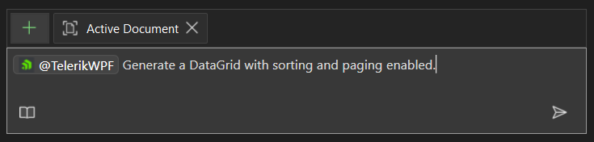

# Telerik WPF GitHub Copilot Extension

The Telerik WPF [GitHub Copilot](https://github.com/features/copilot) extension is an AI-powered coding assistant that provides specialized knowledge about [Telerik UI for WPF components](https://www.telerik.com/wpf). 

This extension enhances GitHub Copilot with proprietary context about Telerik WPF controls, helping you:

* Generate code snippets using Telerik WPF components.
* Get contextual suggestions for component properties and methods.
* Access best practices and implementation patterns.
* Speed up development with AI-powered code completion.

> [Microsoft is sunsetting GitHub Copilot extensions](https://github.blog/changelog/2025-09-24-deprecate-github-copilot-extensions-github-apps) on November 10, 2025, in favor of the Model Context Protocol (MCP) standard.
>
> From that date, the Telerik and Kendo UI AI Coding Assistants will be available exclusively through our [MCP servers](slug:ai-mcp-server). You can enjoy the same powerful capabilities that are delivered by a modern, open, and officially recommended standard.

## Prerequisites

Before using the Telerik WPF GitHub Copilot extension, ensure you have:

* An active [GitHub Copilot](https://github.com/features/copilot) subscription. You can enable or configure GitHub Copilot on the [Copilot Settings page in your GitHub account](https://github.com/settings/copilot).
@[template](/_contentTemplates/ai-coding-assistant.md#getting-started)
* The latest version of your [Copilot-enabled app](https://docs.github.com/en/copilot/building-copilot-extensions/about-building-copilot-extensions#supported-clients-and-ides) (Visual Studio).

## Installation

Follow these steps to install and configure the Telerik WPF Copilot extension:

1. Go to the [Telerik WPF GitHub App](https://github.com/apps/telerikwpf) page and click the **Install** button.
1. You will see a list that includes your GitHub account and all GitHub organizations that you are part of. Select your GitHub account.
1. Click the **Install & Allow** button. This will allow the GitHub Copilot extension to integrate with your GitHub account.
1. Enter your GitHub password when prompted.
1. You will be redirected to telerik.com. Enter your Telerik account credentials if prompted. This step links the GitHub Copilot extension with your Telerik account.
1. Upon successful Telerik authentication, you will be redirected to a confirmation page that indicates successful Copilot extension installation.
1. Restart Visual Studio.
1. Start a new chat session in Copilot.

## Usage

To use the Telerik WPF Copilot extension:

1. Open the GitHub Copilot chat window in Visual Studio.
1. Ensure you are in **Ask** mode and not in **Edit** or **Agent** mode. The Edit and Agent modes do not use the Telerik Copilot extension. However, the Agent mode can use the [Telerik WPF MCP server]().
1. Start your prompt with `@TelerikWPF` and type your request. Verify that `@TelerikWPF` is recognized and highlighted; otherwise, the extension may not be properly installed.
1. Look for a status label such as **Telerik WPF working...** or **Telerik WPF generating response...** in the output to confirm the extension is active.
1. Grant permission to the Telerik WPF extension to read your workspace files when prompted. This is required only the first time to send a prompt. Also, it might be required to restart Visual Studio again.
1. For unrelated queries, start a new chat session in a new window to avoid context pollution from previous conversations.

### Sample Prompts

The following examples demonstrate useful prompts for the Telerik WPF extension:

* "`@TelerikWPF` Give me an example of binding an ObservableCollection<Customer> to a RadGridView, including sorting and grouping."
* "`@TelerikWPF` Create a RadComboBox bound to a list of countries in MVVM, displaying country names but binding the SelectedValue to a CountryCode property."
* "`@TelerikWPF` Show XAML and ViewModel code for a RadTreeView bound to a hierarchical ObservableCollection<Category> where each category contains products. Expand all categories by default."

## Number of Requests

@[template](/_contentTemplates/ai-coding-assistant.md#number-of-requests)

## Troubleshooting

If you encounter issues:

* Ensure the `@TelerikWPF` mention is properly highlighted in your prompt.
* Verify that you have an active GitHub Copilot subscription.
* Restart your IDE after installation.
* Check that you're in Ask mode, not Edit or Agent mode.

## See Also 

* [GitHub Copilot Documentation](https://docs.github.com/en/copilot)
* [GitHub Copilot Tutorials](https://github.com/features/copilot/tutorials)
* [Telerik WPF MCP Server]()
* [Telerik UI for WPF Documentation](https://docs.telerik.com/devtools/wpf/)
