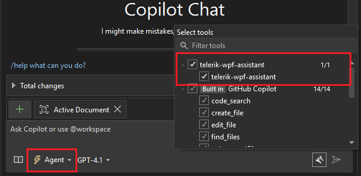
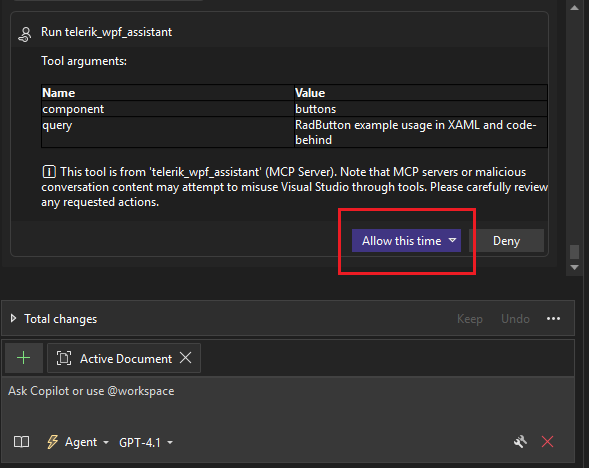
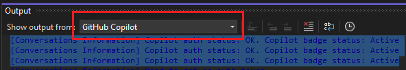

# Getting Started with Telerik WPF MCP Server (Manual Installation)

The Telerik WPF [MCP (Model Context Protocol) Server](https://modelcontextprotocol.io/introduction) enhances your AI-powered development experience by providing specialized context about Telerik UI for WPF components.

This MCP server enables AI-powered IDEs and tools to generate more accurate, tailored code that leverages [Telerik UI for WPF components](https://www.telerik.com/WPF-ui) and APIs. You can ask complex questions about Telerik components, request specific implementations, and generate comprehensive code solutions.

>tip The MCP server can be [installed also as a NuGet package](), instead of using __Node.js__ and `npm` commands as shown below.

## Prerequisites

To use the Telerik WPF MCP server, you need:

* [Node.js](https://nodejs.org/en) 18 or newer.
* An [MCP-compatible client](https://modelcontextprotocol.io/clients) that supports **MCP tools** (latest version recommended).
* Ensure that MCP servers are enabled in Visual Studio. Also, check if MCP access is managed by your GitHub organization. If that is the case, ensure that the organization allows MCP servers. Otherwise, Copilot won't try loading any MCPs.

@[template](/_contentTemplates/ai-coding-assistant.md#getting-started)

## Server Installation

Install the Telerik WPF MCP server using npm:

```bash
npm i @progress/telerik-wpf-mcp
```

### Server Configuration

Use these settings when configuring the server in your MCP client:

| Setting | Value |
|---------|-------|
| Package Name | `@progress/telerik-wpf-mcp` |
| Type | `stdio` (standard input/output transport) |
| Command | `npx` |
| Arguments | `-y` |
| Server Name | `telerikWpfAssistant` (customizable) |

### License Configuration

Add your [Telerik license key]() as an environment parameter in your `mcp.json` file using one of these options:

__Option 1: License File Path (Recommended)__

 ```json
 "env": {
     "TELERIK_LICENSE_PATH": "THE_PATH_TO_YOUR_LICENSE_FILE"
 }
 ```
 
The `THE_PATH_TO_YOUR_LICENSE_FILE` should point to the `telerik-license.txt` file, which is usually located in the AppData folder. 
So, the field often will look like this: `"TELERIK_LICENSE_PATH": "%appdata%/Telerik/telerik-license.txt"`

__Option 2: Direct License Key__

 ```json
 "env": {
     "TELERIK_LICENSE": "YOUR_LICENSE_KEY_HERE"
 }
 ```

> Option 1 is recommended unless you're sharing settings across different systems. Remember to [update your license key](#updating-your-license-key) when necessary.

## Visual Studio Installation

For complete setup instructions, see [Use MCP servers in Visual Studio](https://learn.microsoft.com/en-us/visualstudio/ide/mcp-servers).

> Early Visual Studio 17.14 versions require the Copilot Chat window to be open when opening a solution for the MCP server to work properly.

### Workspace-Specific Setup:

1. Add `.mcp.json` to your solution folder.

 ```json
 {
   "inputs": [],
   "servers": {
     "telerik-wpf-assistant": {
       "type": "stdio",
       "command": "npx",
       "args": ["-y", "@progress/telerik-wpf-mcp@latest"],
       "env": {
         "TELERIK_LICENSE_PATH": "THE_PATH_TO_YOUR_LICENSE_FILE",
         // or
         "TELERIK_LICENSE": "YOUR_LICENSE_KEY"
       }
     }
   }
 }
 ```

2. Restart Visual Studio.
3. Enable the `telerik-wpf-assistant` tool in the [Copilot Chat window's tool selection dropdown](https://learn.microsoft.com/en-us/visualstudio/ide/mcp-servers?view=vs-2022#configuration-example-with-github-mcp-server).

	

### Global Setup:

To enable the server globally for all projects, add the `.mcp.json` file to your user directory (`%USERPROFILE%`, e.g., `C:\Users\YourName\.mcp.json`).

### Telerik Visual Studio Extension Setup:

The `.mcp.json` file can be created and updated by using the [Telerik Visual Studio Extension]() menu in Visual Studio.



The `Configure MCP Server Globally` option creates (or updates if existing) the global `%USERPROFILE%\.mcp.json` file and adds  the Telerik server entry.

The `Configure MCP Server for Solution` option is visible only if you have a project opened in Visual Studio. The option creates (or updates if existing) the  `.mcp.json` file in the solution directory.

The `Add/Update GitHub Copilot Instructions` option is visible only if you have a project opened in Visual Studio. The option creates (or updates if existing) an [copilot-instructions.md](https://docs.github.com/en/copilot/how-tos/configure-custom-instructions/add-repository-instructions?tool=visualstudio) file in the `.github\` folder of the solution (`\SolutionDir\.github\copilot-instructions.md`), which includes extra context that is automatically used with the prompt given to the Copilot chat in Visual Studio.

## Troubleshooting

>warning **Known Issue: Hanging tool calls in Visual Studio**
> 
>When using Telerik AI tools in Visual Studio, GitHub Copilot may:
>- **hang** during tool invocation;
>- show UI for a successful tool response, but actually **fail silently**;
>- continue generation without waiting for **parallel tool calls**.
>In these cases, the response may be generated but not provided to the Copilot Agent UI.
>This is a known issue in Visual Studio Copilot, not related to Telerik MCP servers or AI tools, and does not reproduce in VS Code.
>For more details, see the related Visual Studio Developer Community issue:  
>https://developercommunity.visualstudio.com/t/Copilot-stopped-working-after-latest-upd/10936456
>
>Microsoft has acknowledged the issue and marked it as **Fixed - Pending Release**. A future Visual Studio update is expected to resolve it.

## Usage

To use the Telerik MCP Server:

1. Start your prompt with one of these triggers:
   - `/telerik` / `@telerik` / `#telerik`
   - `/telerikwpf` / `@telerikwpf` / `#telerikwpf`
   - `#telerik-wpf-assistant`
   
1. Grant permissions when prompted (per session, workspace, or always).

	

1. Start fresh sessions for unrelated prompts to avoid context pollution.

You can check the Output pane of Visual Studio for diagnostics information related to Copilot. To display the relevant information, select to show output from GitHub Copilot.



### Improving Server Usage

To increase the likelihood of the Telerik MCP server being used, add custom instructions to your AI tool:
- [GitHub Copilot custom instructions](https://docs.github.com/en/copilot/customizing-copilot/adding-repository-custom-instructions-for-github-copilot#about-repository-custom-instructions-for-github-copilot-chat)

### Sample Prompts

The following examples demonstrate useful prompts for the Telerik WPF MCP Server:

* "`/telerik` Give me an example of binding an ObservableCollection&lt;Customer&gt; to a RadGridView, including sorting and grouping."
* "`/telerikWPF` Create a RadComboBox bound to a list of countries in MVVM, displaying country names but binding the SelectedValue to a CountryCode property."
* "`/telerik` Show XAML and ViewModel code for a RadTreeView bound to a hierarchical ObservableCollection&lt;Category&gt; where each category contains products. Expand all categories by default."

## Number of Requests

@[template](/_contentTemplates/ai-coding-assistant.md#number-of-requests)

## Local AI Model Integration

You can use the Telerik WPF MCP server with local large language models (LLMs):

1. Run a local model, for example, through [Ollama](https://ollama.com).
2. Use a bridge package like [MCP-LLM Bridge](https://github.com/patruff/ollama-mcp-bridge).
3. Connect your local model to the Telerik MCP server.

This setup allows you to use the Telerik AI Coding Assistant without cloud-based AI models.

## See Also

* [AI Coding Assistant Overview]()
