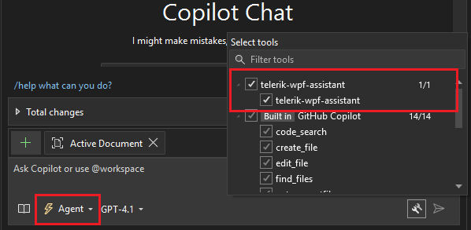
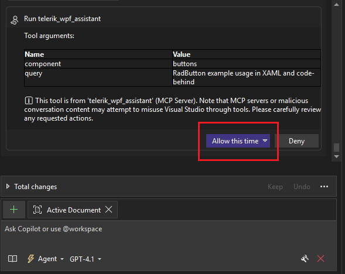
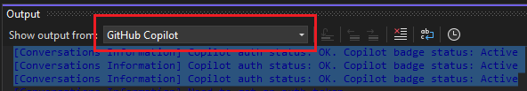

## Getting Started with Telerik WPF MCP Server

The Telerik WPF [MCP (Model Context Protocol) Server](https://modelcontextprotocol.io/introduction) enhances your AI-powered development experience by providing specialized context about Telerik UI for WPF components.

This MCP server enables AI-powered IDEs and tools to generate more accurate, tailored code that leverages [Telerik UI for WPF components](https://www.telerik.com/WPF-ui) and APIs. You can ask complex questions about Telerik components, request specific implementations, and generate comprehensive code solutions.

The MCP Server is available as a NuGet package. Beginning with .NET 10 it can be executed directly via the `dnx` command. For .NET 8 and .NET 9 (where `dnx` is not available) you can install it as a local dotnet tool and invoke its executable.

## Prerequisites

| Target Runtime | Required SDK | Invocation Method | Notes |
|----------------|--------------|-------------------|-------|
| .NET 10 (recommended) | .NET 10 SDK (Preview 6 or newer) | `dnx` dynamic execution | Simplest approach; no prior install step |
| .NET 8 / .NET 9 | .NET 8 or .NET 9 SDK | Local dotnet tool (`telerik-wpf-assistant.exe`) | `dnx` not supported; install tool manually |

Common requirements:

* An [MCP-compatible client](https://modelcontextprotocol.io/clients) that supports MCP tools (latest version recommended).
* A WPF project targeting `net10.0-windows` (recommended), `net8.0-windows` or `net9.0-windows`
* A valid [Telerik license key]().

## Summary of Installation Approaches

| Aspect | .NET 10 | .NET 8 / 9 |
|--------|------------|---------|
| Availability of `dnx` | Available | Not available |
| Install Command | None (resolved on demand) | `dotnet tool install --tool-path ./.tools Telerik.WPF.MCP` |
| Executable Path | Handled by `dnx` | `./.tools/telerik-wpf-assistant.exe` |
| .mcp.json Command | `dnx` | `.\\.tools\\telerik-wpf-assistant.exe` |
| .mcp.json Args | `Telerik.WPF.MCP`, `--yes` | _None_ |
| Update Version | Handled by latest package resolved by `dnx` | Re-run tool install with `--version` or `tool update` |
| Offline Use | Requires prior NuGet cache warm-up | Requires prior tool install |

## Server Installation

### .NET 10 (recommended)

No manual install step is needed. The `dnx` command will download and execute the NuGet package on demand.

### .NET 8 / .NET 9

Install the MCP server as a local tool in your solution root (or another chosen path):

```powershell
dotnet tool install --tool-path ./.tools Telerik.WPF.MCP
```

If updating:

```powershell
dotnet tool update --tool-path ./.tools Telerik.WPF.MCP
```

This creates the executable at `./.tools/telerik-wpf-assistant.exe`.

## Server Configuration

### .NET 10 (recommended) Configuration (`.mcp.json`)

Use these settings when configuring the server in your MCP client:

| Setting | Value |
|---------|-------|
| Package Name | `Telerik.WPF.MCP` |
| Type | `stdio` |
| Command | `dnx` |
| Arguments | `Telerik.WPF.MCP`, `--yes` |
| Server Name | `telerik-wpf-assistant` (customizable) |

### .NET 8 / .NET 9 Configuration (`.mcp.json`)

Add a `.mcp.json` file to your solution root (or to `%USERPROFILE%` for global usage):

```json
{
  "servers": {
    "telerik-wpf-assistant": {
      "type": "stdio",
      "command": ".\\.tools\\telerik-wpf-assistant.exe",
      "env": {
        "TELERIK_LICENSE_PATH": "THE_PATH_TO_YOUR_LICENSE_FILE"
      }
    }
  }
}
```

If you prefer embedding the license string directly:

```json
"env": {
  "TELERIK_LICENSE": "YOUR_LICENSE_KEY"
}
```

### Workspace-Specific Setup

Add a `.mcp.json` file to your solution (root) folder. Choose the variant that matches your target .NET runtime:

#### .NET 10 Example (using `dnx`)

```json
{
  "servers": {
    "telerik-wpf-assistant": {
      "type": "stdio",
      "command": "dnx",
      "args": ["Telerik.WPF.MCP", "--yes"],
      "env": {
        "TELERIK_LICENSE_PATH": "THE_PATH_TO_YOUR_LICENSE_FILE"
      }
    }
  }
}
```

#### .NET 8 / .NET 9 Example

```json
{
  "servers": {
    "telerik-wpf-assistant": {
      "type": "stdio",
      "command": ".\\.tools\\telerik-wpf-assistant.exe",
      "env": {
        "TELERIK_LICENSE_PATH": "THE_PATH_TO_YOUR_LICENSE_FILE"
      }
    }
  }
}
```

You may substitute `TELERIK_LICENSE` instead of `TELERIK_LICENSE_PATH` (see License Configuration section below for details and recommendations). The `inputs` array is optional and not required for current functionality.

After saving the file, restart Visual Studio and enable the `telerik-wpf-assistant` tool in the [Copilot Chat window's tool selection dropdown](https://learn.microsoft.com/en-us/visualstudio/ide/mcp-servers?view=vs-2022#configuration-example-with-github-mcp-server).



### Global Setup

To enable the server globally for all projects, add the `.mcp.json` file to your user directory (`%USERPROFILE%`, e.g., `C:\Users\YourName\.mcp.json`). The same distinction applies: use the executable path for .NET 8/9, or `dnx` for .NET 10.

### Telerik Visual Studio Extension Setup:

The `.mcp.json` file can be created and updated by using the [Telerik Visual Studio Extension]() menu in Visual Studio.



The `Configure MCP Server Globally` option creates (or updates if existing) the global `%USERPROFILE%\.mcp.json` file and adds  the Telerik server entry.

The `Configure MCP Server for Solution` option is visible only if you have a project opened in Visual Studio. The option creates (or updates if existing) the  `.mcp.json` file in the solution directory.

The `Add/Update GitHub Copilot Instructions` option is visible only if you have a project opened in Visual Studio. The option creates (or updates if existing) an [copilot-instructions.md](https://docs.github.com/en/copilot/how-tos/configure-custom-instructions/add-repository-instructions?tool=visualstudio) file in the `.github\` folder of the solution (`\SolutionDir\.github\copilot-instructions.md`), which includes extra context that is automatically used with the prompt given to the Copilot chat in Visual Studio.

## License Configuration

Add your [Telerik license key]() using one of these options in the `env` section.

__Option 1: License File Path (Recommended)__

```json
"env": {
  "TELERIK_LICENSE_PATH": "THE_PATH_TO_YOUR_LICENSE_FILE"
}
```

The `THE_PATH_TO_YOUR_LICENSE_FILE` should point to the `telerik-license.txt` file, usually in the AppData folder. Often it will look like:

`"TELERIK_LICENSE_PATH": "%appdata%/Telerik/telerik-license.txt"`

__Option 2: Direct License Key__

```json
"env": {
  "TELERIK_LICENSE": "YOUR_LICENSE_KEY_HERE"
}
```

> Option 1 is recommended unless you're sharing settings across different systems. Remember to [update your license key](#updating-your-license-key) when necessary.

## Visual Studio Usage

For complete setup instructions, see [Use MCP servers in Visual Studio](https://learn.microsoft.com/en-us/visualstudio/ide/mcp-servers).

After configuration and restart:

1. Open Copilot Chat.
2. Enable the `telerik-wpf-assistant` tool.
3. Grant permissions when prompted (per session, workspace, or always).


Start fresh sessions for unrelated prompts to avoid context pollution. You can check the Output pane of Visual Studio for diagnostics (select output from GitHub Copilot).



## Troubleshooting

>warning **Known Issue: Hanging tool calls in Visual Studio**
> 
>When using Telerik AI tools in Visual Studio, GitHub Copilot may:
>- **hang** during tool invocation;
>- show UI for a successful tool response, but actually **fail silently**;
>- continue generation without waiting for **parallel tool calls**.
>In these cases, the response may be generated but not provided to the Copilot Agent UI.
>This is a known issue in Visual Studio Copilot, not related to Telerik MCP servers or AI tools, and does not reproduce in VS Code.
>For more details, see the related Visual Studio Developer Community issue:  
>https://developercommunity.visualstudio.com/t/Copilot-stopped-working-after-latest-upd/10936456
>
>Microsoft has acknowledged the issue and marked it as **Fixed - Pending Release**. A future Visual Studio update is expected to resolve it.

## Usage

Begin prompts with any of these triggers to explicitly invoke the server:

- `/telerik` / `@telerik` / `#telerik`
- `/telerikwpf` / `@telerikwpf` / `#telerikwpf`
- `#telerik-wpf-assistant`

   
Grant permissions when prompted (per session, workspace, or always).


Start fresh sessions for unrelated prompts to avoid context pollution.

You can check the Output pane of Visual Studio for diagnostics information related to Copilot. To display the relevant information, select to show output from GitHub Copilot.


## Sample Prompts

Examples you can try:

* `/telerik Give me an example of binding an ObservableCollection<Customer> to a RadGridView, including sorting and grouping.`
* `/telerikWPF Create a RadComboBox bound to a list of countries in MVVM, displaying country names but binding the SelectedValue to a CountryCode property.`
* `/telerik Show XAML and ViewModel code for a RadTreeView bound to a hierarchical ObservableCollection<Category> where each category contains products. Expand all categories by default.`

### Improving Server Usage

To increase the likelihood of the Telerik MCP server being used, add custom instructions to your AI tool:
- [GitHub Copilot custom instructions](https://docs.github.com/en/copilot/customizing-copilot/adding-repository-custom-instructions-for-github-copilot#about-repository-custom-instructions-for-github-copilot-chat)

## Number of Requests

@[template](/_contentTemplates/ai-coding-assistant.md#number-of-requests)

## Local AI Model Integration

You can use the Telerik WPF MCP server with local large language models (LLMs):

1. Run a local model, for example, through [Ollama](https://ollama.com).
2. Use a bridge package like [MCP-LLM Bridge](https://github.com/patruff/ollama-mcp-bridge).
3. Connect your local model to the Telerik MCP server.

This setup allows you to use the Telerik AI Coding Assistant without cloud-based AI models.
