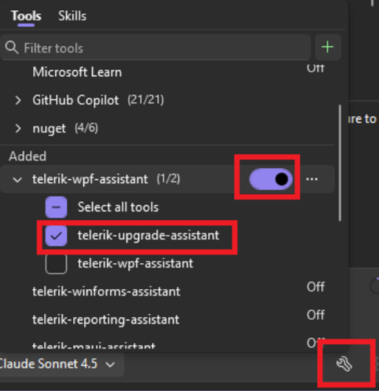
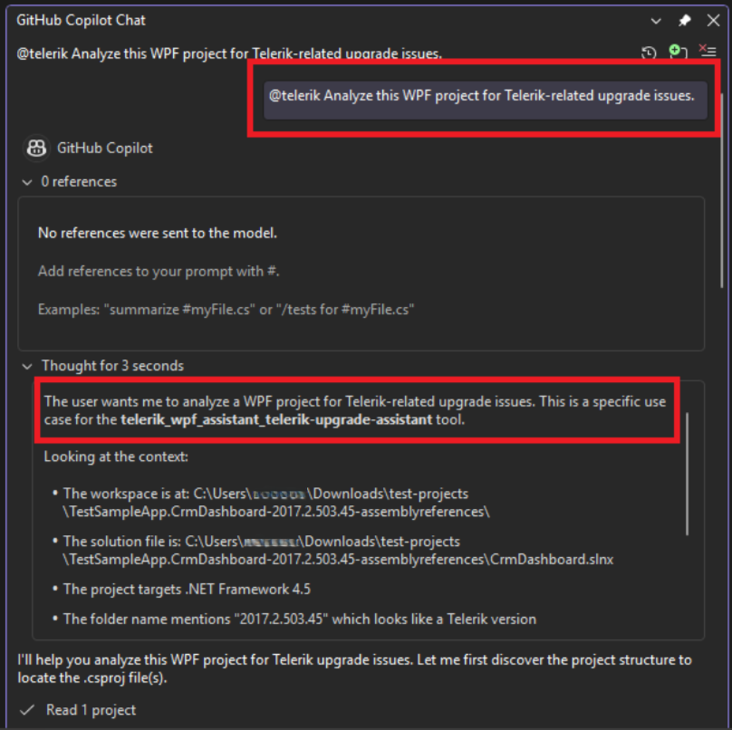
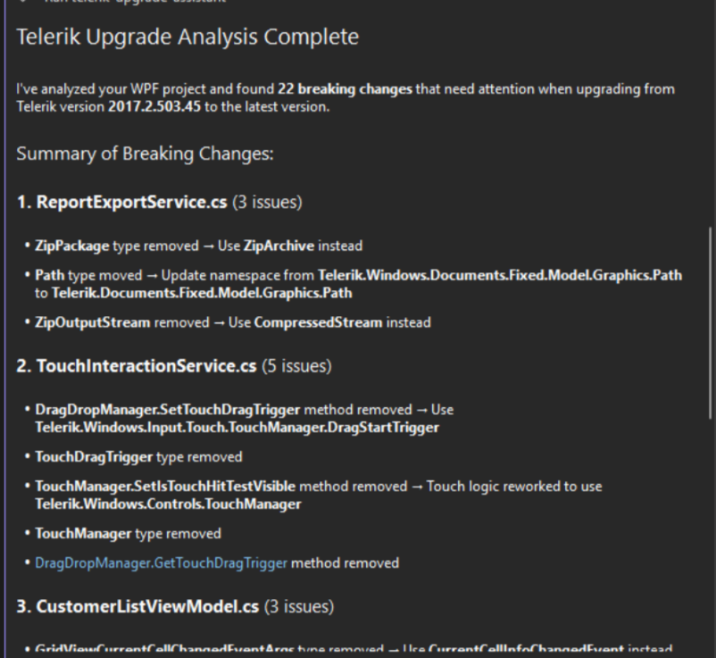

# Telerik UI for WPF MCP Upgrade Assistant

The `telerik_upgrade_assistant` tool is part of the [Telerik WPF MCP Server]() (version 1.8.0 and later). It helps you analyze your existing WPF projects for breaking changes when upgrading between Telerik UI for WPF versions.

The tool integrates with the [Telerik CLI]() (`telerik migrate analyze` command) and returns structured findings to the AI model, which can then interpret and apply the necessary code fixes automatically.

## Prerequisites

To use the upgrade tool, you need:

* The [Telerik WPF MCP Server]() version 1.8.0 or later installed and configured.
* The [Telerik CLI]() global .NET tool. If not already installed, the upgrade tool will detect this and prompt you to install it automatically.
* A WPF project (`.csproj`) that references Telerik UI for WPF assemblies.

>tip If the Telerik CLI is not installed on your machine, the tool will ask for your permission to install it via `dotnet tool install --global Telerik.CLI`. It will also check for available updates and apply them when needed.

## Using the Upgrade Tool

To analyze your WPF project for Telerik-related upgrade issues, follow these steps:

1. Open your WPF solution in Visual Studio.
2. Open the **Copilot Chat** window.
3. Make sure the `telerik-wpf-assistant` MCP tool is enabled in the Copilot Chat tool selection dropdown. For setup instructions, see [Getting Started with Telerik WPF MCP Server]().

4. Type a prompt such as:

    `@telerik Analyze this WPF project for Telerik-related upgrade issues.`

    You can also specify version details:

    `@telerik Analyze my WPF project for breaking changes when upgrading from version 2024.4.1111 to 2025.2.513.`

5. Grant permissions when prompted (per session, workspace, or always). The AI model automatically invokes the `telerik_upgrade_assistant` tool, which runs the analysis and returns a structured report of any breaking changes found in your project.

6. Review the results. The AI model presents the findings grouped by file, with line numbers, affected API members, and recommended actions. You can then ask the AI to apply the suggested fixes directly to your code.

>tip The `telerik_upgrade_assistant` tool uses the [Telerik CLI]() `telerik migrate analyze` command under the hood. You can also run this command directly from the terminal. For all available command options, see the [Telerik CLI Migrate Analyzer]() article.

## Understanding the Results

The upgrade tool returns a structured report that includes:

* **File path**&mdash;The source file where a breaking change was detected.
* **Line number**&mdash;The exact line in the file.
* **Member name**&mdash;The affected API member (property, method, event, or class).
* **Change kind**&mdash;The type of breaking change (removed, renamed, signature changed, etc.).
* **Old signature**&mdash;The previous API signature (when available).
* **New signature**&mdash;The replacement API signature (when available).
* **Next steps**&mdash;Recommended actions for resolving each finding.

## See Also

* [Telerik WPF MCP Server]()
* [Telerik CLI]()
* [Telerik CLI Migrate Analyzer]()
* [Telerik WPF AI Coding Assistant Overview]()
