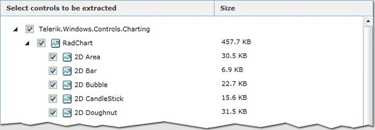

# What is New

## Release Date 14/07/2010

* Support for the __Charting assembly__. We now split the control into separate features, so you will be able to choose which features you need for your project

* Support__Feature Based Selection__. Meaning that some controls have optional parts/features that you can select and at the end you will have even smaller control package, having only the needed parts/features

* Now you are able to select for minifying even our theme __Styles for the built-in Silverlight__ controls like CheckBox, RadioButton, PaswordBox, TextBox and so on. Thus, you can download an assembly having only the themes for those controls. The item in the minifier's TreeView is called “__Silverlight Controls Styles__”

## Release Date 25/06/2010  

* Added: Ability to __minify Themes__. We now support minifying the __themes’__assemblies. Which means that you can now upload themes’ assemblies along with the controls and select the needed controls. At the end of the process you will get the new themes' assemblies __having styles only for the controls you selected__. The minifier client application uses this feature. As a result the Vista theme assembly was reduced __from 2600+K to less then 400K__(__25%__ of the original size). And now the assembly contains only the styles for the couple of controls used in the Assembly Minifier UI. 

* Deeper controls tree – some controls are split in order to select only needed

* Bug-fixes
