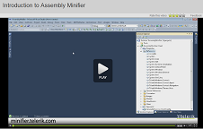
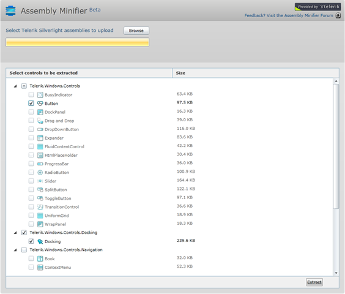

# Overview

<table> <tr><td>RELATED VIDEOS</td></tr><tr><td>
             In this video, you will be introduced to the Telerik Assembly Minifier (beta). This video shows you exactly how to use the Minifier and how it can help you cut the size of your XAPs in half!(Runtime: 08:20)
			

[Link...](http://tv.telerik.com/watch/introduction-assembly-minifier)</td></tr></table>

Telerik [Assembly Minifier](http://minifier.telerik.com/) is a tool that lets you extract only the controls’ classes and resources you need to use in your application development, thus significantly reducing the size of the assemblies. Using the __Assembly Minifier__ you will achieve significantly better loading time when the XAP files containing the minified (optimized) assemblies are to be loaded on the client side.

## Reducing (minifying) the size of Telerik Silverlight assemblies

In order to minify the assemblies, you should:

1. Open the application at: [http://minifier.telerik.com](http://minifier.telerik.com).
		

1. Browse and upload Telerik Silverlight Assemblies, the ones that you want to optimize. See the tips at the bottom, for more information on uploading.
		

1. After you select and upload the assemblies,the Assembly Minifier will automatically start processing and analyzing the files.
		

1. Then, you will be able to select only the controls you will need in your application.
 		

1. As soon as the analyzing process finishes, you will be able to see the relative size of each control.The size is just for comparison purposes and does not mean that the output assemblies will have the exact same size as shown in the TreeListView.
		

1. Once you finish the selection, you can click the Extract button.
		

1. As soon the server processes the Extraction, you will be prompted to Save a ZIP file containing the minified assemblies.
		

1. If you want to try the minified assemblies in an existing project:
		
        

* You should first remove the references to the old assemblies

* Clean up the Visual Studio Solution

* Add references to the newly created (minified) assemblies

* Build the Solution

1. If you want to use the minified assemblies in a new project you should simply add reference to the newly created assemblies in the project. If you have troubles referencing the assemblies, you may need to check the assembly files for the Lock bit and unlock them if needed – right click on the file, go to Properties/Unlock assembly)
 		

Here is how the tool look like

         
      

## Tips for using the Assembly Minifier

* To get the best results from using the Assembly Minifier, you should upload all referenced assemblies (as well as the one that contains the controls you will need) – so that they will be minified according to your selection. For example if you want to use only RadDocking from Telerik.Windows.Controls.Docking.dll, you should also upload Telerik.Windows.Controls.dll and Telerik.Windows.Controls.Navigation.dll and select only RadDocking control. This way you will get minified versions, of all referenced (above mentioned) assemblies, specifically for RadDocking. In this example the output assembly - Telerik.Windows.Controls.dll should be around 400KB (compared to 1100KB) and the Telerik.Windows.Controls.Navigation.dll should be 230KB (compared to 840KB).

* Some controls are using parts that are not compulsory, so you should take care and select them manually. For example RadRibbonBar frequently uses the RadRibbonButton. To include RadRibbonButton in the minified assembly, you should select it.

* For the moment you can NOT optimize RadChart, DataVisualization and Themes assemblies, so you will not be allowed to upload them.

