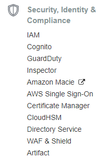
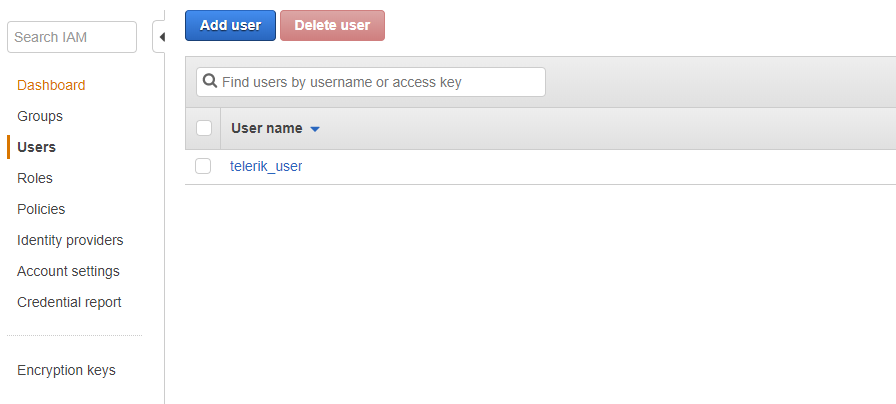

# Getting Started

This article will help you to setup your environment and start using AWS. Here are the main steps that you need to take:

1. [Create an AWS account] (#create-an-aws-account)
2. [Install the AWS SDK for .NET] (#install-the-aws-sdk)
3. [Create a user](#crate-a-user)
4. [Enter the credentials in Visual Studio](#enter-credentials-in-visual-studio)

## Create an AWS account

To create an account go to the [AWS website](https://aws.amazon.com/) and create new account. The process is straightforward and easy. You will be prompted for a credit card number despite that there is a free option. There is short automatic verification via phone as well. The whole process should not take more than 15 minutes. 

## Install the AWS SDK

This is straightforward as well. Just [download the installer](https://aws.amazon.com/visualstudio/) and follow the instructions. Once this is done open Visual Studio.

> There are 2 versions of the SDK for VS2013/VS2015 and VS2017.

Now you should see the AWS start page:

## Creating a user

In order to access the AWS services you need a user. The user management is actually a service. So navigate to the **Security, Identity & Compliance** and click the **IAM** link.

Click add new user and follow the instructions on the screen. There are 4 steps:

1. Chose the name and access (programmatic and/or management console).
2. Chose permission policy - for the firs user you can use any of the existing policies(the third icon).
3. Just confirm by pressing *Create User*.
4. This is a summary page which allows you to download the user details in a csv file. Click Download and save the file. You will import this in Visual Studio. 

## Enter credentials in Visual Studio

This is the final step. If you do not see the AWS start page (see the first image) go to View - AWS Explorer. Click **Add New User** and import the csv file.

> In order to see the codes of each region, please check out the [Amazon API Gateway](https://docs.aws.amazon.com/general/latest/gr/rande.html#apigateway_region)