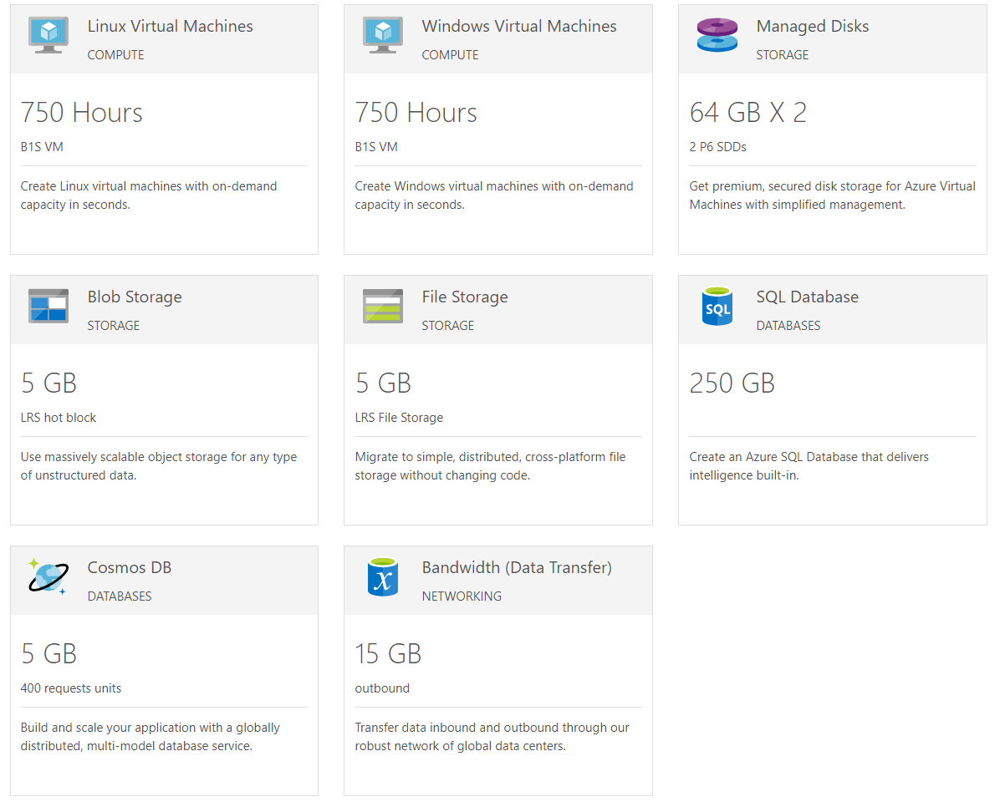

# Azure Overview

Microsoft Azure is a cloud computing service created by Microsoft for building, testing, deploying, and managing applications and services through a global network of Microsoft-managed data centers. It provides software as a service (SaaS), platform as a service (PaaS) and infrastructure as a service (IaaS) and supports many different programming languages, tools and frameworks, including both Microsoft-specific and third-party software and systems.

You can create a [free account](https://azure.microsoft.com/en-us/free/) and take advantage of a number of free services such as Cosmos DB, Blob/File Storage, serverless functions and more and integrate them with the controls from the UI for WPF suite. Here are some of the services that are available:

Here are the currently available topics:

* [Getting Started]()

* Connect to data in the cloud

    * [Cosmos DB]()

    * [SQL Database]()

    * Data Warehouse

* [Blob Storage]()

* [Cognitive services]()()