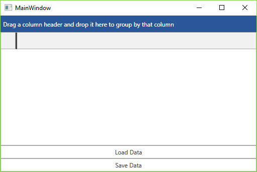
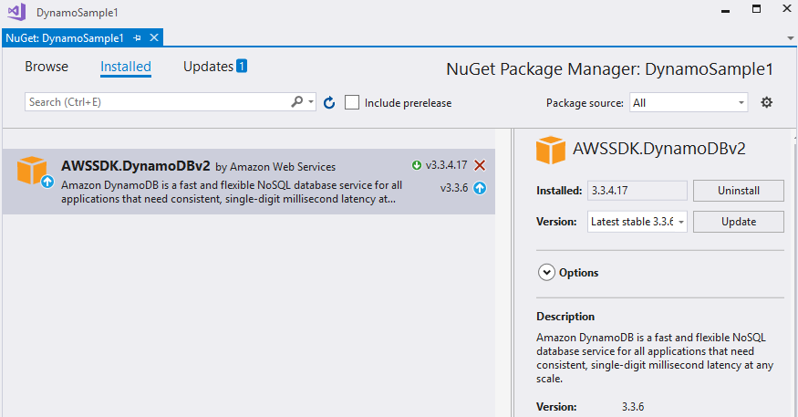
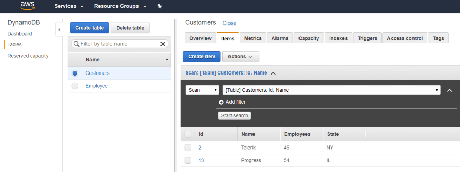
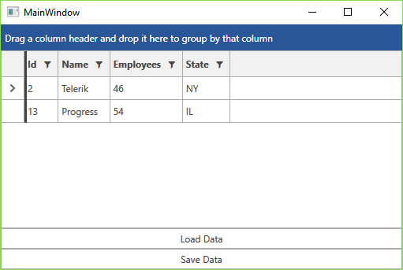

# Dynamo DB

This article will show you how to create a {{ site.framework_name }} application and access data stored in a DynamoDB table by connecting to the **AWS DynamoDB** service.

> Please note that you can use the [local version](https://docs.aws.amazon.com/amazondynamodb/latest/developerguide/DynamoDBLocal.html) of DynamoDB to setup and test your application. This article shows a real example where an actual DynamoDB web service is used.

## Step 1: Create the Application

[Create a new WPF application]()[Create a new Silverlight application]() and add the following assemblies which you will need.

* **Telerik.Windows.Controls**
* **Telerik.Windows.Controls.GridView**
* **Telerik.Windows.Controls.Input**
* **Telerik.Windows.Data**

Now define the following XAML layout which consists of a RadGridView control to display the data and two RadButtons to load and save the data from and to the database.

__Example 1: XAML layout__

```XAML

    <Grid>
		<Grid.RowDefinitions>
			<RowDefinition Height="\*" />
			<RowDefinition Height="Auto" />
			<RowDefinition Height="Auto" />
		</Grid.RowDefinitions>
		<telerik:RadGridView x:Name="grid" ItemsSource="{Binding Customers}" />
		<telerik:RadButton Grid.Row="1" Content="Load Data" Command="{Binding LoadCustomersCommand}" />
		<telerik:RadButton Grid.Row="2" Content="Save Data" Command="{Binding SaveChangesCommand}" />
	</Grid>
```

#### Figure 1: Blank RadGridView and two RadButtons



## Step 2: Install the NuGet package

In **Visual Studio** open the **NuGet Package Manager** and install the **DynamoDB** module.

#### Figure 2: Install DynamoDB package



Another option is to to type the following command in the **NuGet Package Manager Console**: *PM> Install-Package AWSSDK.DynamoDBv2*

In addition you need to [configure your AWS credentials](https://docs.aws.amazon.com/sdk-for-net/v3/developer-guide/net-dg-config.html). One way to do this is to specify the credentials in the **App.config** file of your application as demonstrated in **Example 1**.

__Example 2: Add AWS Credentials__

```XAML

    <?xml version="1.0" encoding="utf-8" ?>
    <configuration>
        <appSettings>
            <add key="AWSProfileName" value="Telerik"/>
            <add key="AWSRegion" value="eu-west-3" />
        </appSettings>
    </configuration>
```

>If you do not have a AWS account in Visual Studio please check the [Getting Started]() article.

## Step 3: Create the ViewModel

As our database contains a list of customers, define a Customer class that will hold the data for a single record.

__Example 3: The Customer class__

```XAML

    public class Customer
    {
        public int Id { get; set; }

        public string Name { get; set; }

        public int Employees { get; set; }

        public string State { get; set; }
    }
```

Now add a class called **MainWindowViewModel** to the example. It will handle all functionality for managing the DynamoDB database.

First of all, create the **Customers** collection which will hold the entries from the database and the method that creates the **Customers** table.

__Example 4: Create the Customers table__

```XAML

    public class MainWindowViewModel : ViewModelBase
    {
        private AmazonDynamoDBClient client;
        private ObservableCollection<Customer> customers;

        public MainWindowViewModel()
        {
            try
            {
                this.client = new AmazonDynamoDBClient();
                this.Customers = new ObservableCollection<Customer>();
                this.CreateCustomersTable();
            }
            catch (Exception ex)
            {
                Console.Error.WriteLine("Error: failed to create a DynamoDB client; " + ex.Message);
            }
        }

        public ObservableCollection<Customer> Customers
        {
            get { return this.customers; }
            set
            {
                if (this.customers != value)
                {
                    this.customers = value;
                    this.OnPropertyChanged("Customers");
                }
            }
        }

        private void CreateCustomersTable()
        {
            List<string> currentTables = client.ListTables().TableNames;

            if (!currentTables.Contains("Customers"))
            {
                CreateTableRequest createRequest = new CreateTableRequest
                {
                    TableName = "Customers",
                    AttributeDefinitions = new List<AttributeDefinition>()
                    {
                        new AttributeDefinition
                        {
                            AttributeName = "Id",
                            AttributeType = "N"
                        },
                        new AttributeDefinition
                        {
                            AttributeName = "Name",
                            AttributeType = "S"
                        }
                    },
                    KeySchema = new List<KeySchemaElement>()
                    {
                        new KeySchemaElement
                        {
                            AttributeName = "Id",
                            KeyType = "HASH"
                        },
                        new KeySchemaElement
                        {
                            AttributeName = "Name",
                            KeyType = "RANGE"
                        }
                    },
                };

                createRequest.ProvisionedThroughput = new ProvisionedThroughput(1, 1);

                CreateTableResponse createResponse;
                try
                {
                    createResponse = client.CreateTable(createRequest);
                }
                catch (Exception ex)
                {
                    Console.Error.WriteLine("Error: failed to create the new table; " + ex.Message);

                    return;
                }
            }
        }
    }
```

Now when the table is ready you can add some data by adding the following method to the viewmodel.

__Example 5: Add items to the table__

```XAML

    private void AddCustomers()
    {
        var table = Amazon.DynamoDBv2.DocumentModel.Table.LoadTable(client, "Customers");
        var search = table.Scan(new Amazon.DynamoDBv2.DocumentModel.Expression());
        if (search.Count == 0)
        {
            Document dataObj1 = new Document();
            dataObj1["Name"] = "Telerik";
            dataObj1["Id"] = 2;
            dataObj1["Employees"] = 46;
            dataObj1["State"] = "NY";
            table.PutItem(dataObj1);

            Document dataObj2 = new Document();
            dataObj2["Name"] = "Progress";
            dataObj2["Id"] = 13;
            dataObj2["Employees"] = 54;
            dataObj2["State"] = "IL";
            table.PutItem(dataObj2);
        }
    }
```

You can then invoke the **AddCustomers** method in the constructor of the viewmodel.

__Example 6: Invoke the AddCustomers method in the viewmodel's constructor__

```XAML

    public MainWindowViewModel()
    {
        try
        {
            this.client = new AmazonDynamoDBClient();
            this.Customers = new ObservableCollection<Customer>();
            this.CreateCustomersTable();
            this.AddCustomers();
        }
        catch (Exception ex)
        {
            Console.Error.WriteLine("Error: failed to create a DynamoDB client; " + ex.Message);
        }
    }
```

Now set the **DataContext** of the Grid to the **MainWindowViewModel** so that the table is created and the entries are added.

__Example 7: Initialize the MainWindowViewModel__

```XAML

    <Grid.DataContext>
        <local:MainWindowViewModel />
    </Grid.DataContext>
```

If you run the code at this point you will be able to see the data in your AWS console.



## Step 4: Get the Data from DynamoDb

Now you are ready to populate the RadGridView control with the data by iterating over the records in the database and adding items to the Customers collection.

__Example 8: Load data from the database__

```XAML

    // MainWindowViewModel.cs
    private void LoadData(object obj)
    {
        var table = Amazon.DynamoDBv2.DocumentModel.Table.LoadTable(client, "Customers");
        var search = table.Scan(new Amazon.DynamoDBv2.DocumentModel.Expression());

        var documentList = new List<Document>();
        do
        {
            documentList.AddRange(search.GetNextSet());

        } while (!search.IsDone);

        var customers = new ObservableCollection<Customer>();
        foreach (var doc in documentList)
        {
            var customer = new Customer();
            foreach (var attribute in doc.GetAttributeNames())
            {
                var value = doc[attribute];
                if (attribute == "Id")
                {
                    customer.Id = Convert.ToInt32(value.AsPrimitive().Value);
                }
                else if (attribute == "Name")
                {
                    customer.Name = value.AsPrimitive().Value.ToString();
                }
                else if (attribute == "Employees")
                {
                    customer.Employees = Convert.ToInt32(value.AsPrimitive().Value);
                }
                else if (attribute == "State")
                {
                    customer.State = value.AsPrimitive().Value.ToString();
                }
            }

            customers.Add(customer);
        }

        this.Customers = customers;
    }
```

If you now call the **LoadData** method in the constructor of the viewmodel, the grid will be populated with the entries from the AddCustomers method.

__Example 9: Load data from the database__

```XAML

    this.client = new AmazonDynamoDBClient();
    this.Customers = new ObservableCollection<Customer>();
    this.CreateCustomersTable();
    this.AddCustomers();
    this.LoadData(null);
```

#### Figure 3: The populated RadGridView



## Step 5: Save/Load Changes

All that's left is to handle the click of the two RadButtons. For the purpose, add two commands to your viewmodel.

__Example 10: Define the save and load commands__

```XAML

    public ICommand LoadCustomersCommand { get; set; }
    public ICommand SaveChangesCommand { get; set; }

    public MainWindowViewModel()
    {
        // ...
            this.LoadCustomersCommand = new DelegateCommand(LoadData);
            this.SaveChangesCommand = new DelegateCommand(SaveChanges);
        // ...
    }
```

> This example uses the **DelegateCommand** class provided by the UI for {{ site.framework_name }} suite, but you can replace this with an implementation of the **ICommand** interface.

As you can see in **Example 10**, the **LoadCustomersCommand** in turn calls the logic of the **LoadData** method which we already defined and used to initially load the data.

All that's left is to bind the command of the "Save Data" button. The **SaveChanges** method it is pointing to iterates over all rows and updates the respective items in the database. 

__Example 11: Save changes to the database__

```XAML

    private void SaveChanges(object obj)
    {
        foreach (var item in this.Customers)
        {
            this.UpdateCustomer(item as Customer);
        }
    }

    private void UpdateCustomer(Customer customer)
    {
        var table = Amazon.DynamoDBv2.DocumentModel.Table.LoadTable(client, "Customers");
        var entry = new Document();
        entry["Id"] = customer.Id;
        entry["Name"] = customer.Name;
        entry["Employees"] = customer.Employees;
        entry["State"] = customer.State;
        table.UpdateItem(entry);
    }
```

The changes made in the RadGridView control will now be reflected in the database when you click the "Save Data" button.

## See Also

* [Storage (S3)]()
* [Relational Database Service]()