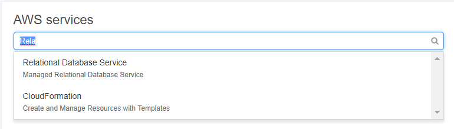
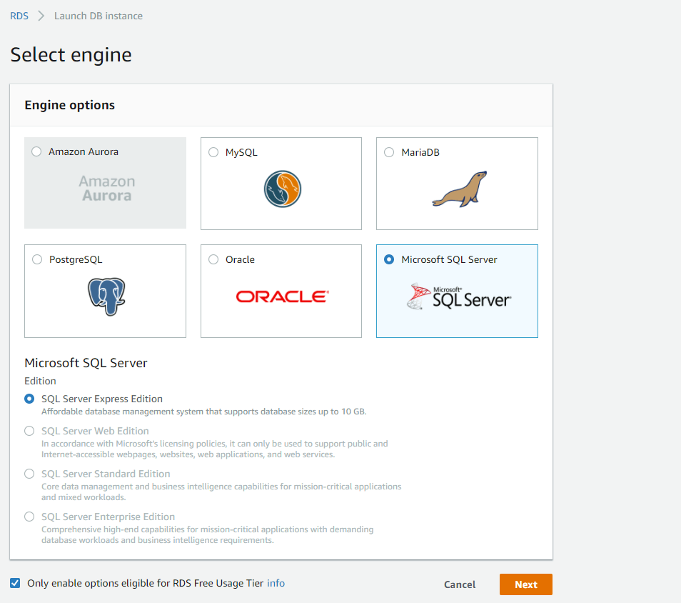
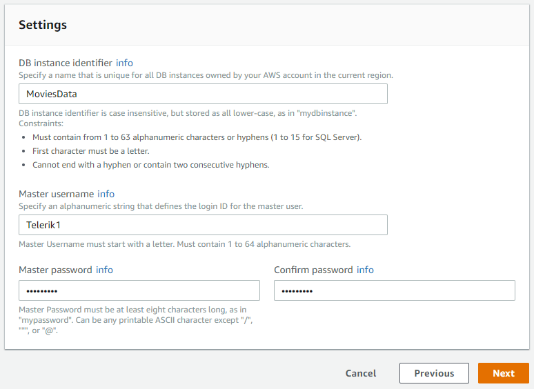
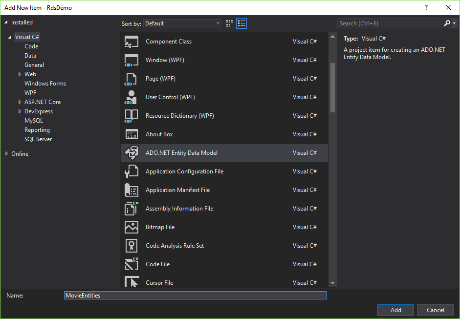
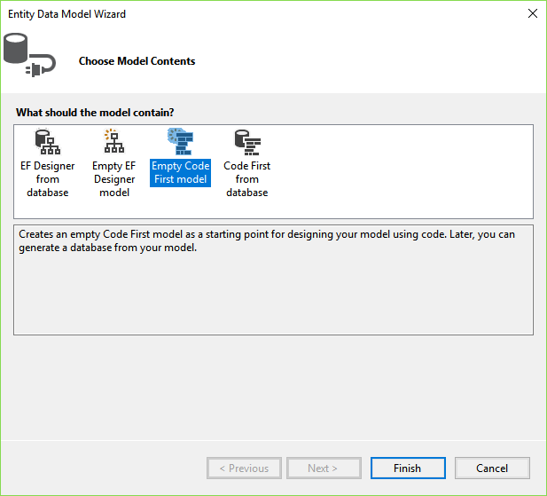
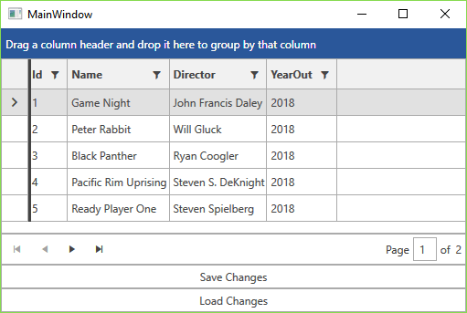

# Relational Database Service (RDS)

This article will show you to create a {{ site.framework_name }} application and access data stored in the cloud by using the **Amazon Relational Database Service**. You will then display the data using the [RadGridView]() and [RadDataPager]() controls. For the purpose, you will use the **QueryableEntityCollectionView** class which will transfer all the group, filter, sort and paging operations to the cloud.

## Step 1: Set up the Database Instance

Go to the AWS console, type in "Relational Database Services" and click the first result from the dropdown get to the Amazon RDS dashboard page. From the dashboard click the __Get Started Now__ button. 



This will lead you to the **Select Engine** page. Select **SQL server Express Edition** and click Next. 



On the next screen choose any options you want. For this example we are using the free tier options. In the **Settings** section of the page choose database name and specify the user name an password.



Click next and choose the options that suit your desired setup. Make sure that **Publicly Accessible** option is set to **Yes**. Then click __Launch DB Instance__ and wait until the database is created.

>Detailed information on all the available options during the setup is available [here](https://docs.aws.amazon.com/AmazonRDS/latest/UserGuide/CHAP_GettingStarted.CreatingConnecting.SQLServer.html).

At this point you are ready to connect to the instance using **Microsoft SQL Server Management Studio** as explained [here](https://docs.aws.amazon.com/AmazonRDS/latest/UserGuide/USER_ConnectToMicrosoftSQLServerInstance.html).

## Step 2: Create the Application

[Create a new WPF application]()[Create a new Silverlight application]() and add the following assemblies which you will need.

* **Telerik.Windows.Controls**
* **Telerik.Windows.Controls.Data**
* **Telerik.Windows.Controls.EntityFramework60**
* **Telerik.Windows.Controls.GridView**
* **Telerik.Windows.Controls.Input**
* **Telerik.Windows.Data**

## Step 3: Create the Database Using Entity Framework

**1.** Add a new item to your project and choose **ADO.NET Entity Data Model** from the list of available items.

**2.** Give it a suitable name such as **MovieEntities** and click **Add**.



**3.** Choose **Empty Code First model** from the **Choose Model Contents** dialog.



This will generate the MovieEntities class for you which inherits from **DbContext** and will be used by Entity Framework to communicate with the database.

Now, define the **Movie** class which will hold the data for a single record from the database.

__Example 1: Define Movie class__

```C#

    public class Movie
    {
        public int Id { get; set; }

        public string Name { get; set; }

        public string Director { get; set; }

        public string YearOut { get; set; }
    }
```

Then add a Movies property to the MovieEntities class which will hold the collection of records obtained from the database.

__Example 2: The Movies IDbSet__

```C#

    public IDbSet<Movie> Movies { get; set; }
```

Now either update the MovieEntities connection string in your **app.config** file with your database instance's endpoint and user credentials or directly add them to the DbContext's constructor:

__Example 3: Set the connection string__

```C#

    public MovieEntities() 
        : base(GetRDSConnectionString())
    {
    }

    public static string GetRDSConnectionString()
    {
        string dbname = "Movies";
        string username = "user";
        string password = "pass";
        string hostname = "sample-instance.************rds.amazonaws.com";
        string port = "1433";

        return "Data Source=" + hostname + ";Initial Catalog=" + dbname + ";User ID=" + username + ";Password=" + password + ";";
    }
```

Open the Package Manager Console and run the **Enable-Migrations** command which will in turn crate a **Migrations** folder with a **Configuration** class in it.

Enable automatic migrations for the database by setting the **AutomaticMigrationsEnabled** property to **True** and seed some records to the database by overriding the **Seed** method.

__Example 4: Enable automatic migrations__

```C#

    internal sealed class Configuration : DbMigrationsConfiguration<MovieEntities>
    {
        public Configuration()
        {
            AutomaticMigrationsEnabled = true;
        }

        protected override void Seed(MovieEntities context)
        {
            if (!context.Movies.Any())
            {
                context.Movies.Add(new Movie() { Director = "John Francis Daley", Id = 0, Name = "Game Night", YearOut = "2018" });
                context.Movies.Add(new Movie() { Director = "Will Gluck", Id = 1, Name = "Peter Rabbit", YearOut = "2018" });
                context.Movies.Add(new Movie() { Director = "Ryan Coogler", Id = 2, Name = "Black Panther", YearOut = "2018" });
                context.Movies.Add(new Movie() { Director = "Steven S. DeKnight", Id = 3, Name = "Pacific Rim Uprising", YearOut = "2018" });
                context.Movies.Add(new Movie() { Director = "Steven Spielberg", Id = 4, Name = "Ready Player One", YearOut = "2018" });
                context.Movies.Add(new Movie() { Director = "Rian Johnson", Id = 5, Name = "Star Wars: The Last Jedi", YearOut = "2017" });
                context.Movies.Add(new Movie() { Director = "Jon Watts", Id = 6, Name = "Spider-Man: Homecoming", YearOut = "2017" });
                context.Movies.Add(new Movie() { Director = "Taika Waititi", Id = 7, Name = "Thor: Ragnarok", YearOut = "2017" });
                context.Movies.Add(new Movie() { Director = "Bill Condon", Id = 8, Name = "Beauty and the Beast", YearOut = "2017" });
            }
        }
    }
```

Run the **Update-Database** command in the Package Manager Console to create the **Movies** database and add the two records to it.

## Step 5: Define the ViewModel

Now that the database is created an populated, you can create the viewmodel which will handle all the interaction with the database. First define the properties which will be used to interact with the view.

__Example 5: Define public properties__

```C#

    public class MainWindowViewModel : ViewModelBase
	{
		private QueryableCollectionView view;
		private bool isBusy;

		public ICommand SaveChangesCommand { get; set; }
		public ICommand LoadDataCommand { get; set; }

		public MainWindowViewModel()
		{
		}

		public QueryableCollectionView View
		{
			get { return this.view; }
			set
			{
				if (this.view != value)
				{
					this.view = value;
					this.OnPropertyChanged("View");
				}
			}
		}

		public bool IsBusy
		{
			get { return this.isBusy; }
			set
			{
				if (this.isBusy != value)
				{
					this.isBusy = value;
					this.OnPropertyChanged("IsBusy");
				}
			}
		}
	}
```

## Step 6: Query the Data

Now what's left is to actually make the connection to the database and query the data. For the purpose, create a new **BackgroundWorker** in the viewmodel's constructor and handle the **DoWork** and **RunWorkerCompleted** events as shown in **Example 3**.

__Example 6: Add logic to work with the SQL database__

```C#

    public class MainWindowViewModel : ViewModelBase
	{
		// ...
		private readonly BackgroundWorker worker;
		private MovieEntities context;

		public MainWindowViewModel()
		{
			this.IsBusy = true;
			this.worker = new BackgroundWorker();
			this.worker.DoWork += worker_DoWork;
			this.worker.RunWorkerCompleted += worker_RunWorkerCompleted;
			this.worker.RunWorkerAsync();
		}

        // ...

		private void worker_DoWork(object sender, DoWorkEventArgs e)
		{
			this.context = new MovieEntities();
			var objectContext = ((IObjectContextAdapter) this.context).ObjectContext;
			e.Result = objectContext;
		}

		private void worker_RunWorkerCompleted(object sender, RunWorkerCompletedEventArgs e)
		{
			this.View = new QueryableEntityCollectionView<Movie>(e.Result as ObjectContext, "Movies");
			this.IsBusy = false;
		}
	}
```

What the code in **Example 6** does is to set the **IsBusy** property so that some indication is displayed in the UI. It then initializes the **BackgroundWorker**, subscribes to its events and runs it asynchronously. The **DoWork** handler then creates a new instance of the **MovieEntities** class and gets its **ObjectContext** via the explicit implementation of the **IObjectContextAdapter** interface.

The **RunWorkerCompleted** event handler then creates a new instance of the generic **QueryableEntityCollectionView** class by passing the **ObjectContext** obtained as a result of the background worker and the entity set name, in this case - **"Products"**. This QueryableEntityCollectionView will in turn handle all the group, filter, sort and paging operations on the server.

## Step 7: Save and Load Changes To and From the Database

The final step is to actually save any changes that are made the database as well as obtain the updated data in case any changes on the cloud have occured. **Example 4** demonstrates the code for these two operations.

__Example 7: Save and Load changes__

```C#

    public MainWindowViewModel()
    {
        // ...
        this.SaveChangesCommand = new DelegateCommand(OnSaveChangesCommandExecuted);
        this.LoadDataCommand = new DelegateCommand(OnLoadDataCommandExecuted);
    }

    // ...

    private void OnSaveChangesCommandExecuted(object obj)
    {
        this.context.SaveChanges();
    }

    private void OnLoadDataCommandExecuted(object obj)
    {
        this.IsBusy = true;
        this.worker.RunWorkerAsync();
    }
```

## Step 8: Create the Layout

All that's left is to define the actual user interface clients of this application will use. The layout consists of a RadGridView to display the data, a RadDataPager to page it and two buttons - one to save the changes to the database and one to load newly-updated data from the cloud. Note that the **local** namespace in the example corresponds to the namespace where **MainWindowViewModel** resides.

__Example 8: The final layout__

```XAML

    <Grid>
		<Grid.DataContext>
			<local:MainWindowViewModel />
		</Grid.DataContext>
        <Grid.RowDefinitions>
            <RowDefinition Height="\*" />
            <RowDefinition Height="Auto" />
            <RowDefinition Height="Auto" />
            <RowDefinition Height="Auto" />
        </Grid.RowDefinitions>
        <telerik:RadGridView IsBusy="{Binding IsBusy}" ItemsSource="{Binding View}"/>
        <telerik:RadDataPager Grid.Row="1" PageSize="50" Source="{Binding View}"/>
        <telerik:RadButton Grid.Row="2" Content="Save Changes" Command="{Binding SaveChangesCommand}" />
		<telerik:RadButton Grid.Row="3" Content="Load Changes" Command="{Binding LoadDataCommand}" />
    </Grid>
```

**Figure 1** demonstrates the final result in the **Office2016** theme.

#### Figure 1: The resulting layout in the Office2016 theme



## See Also

* [DynamoDB]()
* [Storage (S3)]()