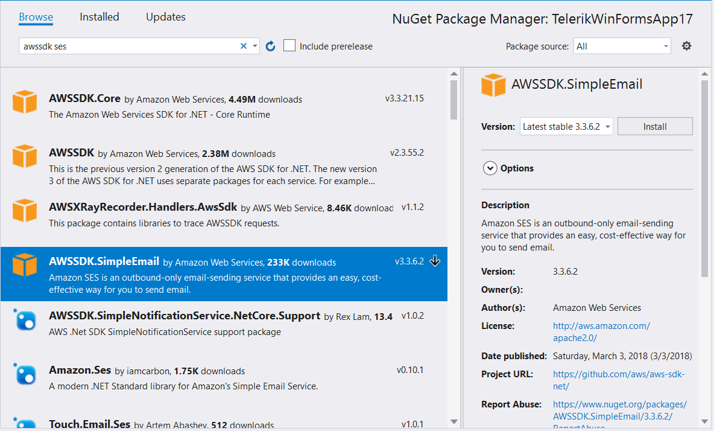
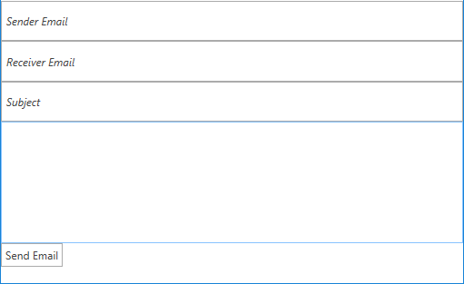

# Simple Email Service

Amazon SES is an email service that provides you with a way to send and receive emails using your own email addresses and domains.

This article will demonstrate how one can use this service from a {{ site.framework_name }} application and send an email to a specific address.

## Step 1: Create the {{ site.framework_name }} Application

Create a standard {{ site.framework_name }} application and add 3 [RadWaterMarkTextBoxes]() and a [RadButton]() to it. The watermarktextboxes will contain the sender and receiver emails and the subject. The button will be responsible for sending the email.

__Example 1: Defining the view__

```XAML
    <Grid>
        <Grid.RowDefinitions>
            <RowDefinition  />
            <RowDefinition />
            <RowDefinition />
            <RowDefinition Height="3*" />
            <RowDefinition />
        </Grid.RowDefinitions>

        <telerik:RadWatermarkTextBox  Text="{Binding FromEmail}" WatermarkContent="Sender Email" />
        <telerik:RadWatermarkTextBox Text="{Binding ToEmail}" WatermarkContent="Receiver Email" Grid.Row="1"/>
        <telerik:RadWatermarkTextBox Text="{Binding Subject}" WatermarkContent="Subject" Grid.Row="2" />
        <TextBox Text="{Binding Content}" Grid.Row="3" />
        <telerik:RadButton Command="{Binding SendEmailCommand}" Content="Send Email" Grid.Row="4"  HorizontalAlignment="Left" VerticalAlignment="Top"/>
    </Grid>
```


## Step 2: Add the SES assemblies

Open the NuGet Package Manager and install the **AWSSDK Simple Email** package.



In addition you need to add the following to your **App.config** file:

__Example 2: Adding the AWS Profile in App.config__
```XAML
    <?xml version="1.0" encoding="utf-8" ?>
        <configuration>
            <appSettings>
                <add key="AWSProfileName" value="Telerik"/>
                <add key="AWSRegion" value="eu-west-3" />
            </appSettings>
        </configuration>
```

> If you do not have an AWS account in Visual Studio please check the [Getting Started]() article.

## Step 3: Define the ViewModel

The Next step is to create the ViewModel. It will need an [IAmazonSimpleEmailService](https://docs.aws.amazon.com/sdkfornet/v3/apidocs/items/SimpleEmail/TISimpleEmailService.html) instance which will be used for sending the emails. We also need to implement the command that the RadButton is bound to.

__Example 3: Defining the ViewModel__

```C#
    public class ViewModel
    {
        private IAmazonSimpleEmailService emailServiceClient;

        public ViewModel()
        {
            this.SendEmailCommand = new DelegateCommand(OnSendEmail);
        }

        public ICommand SendEmailCommand { get; set; }
        public string FromEmail { get; set; }
        public string ToEmail { get; set; }
        public string Subject { get; set; }
        public string Content { get; set; }

        private void OnSendEmail(object obj)
        {
            using (this.emailServiceClient = new AmazonSimpleEmailServiceClient())
            {
                var sendRequest = new SendEmailRequest
                {
                    Source = FromEmail,
                    Destination = new Destination { ToAddresses = new List<string> { ToEmail } },
                    Message = new Message
                    {
                        Subject = new Content(this.Subject),
                        Body = new Body { Text = new Content(this.Content) }
                    }
                };
                
                var response = this.emailServiceClient.SendEmail(sendRequest);
            }
        }
    }
```
```VB.NET
    Public Class ViewModel

        Private emailServiceClient As IAmazonSimpleEmailService

        Public Sub New()
            Me.SendEmailCommand = New DelegateCommand(AddressOf OnSendEmail)
        End Sub

        Public Property SendEmailCommand As ICommand

        Public Property FromEmail As String

        Public Property ToEmail As String

        Public Property Subject As String

        Public Property Content As String

        Private Sub OnSendEmail(ByVal obj As Object)
            Me.emailServiceClient = New AmazonSimpleEmailServiceClient
            Dim sendRequest = New SendEmailRequest() With {
                                                        .Source = FromEmail,
                                                        .Destination = New Destination With {.ToAddresses = New List(Of String)(New String() {ToEmail})},
                                                        .Message = New Message With {
                                                            .Subject = New Content(Me.Subject),
                                                            .Body = New Body With {.Text = New Content(Me.Content)}
                                                        }
                                                    }

            Dim response = Me.emailServiceClient.SendEmail(sendRequest)
        End Sub
    End Class
```

All that is left now is to set the DataContext to our ViewModel as demonstrated in **Example 4**.

__Example 4: Defining the ViewModel__

```C#
    public MainWindow()
        {
            InitializeComponent();
            this.DataContext = new ViewModel();
        }
```
```VB.NET
    Public Sub New()
        InitializeComponent()
        Me.DataContext = New ViewModel()
    End Sub
```

#### Figure 1: Result from the example in the Office2016 theme



## Step 4: Add verified email addresses

Before using the application you must verify some email addresses. If you are using the test environment both sender and receiver addresses must be verified. This should be done from the AWS console. You can read the [Verifying an Email Address Using the Amazon SES Console](https://docs.aws.amazon.com/ses/latest/DeveloperGuide/verify-email-addresses-procedure.html#verify-email-addresses-procedure-console) article in order to learn how to do that.

> Please note that the addresses are verified for each region and the regions in the console and the application must be the same. 

After the addresses are added you are ready to test your application. 

# See Also

* [Simple Email Service - Overview](https://docs.aws.amazon.com/ses/latest/DeveloperGuide/Welcome.html)
* [DynamoDB]()
* [Relational Database Service]() 