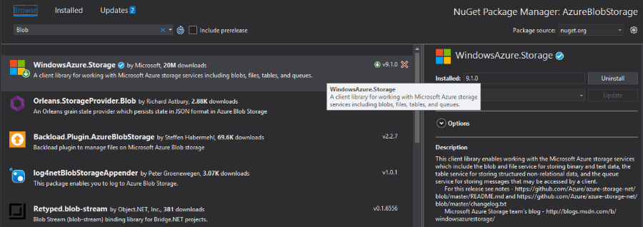
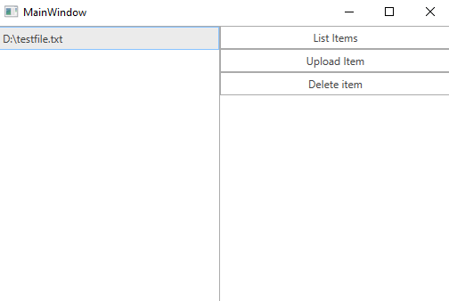

# Blob Storage

Azure Blob storage is a service for storing large amounts of unstructured object data, such as text or binary data, that can be accessed from anywhere in the world via HTTP or HTTPS. You can use Blob storage to expose data publicly to the world, or to store application data privately. This article will demonstrate how one can use this service from a {{ site.framework_name }} application and manage the uploaded files.

## Set up storage account

For the purposes of this article, you will have to create an [Azure Blob Storage account](https://docs.microsoft.com/en-us/azure/storage/common/storage-create-storage-account).

## Step 1: Create the {{ site.framework_name }} Application

Create a standard {{ site.framework_name }} application and add 3 [RadButtons]() and a [RadListBox]() to it. The first button will list all of the files uploaded in our storage. The second button will upload a file and the third one will delete the selected file in the RadListBox.

__Example 1: Defining the view__
```XAML
    <Grid>
        <Grid.ColumnDefinitions>
            <ColumnDefinition Width="250" />
            <ColumnDefinition />
        </Grid.ColumnDefinitions>

        <telerik:RadListBox x:Name="radListBox" ItemsSource="{Binding FileNames}" SelectedItem="{Binding SelectedItem, Mode=TwoWay}" />

        <Grid Grid.Column="1">
            <Grid.RowDefinitions>
                <RowDefinition Height="Auto" />
                <RowDefinition Height="Auto"/>
                <RowDefinition Height="Auto"/>
            </Grid.RowDefinitions>

            <telerik:RadButton Command="{Binding ListItemsCommand}"  Content="List Items"/>
            <telerik:RadButton Command="{Binding UploadItemCommand}" Content="Upload Item" Grid.Row="1"/>
            <telerik:RadButton Command="{Binding DeleteItemCommand}" Content="Delete item" Grid.Row="2"/>
        </Grid>
    </Grid>
```

## Step 2: Install the NuGet package

Open the NuGet Package Manager and install the **WindowsAzure.Storage** package.



## Step 3: Define the ViewModel

The next step is to create the ViewModel. It will need an [CloudStorageAccount](https://docs.microsoft.com/en-us/dotnet/api/microsoft.windowsazure.storage.cloudstorageaccount?view=azure-dotnet), [CloudBlobContainer](https://docs.microsoft.com/en-us/dotnet/api/microsoft.windowsazure.storage.blob.cloudblobcontainer?view=azure-dotnet) and a [CloudBlobClient](https://docs.microsoft.com/en-us/dotnet/api/microsoft.windowsazure.storage.blob.cloudblobclient?view=azure-dotnet) which will be used for connecting to your storage account and for managing the data. We also need to implement all of the commands that the RadButtons are bound to.

__Example 2: Defining the ViewModel__

```C#
    public class ViewModel
    {
        private string connectionString;
        CloudStorageAccount storageAccount;
        CloudBlobContainer cloudBlobContainer;
        CloudBlobClient cloudBlobClient;

        private object selectedItem;
        private ObservableCollection<string> fileNames;
        private IFileDialogService fileDialogService;

        public ViewModel(string connectionString, IFileDialogService fileDialogService)
        {
            this.fileNames = new ObservableCollection<string>();
            this.ListItemsCommand = new DelegateCommand(OnListItems);
            this.UploadItemCommand = new DelegateCommand(OnUploadItem);
            this.DeleteItemCommand = new DelegateCommand(OnDeleteItem);
            this.fileDialogService = fileDialogService;

            this.connectionString = connectionString;

            if (CloudStorageAccount.TryParse(connectionString, out storageAccount))
            {
                // Connection string is valid and the storageAccount variable is set
                cloudBlobClient = storageAccount.CreateCloudBlobClient();
                // Create a new Container with a unique name
                cloudBlobContainer = cloudBlobClient.GetContainerReference("mytestcontainer" + Guid.NewGuid().ToString());
                cloudBlobContainer.Create();
            }
            else
            {
                MessageBox.Show("Could not connect to storage account");
            }
        }

        public object SelectedItem
        {
            get { return this.selectedItem; }
            set { this.selectedItem = value; }
        }

        public ObservableCollection<string> FileNames
        {
            get { return this.fileNames; }
            set { this.fileNames = value; }
        }

        private ICommand listItemsCommand;

        public ICommand ListItemsCommand
        {
            get { return this.listItemsCommand; }
            set { this.listItemsCommand = value; }
        }

        private ICommand deleteItemCommand;

        public ICommand DeleteItemCommand
        {
            get { return this.deleteItemCommand; }
            set { this.deleteItemCommand = value; }
        }

        private ICommand uploadItemCommand;

        public ICommand UploadItemCommand
        {
            get { return this.uploadItemCommand; }
            set { this.uploadItemCommand = value; }
        }

        private void OnDeleteItem(object obj)
        {
            if (this.SelectedItem == null)
            {
                MessageBox.Show("Please select an Item");
                return;
            }
           
            var blockBlob = cloudBlobContainer.GetBlockBlobReference(this.SelectedItem.ToString());
            blockBlob.DeleteIfExists();
        }

        private void OnUploadItem(object obj)
        {
            var fileName = fileDialogService.OpenFileDialog();

            CloudBlockBlob cloudBlockBlob = cloudBlobContainer.GetBlockBlobReference(fileName);
            cloudBlockBlob.UploadFromFile(fileName);
        }

        private void OnListItems(object obj)
        {
            var blobs = cloudBlobContainer.ListBlobs(useFlatBlobListing: true);

            this.FileNames.Clear();

            foreach (CloudBlockBlob blob in blobs)
            {
                this.FileNames.Add(blob.Name);
            }
        }
    }
```
```VB.NET
    Public Class ViewModel
		Private connectionString As String
		Private storageAccount As CloudStorageAccount
		Private cloudBlobContainer As CloudBlobContainer
		Private cloudBlobClient As CloudBlobClient


		Private _selectedItem As Object
		Private _fileNames As ObservableCollection(Of String)
		Private fileDialogService As IFileDialogService

		Public Sub New(ByVal connectionString As String, ByVal fileDialogService As IFileDialogService)
			Me._fileNames = New ObservableCollection(Of String)()
			Me.ListItemsCommand = New DelegateCommand(AddressOf OnListItems)
			Me.UploadItemCommand = New DelegateCommand(AddressOf OnUploadItem)
			Me.DeleteItemCommand = New DelegateCommand(AddressOf OnDeleteItem)
			Me.fileDialogService = fileDialogService

			Me.connectionString = connectionString

			If CloudStorageAccount.TryParse(connectionString, storageAccount) Then
				' Connection string is valid and the storageAccount variable is set
				cloudBlobClient = storageAccount.CreateCloudBlobClient()
				' Create a new Container with a unique name
				cloudBlobContainer = cloudBlobClient.GetContainerReference("mytestcontainer" & Guid.NewGuid().ToString())
				cloudBlobContainer.Create()
			Else
				MessageBox.Show("Could not connect to storage account")
			End If
		End Sub

		Public Property SelectedItem() As Object
			Get
				Return Me._selectedItem
			End Get
			Set(ByVal value As Object)
				Me._selectedItem = value
			End Set
		End Property

		Public Property FileNames() As ObservableCollection(Of String)
			Get
				Return Me._fileNames
			End Get
			Set(ByVal value As ObservableCollection(Of String))
				Me._fileNames = value
			End Set
		End Property


		Private _listItemsCommand As ICommand

		Public Property ListItemsCommand() As ICommand
			Get
				Return Me._listItemsCommand
			End Get
			Set(ByVal value As ICommand)
				Me._listItemsCommand = value
			End Set
		End Property


		Private _deleteItemCommand As ICommand

		Public Property DeleteItemCommand() As ICommand
			Get
				Return Me._deleteItemCommand
			End Get
			Set(ByVal value As ICommand)
				Me._deleteItemCommand = value
			End Set
		End Property

		Private _uploadItemCommand As ICommand

		Public Property UploadItemCommand() As ICommand
			Get
				Return Me._uploadItemCommand
			End Get
			Set(ByVal value As ICommand)
				Me._uploadItemCommand = value
			End Set
		End Property

		Private Sub OnDeleteItem(ByVal obj As Object)
			If Me.SelectedItem Is Nothing Then
				MessageBox.Show("Please select an Item")
				Return
			End If

			Dim blockBlob = cloudBlobContainer.GetBlockBlobReference(Me.SelectedItem.ToString())
			blockBlob.DeleteIfExists()
		End Sub

		Private Sub OnUploadItem(ByVal obj As Object)
			Dim fileName = fileDialogService.OpenFileDialog()

			Dim cloudBlockBlob As CloudBlockBlob = cloudBlobContainer.GetBlockBlobReference(fileName)
			cloudBlockBlob.UploadFromFile(fileName)
		End Sub

		Private Sub OnListItems(ByVal obj As Object)
			Dim blobs = cloudBlobContainer.ListBlobs(useFlatBlobListing:= True)

			Me.FileNames.Clear()

			For Each blob As CloudBlockBlob In blobs
				Me.FileNames.Add(blob.Name)
			Next blob
		End Sub
End Class
```

## Step 4: Define the OpenFileDialogService

The only thing left is to define the interface through which we are opening the [RadOpenFileDialog](). We also need to define the implementation of that interface which will simply open a RadOpenFileDialog and return the path of the opened file.

__Example 3: Defining the OpenFileDialogService and IFileDialogService__

```C#
    public interface IFileDialogService
    {
        string OpenFileDialog();
    }

    public class OpenFileDialogService : IFileDialogService
    {
        public string OpenFileDialog()
        {
            RadOpenFileDialog choosefiledialog = new RadOpenFileDialog();
            choosefiledialog.Filter = "All Files (*.*)|*.*";
            choosefiledialog.FilterIndex = 1;
            choosefiledialog.Multiselect = false;
            choosefiledialog.ShowDialog();

            if (choosefiledialog.DialogResult == true)
            {
                return choosefiledialog.FileName;
            }

            return string.Empty;
        }
    }
```
```VB.NET
    Interface IFileDialogService
        Function OpenFileDialog() As String
    End Interface

    Public Class OpenFileDialogService
    Inherits IFileDialogService

        Public Function OpenFileDialog() As String
            Dim choosefiledialog As RadOpenFileDialog = New RadOpenFileDialog()
            choosefiledialog.Filter = "All Files (*.*)|*.*"
            choosefiledialog.FilterIndex = 1
            choosefiledialog.Multiselect = False
            choosefiledialog.ShowDialog()
            If choosefiledialog.DialogResult = True Then
                Return choosefiledialog.FileName
            End If

            Return String.Empty
        End Function
    End Class
```

All that is left is to set the DataContext to our ViewModel and pass an instance of the OpenFileDialogService and the connection string of the storage account.

__Example 4: Set the DataContext__

```C#
    public MainWindow()
    {
        InitializeComponent();
        var connectionString = "myConnectionString";
        this.DataContext = new ViewModel(connectionString, new OpenFileDialogService());
    }
```
```VB.NET
    Public Sub New()
		InitializeComponent()
		Dim connectionString = "myConnectionString"
		Me.DataContext = New ViewModel(connectionString, New OpenFileDialogService())
    End Sub
```

> You can find the connection string in the **All settings** of your storage account in the **Access keys** section.

#### Figure 1: Example after uploading a file and listing it in the Office2016 theme




## See Also

* [Get started with Azure Blob storage using .NET](https://docs.microsoft.com/en-us/azure/storage/blobs/storage-quickstart-blobs-dotnet)
* [Azure Storage samples using .NET](https://docs.microsoft.com/en-us/azure/storage/common/storage-samples-dotnet?toc=%2fazure%2fstorage%2fblobs%2ftoc.json)