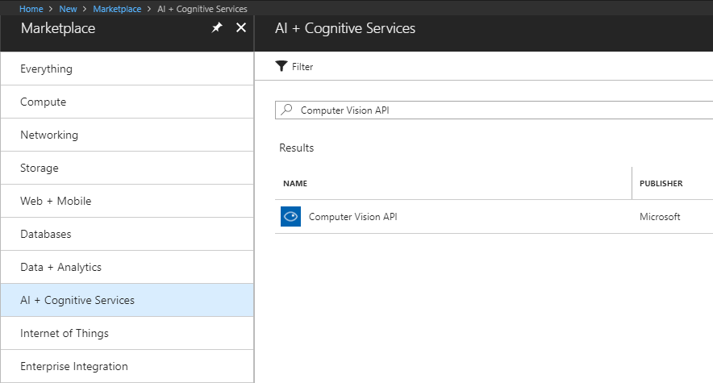
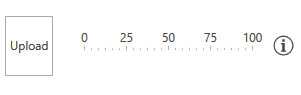

# Image Analysis

This article will guide you through the process of integrating Azure's [Computer Vision API](https://azure.microsoft.com/en-us/services/cognitive-services/computer-vision/) with the controls from the UI for {{ site.framework_name }} suite. More specifically, you will use the [RadFileDialogs](), [RadGauge]() and [RadGlyph]() to create a simple user control which will determine whether an uploaded photo is a portrait or not.

## Create a Computer Vision API Account

Before you start, you need to create a new Computer Vision API account through the Azure portal. This has been explained in great detail in [this article](https://docs.microsoft.com/en-us/azure/cognitive-services/cognitive-services-apis-create-account).



Once you've created the account, you have to obtain the subscription keys that have been generated for you. You will require them later on in order to make API calls from your application.

## Create the Application

[Create a new WPF application]()[Create a new Silverlight application]() and add the following assemblies which you will need.

* **Telerik.Windows.Controls**
* **Telerik.Windows.Controls.DataVisualization**
* **Telerik.Windows.Controls.FileDialogs**
* **Telerik.Windows.Controls.GridView**
* **Telerik.Windows.Data**

You can then [set a theme]() for the application.

Once you've set a theme for your application, add the following dictionary to your list of merged dictionaries which will enable you to use the **TelerikWebUI** [font glyphs]() for the icons in the project.

__Example 1: The User Control's Definition__

```XAML
    <Application.Resources>
		<ResourceDictionary>
			<ResourceDictionary.MergedDictionaries>
				<!-- ... -->
				<ResourceDictionary Source="/Telerik.Windows.Controls;component/Themes/FontResources.xaml"/>
			</ResourceDictionary.MergedDictionaries>
		</ResourceDictionary>
	</Application.Resources>
```

## Define the User Control's Layout

Now, add a new **UserControl** to your project. You can give it a descriptive name, such as ImageUploadControl, for example. Next, define the following XAML:

__Example 2: The User Control's Definition__

```XAML

    <UserControl x:Class="AzureCognitiveServices.ImageUploadControl"
             xmlns="http://schemas.microsoft.com/winfx/2006/xaml/presentation"
             xmlns:x="http://schemas.microsoft.com/winfx/2006/xaml"
             xmlns:mc="http://schemas.openxmlformats.org/markup-compatibility/2006" 
             xmlns:d="http://schemas.microsoft.com/expression/blend/2008" 
             xmlns:local="clr-namespace:AzureCognitiveServices"
             xmlns:telerik="http://schemas.telerik.com/2008/xaml/presentation"
             mc:Ignorable="d" 
             d:DesignHeight="300" d:DesignWidth="300">
		<Grid>
			<Grid.ColumnDefinitions>
				<ColumnDefinition Width="Auto" />
				<ColumnDefinition Width="Auto" />
				<ColumnDefinition Width="Auto" />
			</Grid.ColumnDefinitions>
			<telerik:RadButton Content="Upload" Click="Button1_Click" />
			<telerik:RadHorizontalLinearGauge Grid.Column="1">
				<telerik:HorizontalLinearScale Min="0" Max="100" Margin="10">
					<telerik:HorizontalLinearScale.Indicators>
						<telerik:BarIndicator Value="{Binding Confidence, Mode=TwoWay, RelativeSource={RelativeSource AncestorType=local:ImageUploadControl}}"/>
					</telerik:HorizontalLinearScale.Indicators>
				</telerik:HorizontalLinearScale>
			</telerik:RadHorizontalLinearGauge>
			<Border Grid.Column="2" Margin="10, 0, 0, 0">
				<Border.ToolTip>
					<TextBlock MaxWidth="300" TextWrapping="Wrap" Text="The horizontal gauge on the left displays how likely we are to approve the profile image you provided. If the value shown by the control is less than 50, you may want to upload a different photo." />
				</Border.ToolTip>
				<Path Data="{telerik:RadGlyph Glyph={StaticResource GlyphInformation}}" Fill="{telerik:Office2016Resource ResourceKey=IconBrush}" Width="20" Height="20" Stretch="Uniform" />
			</Border>
		</Grid>
	</UserControl>
```

## Add the Newtonsoft.Json NuGet Package

You now have to add the **Newtonsoft.Json** NuGet package which will allow you to deserialize the returned JSON response.

## Add Reference to System.Net.Http

You also need to add a reference to **System.Net.Http** which holds the API required to make requests to the service's REST API.

## Use the Computer Vision API

The code in **Example 3** handles the button's **Click** event and uses the Computer Vision API to analyze the image uploaded file which is selected from a [RadOpenFileDialog]().

__Example 3: The User Control's Definition__

```XAML

    public partial class ImageUploadControl : UserControl
	{
		const string subscriptionKey = "the subscription key you obtained from Azure";
		const string uriBase = "https://westeurope.api.cognitive.microsoft.com/vision/v1.0/analyze";

		public ImageUploadControl()
		{
			InitializeComponent();
			this.DataContext = this;
		}

		public double Confidence
		{
			get { return (double) GetValue(ConfidenceProperty); }
			set { SetValue(ConfidenceProperty, value); }
		}

		public static readonly DependencyProperty ConfidenceProperty =
			DependencyProperty.Register("Confidence", typeof(double), typeof(ImageUploadControl), new PropertyMetadata(0.0));

		private async void Button1_Click(object sender, RoutedEventArgs e)
		{
			RadOpenFileDialog openFileDialog = new RadOpenFileDialog();
			openFileDialog.Owner = this;
			openFileDialog.Filter = "|Image Files|*.jpg;*.png";
			openFileDialog.ShowDialog();
			if (openFileDialog.DialogResult == true)
			{
				string fileName = openFileDialog.FileName;
				var result = await MakeAnalysisRequest(fileName);
				var res = JsonConvert.DeserializeObject<ImageResponse>(result);
				this.Confidence = (double) (this.CalculatePortraitProbability(res) * 100);
			}
		}

		// ...
	}
```

What's left to do is to define the **MakeAnalysisRequest** method which will get the actual response from the service for the provided image and the **CalculatePortraitProbability** method which will calculate the final result based on the **categories** and **tags** from the response.

__Example 4: The User Control's Definition__

```XAML

	/// <summary>
	/// Gets the analysis of the specified image file by using the Computer Vision REST API.
	/// </summary>
	/// <param name="imageFilePath">The image file.</param>
	static async Task<string> MakeAnalysisRequest(string imageFilePath)
	{
		HttpClient client = new HttpClient();

		// Request headers.
		client.DefaultRequestHeaders.Add("Ocp-Apim-Subscription-Key", subscriptionKey);

		// Request parameters. A third optional parameter is "details".
		string requestParameters = "visualFeatures=Categories,Faces,Tags&language=en";

		// Assemble the URI for the REST API Call.
		string uri = uriBase + "?" + requestParameters;

		HttpResponseMessage response;

		// Request body. Posts a locally stored JPEG image.
		byte[] byteData = GetImageAsByteArray(imageFilePath);

		using (ByteArrayContent content = new ByteArrayContent(byteData))
		{
			// This example uses content type "application/octet-stream".
			// The other content types you can use are "application/json" and "multipart/form-data".
			content.Headers.ContentType = new MediaTypeHeaderValue("application/octet-stream");

			// Execute the REST API call.
			response = await client.PostAsync(uri, content);

			// Get the JSON response.
			return await response.Content.ReadAsStringAsync();
		}
	}

	/// <summary>
	/// Returns the contents of the specified file as a byte array.
	/// </summary>
	/// <param name="imageFilePath">The image file to read.</param>
	/// <returns>The byte array of the image data.</returns>
	static byte[] GetImageAsByteArray(string imageFilePath)
	{
		FileStream fileStream = new FileStream(imageFilePath, FileMode.Open, FileAccess.Read);
		BinaryReader binaryReader = new BinaryReader(fileStream);
		return binaryReader.ReadBytes((int) fileStream.Length);
	}

	public class ImageResponse
	{
		public IList<Category> Categories { get; set; }

		public IList<Tag> Tags { get; set; }

		public IList<object> Faces { get; set; }
	}

	public class Tag
	{
		public string Name { get; set; }

		public decimal Confidence { get; set; }
	}

	public class Category
	{
		public string Name { get; set; }
		public decimal Score { get; set; }
	}

	private decimal CalculatePortraitProbability(ImageResponse res)
	{
		if (res.Faces.Any())
		{
			if (res.Faces.Count > 1)
			{
				return 0;
			}
			else
			{
				var portraitCategory = res.Categories.FirstOrDefault(r => r.Name == "people_portrait");
				if (portraitCategory != null)
				{
					return portraitCategory.Score;
				}
				else
				{
					var personCategory = res.Categories.FirstOrDefault(r => r.Name == "people_");
					if (personCategory != null)
					{
						return personCategory.Score;
					}
					else
					{
						var personTag = res.Tags.FirstOrDefault(t => t.Name == "person");
						if (personTag != null)
						{
							return personTag.Confidence * 0.7M;
						}
					}
				}
			}
		}

		return 0;
	}
```

The code from **Example 4** creates an HTTP request which is asynchronously processed by the service. The returned JSON is then deserialized into an **ImageResponse** instance which is modeled to hold the data (an example of the actual JSON which is returned can be found in [this article](https://docs.microsoft.com/en-us/azure/cognitive-services/computer-vision/quickstarts/csharp#analyze-an-image-response)).

Finally, the **CalculatePortraitProbability** method analyzes the ImageResponse and based on some custom logic returns a value between **0 and 1** which is the probability based on our custom criteria that the image is actually a portrait. You're free to customize this logic based on your project's requirements.

Once the probability is calculated it is passed to the **Confidence** property of our control which in turn updates the value of the [RadHorizontalLinearGauge]()'s indicator to inform the user whether he should upload another photo.

## Use the User Control

That's it. You can now use the control however you find necessary to analyze uploaded images.

__Example 5: Use the User Control__

```XAML

	<local:ImageUploadControl Height="60" />
```

**Figure 1** shows the final result in the Office2016 theme.

#### Figure 1: The custom image upload control in the Office2016 theme



## See Also

* [Speech-to-Text]()
* [Text Analysis]()
* [Blob Storage]()
* [Azure SQL Database]()