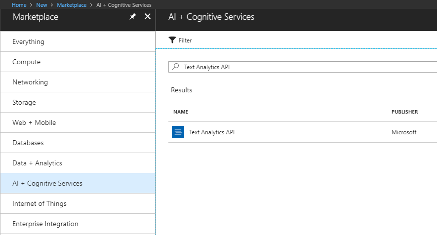
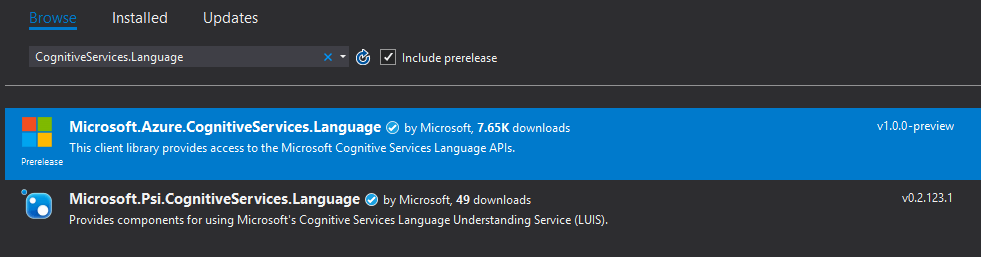
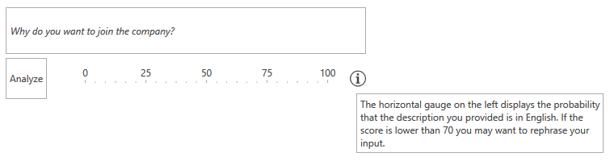

# Text Analysis

This article will guide you through the process of integrating Azure's [Text Analytics API](https://azure.microsoft.com/en-us/services/cognitive-services/text-analytics/) with the controls from the UI for {{ site.framework_name }} suite. More specifically, you will use the [RadWatermarkTextBox](), [RadGauge]() and [RadGlyph]() to create a simple user control which will determine whether the text which is entered is in English or not as well as analyze its sentiment.

## Create a Text Analytics API Account

Before you start, you need to create a new Text Analytics API account through the Azure portal. This has been explained in great detail in [this article](https://docs.microsoft.com/en-us/azure/cognitive-services/cognitive-services-apis-create-account).



Once you've created the account, you have to obtain the subscription keys that have been generated for you. You will require them later on in order to make API calls from your application.

## Create the Application

Start by [creating a new WPF application]()[creating a new Silverlight application]() and add the following assemblies which you will need.

* **Telerik.Windows.Controls**
* **Telerik.Windows.Controls.DataVisualization**
* **Telerik.Windows.Data**

You can then [set a theme]() for the application.

Once you've set a theme for your application, add the following dictionary to your list of merged dictionaries which will enable you to use the **TelerikWebUI** [font glyphs]() for the icons in the project.

__Example 1: The User Control's Definition__

```XAML
    <Application.Resources>
		<ResourceDictionary>
			<ResourceDictionary.MergedDictionaries>
				<!-- ... -->
				<ResourceDictionary Source="/Telerik.Windows.Controls;component/Themes/FontResources.xaml"/>
			</ResourceDictionary.MergedDictionaries>
		</ResourceDictionary>
	</Application.Resources>
```

## Define the User Control's Layout

Now, add a new **UserControl** to your project. You can give it a descriptive name, such as TextAnalysisControl, for example. Next, define the following XAML:

__Example 2: The User Control's Definition__

```XAML

    <UserControl x:Class="AzureCognitiveServices.TextAnalysisControl"
             xmlns="http://schemas.microsoft.com/winfx/2006/xaml/presentation"
             xmlns:x="http://schemas.microsoft.com/winfx/2006/xaml"
             xmlns:mc="http://schemas.openxmlformats.org/markup-compatibility/2006" 
             xmlns:d="http://schemas.microsoft.com/expression/blend/2008" 
             xmlns:telerik="http://schemas.telerik.com/2008/xaml/presentation"
             xmlns:local="clr-namespace:AzureCognitiveServices"
             mc:Ignorable="d" 
             d:DesignHeight="300" d:DesignWidth="300">
		<Grid>
			<Grid.ColumnDefinitions>
				<ColumnDefinition Width="Auto" />
				<ColumnDefinition Width="*" />
				<ColumnDefinition Width="Auto" />
			</Grid.ColumnDefinitions>
			<Grid.RowDefinitions>
				<RowDefinition Height="Auto" />
				<RowDefinition Height="Auto" />
				<RowDefinition Height="Auto" />
			</Grid.RowDefinitions>
			<telerik:RadWatermarkTextBox x:Name="tb" Grid.ColumnSpan="3" MinLines="3" Margin="0, 0, 0, 5" TextWrapping="Wrap" AcceptsReturn="True" WatermarkContent="Why do you want to join the company?" />
			<telerik:RadButton Content="Analyze" Click="RadButton_Click" Grid.Row="1" />
			<telerik:RadHorizontalLinearGauge Grid.Row="1" Grid.Column="1">
				<telerik:HorizontalLinearScale Min="0" Max="100" Margin="10">
					<telerik:HorizontalLinearScale.Indicators>
						<telerik:BarIndicator Value="{Binding Confidence, Mode=TwoWay, RelativeSource={RelativeSource AncestorType=local:TextAnalysisControl}}"/>
					</telerik:HorizontalLinearScale.Indicators>
				</telerik:HorizontalLinearScale>
			</telerik:RadHorizontalLinearGauge>
			<Border Grid.Row="1" Grid.Column="2" Background="Transparent">
				<Border.ToolTip>
					<TextBlock MaxWidth="300" TextWrapping="Wrap" Text="The horizontal gauge on the left displays the probability that the description you provided is in English and has a positive tone. If the score is lower than 70 you may want to rephrase your input." />
				</Border.ToolTip>
				<Path  Data="{telerik:RadGlyph Glyph={StaticResource GlyphInformation}}" Fill="{telerik:Office2016Resource ResourceKey=IconBrush}" Width="20" Height="20" Stretch="Uniform" />
			</Border>
		</Grid>
	</UserControl>
```

## Add the Microsoft.Azure.CognitiveServices.Language NuGet Package

You can now add the **Microsoft.Azure.CognitiveServices.Language** NuGet package corresponding which provides access to the Microsoft Cognitive Services Language APIs.

> The package requires a .NET Framework version equal or higher than **4.5.2**. If you're using a lower version, you will need to call the HTTP endpoints directly from C# and serialize and deserialize the requests and responses similarly to the example found in the [Image Analysis]() article.



## Use the Text Analytics API

**Example 3** demonstrates how to handle the button's **Click** event and use the Text Analytics API to analyze the text input in the RadWatermarkBox.

__Example 3: The User Control's Definition__

```XAML

    public partial class TextAnalysisControl : UserControl
    {
        const string subscriptionKey = "the subscription key you obtained from Azure";
        private ITextAnalyticsAPI client;

        public TextAnalysisControl()
        {
            InitializeComponent();
            client = new TextAnalyticsAPI();
            client.AzureRegion = AzureRegions.Westeurope;
            client.SubscriptionKey = subscriptionKey;
        }

        public double Confidence
        {
            get { return (double) GetValue(ConfidenceProperty); }
            set { SetValue(ConfidenceProperty, value); }
        }
        
        public static readonly DependencyProperty ConfidenceProperty =
            DependencyProperty.Register("Confidence", typeof(double), typeof(TextAnalysisControl), new PropertyMetadata(0.0));

        private async Task<double?> MakeAnalysisRequest(string text)
        {
            LanguageBatchResult languageResult = await client.DetectLanguageAsync(
                    new BatchInput(
                        new List<Input>()
                        {
                          new Input("1", text)
                        }));

			var detectedLanguage = languageResult.Documents.First().DetectedLanguages.First();
			var englishProbability = detectedLanguage.Name == "English" ? detectedLanguage.Score : 0;

			SentimentBatchResult sentimentResult = await client.SentimentAsync(
			new MultiLanguageBatchInput(new List<MultiLanguageInput>()
			{
				new MultiLanguageInput(detectedLanguage.Iso6391Name, "1", text)
			}));

			double? sentiment = 0;
			if (sentimentResult.Documents.Any())
			{
				sentiment = sentimentResult.Documents.First().Score;
			}

			return (englishProbability + sentiment) / 2;
        }

        private async void RadButton_Click(object sender, RoutedEventArgs e)
        {
            var result = await MakeAnalysisRequest(tb.Text);
            this.Confidence = (double) (result * 100);
        }
    }
```

The code from **Example 3** first sets up the **TextAnalyticsAPI** by specifying the region and subscription key of the Text Analytics API account you set up earlier. 

The click of the **Analyze** button in turn invokes the **MakeAnalysisRequest** method which first asynchronously calls the **DetectLanguageAsync** and **SentimentAsync** methods which will detect the language and the sentiment of the provided text and return a **value between 0 and 1** as the result.

Once both results are retrieved, the code calculates their average and passes it to the **Confidence** property of our control which in turn updates the value of the [RadHorizontalLinearGauge]()'s indicator to inform the users whether they should rephrase their input.

## Use the User Control

That's it. You can now use the control however you find necessary to analyze user input.

__Example 4: Use the User Control__

```XAML

	<local:TextAnalysisControl Height="60" />
```

**Figure 1** shows the final result in the Office2016 theme.

#### Figure 1: The custom text analytics control in the Office2016 theme



## See Also

* [Speech-to-Text]()
* [Image Analysis]()
* [Blob Storage]()
* [Azure SQL Database]()
