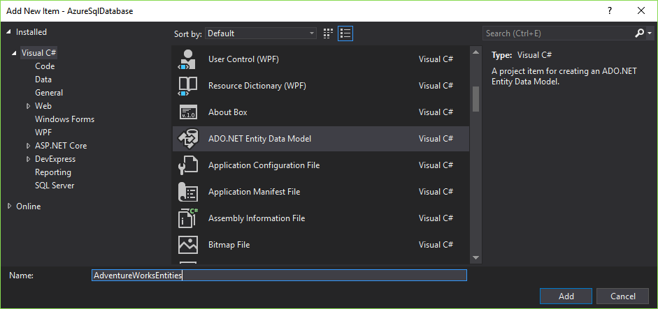
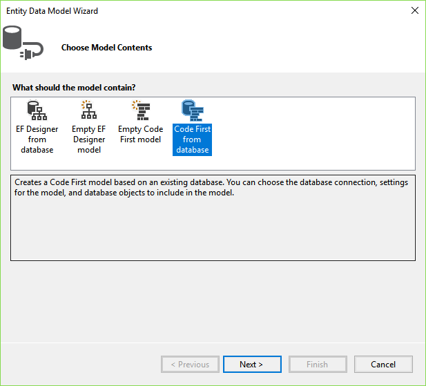
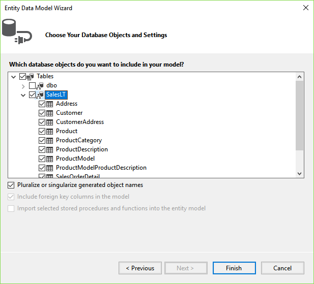
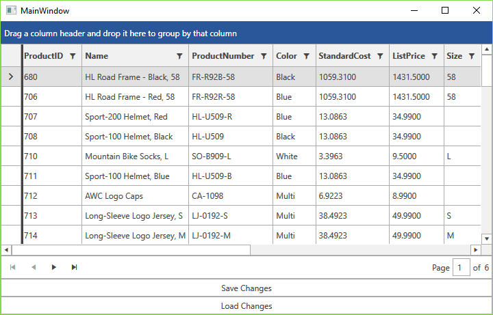

# SQL Database

This article demonstrates how to integrate an Azure's [SQL Database](https://azure.microsoft.com/en-us/services/sql-database/) and display the data using the [RadGridView]() and [RadDataPager]() controls. For the purpose, you will use the **QueryableEntityCollectionView** class which will transfer all the group, filter, sort and paging operations to the cloud.

* [Set Up the Database](#set-up-the-database)
* [Create the Application](#create-the-application)
* [Reverse-engineer the Database Using Entity Framework](#reverse-engineer-the-database-using-entity-framework)
* [Define the ViewModel](#define-the-viewmodel)
* [Query the Data](#query-the-data)
* [Save and Load Changes To and From the Database](#save-and-load-changes-to-and-from-the-database)
* [Create the Layout](#create-the-layout)

## Step 1: Set Up the Database

Start by setting up the **AdventureWorksLT** database from the [Create an Azure SQL Database Tutorial](https://docs.microsoft.com/en-us/azure/sql-database/sql-database-get-started-portal).

## Step 2: Create the Application

[Create a new WPF application]()[Create a new Silverlight application]() and add the following assemblies which you will need.

* **Telerik.Windows.Controls**
* **Telerik.Windows.Controls.Data**
* **Telerik.Windows.Controls.EntityFramework60**
* **Telerik.Windows.Controls.GridView**
* **Telerik.Windows.Controls.Input**
* **Telerik.Windows.Data**

## Step 3: Reverse-engineer the Database Using Entity Framework

1. Add a new item to your project and choose **ADO.NET Entity Data Model** from the list of available items.

2. Give it a suitable name such as **AdventureWorksEntities** and click **Add**.



3. Choose **Code First from database** from the **Choose Model Contents** dialog.



4. Click on **New Connection...** and input the server name and credentials which you can obtain from the Azure portal. Choose the **SQL Server Authentication** option to log on to the server.

5. Choose whether or not to include the sensitive data in the connection string, choose a name for it and click **Next**.

6. Pick the database object you wish to include and click **Finish**.



You are now able to work with the entities you chose through the created **DbContext** - AdventureWorksEntities in our case.

## Step 4: Define the ViewModel

All the interaction with the Azure SQL Database will be done by the viewmodel. First define the properties which will be used to interact with the view.

__Example 1: Define public properties__

```C#

    public class MainWindowViewModel : ViewModelBase
	{
		private QueryableCollectionView view;
		private bool isBusy;

		public ICommand SaveChangesCommand { get; set; }
		public ICommand LoadDataCommand { get; set; }

		public MainWindowViewModel()
		{
		}

		public QueryableCollectionView View
		{
			get { return this.view; }
			set
			{
				if (this.view != value)
				{
					this.view = value;
					this.OnPropertyChanged("View");
				}
			}
		}

		public bool IsBusy
		{
			get { return this.isBusy; }
			set
			{
				if (this.isBusy != value)
				{
					this.isBusy = value;
					this.OnPropertyChanged("IsBusy");
				}
			}
		}
	}
```

## Step 5: Query the Data

Now what's left is to actually make the connection to the database and query the data. For the purpose, create a new **BackgroundWorker** in the viewmodel's constructor and handle the **DoWork** and **RunWorkerCompleted** events as shown in **Example 3**.

__Example 2: Add logic to work with the SQL database__

```C#

    public class MainWindowViewModel : ViewModelBase
	{
		// ...
		private readonly BackgroundWorker worker;
		private AdventureWorksEntities context;

		public MainWindowViewModel()
		{
			this.IsBusy = true;
			this.worker = new BackgroundWorker();
			this.worker.DoWork += worker_DoWork;
			this.worker.RunWorkerCompleted += worker_RunWorkerCompleted;
			this.worker.RunWorkerAsync();
		}

        // ...

		private void worker_DoWork(object sender, DoWorkEventArgs e)
		{
			this.context = new AdventureWorksEntities();
			var objectContext = ((IObjectContextAdapter) this.context).ObjectContext;
			e.Result = objectContext;
		}

		private void worker_RunWorkerCompleted(object sender, RunWorkerCompletedEventArgs e)
		{
			this.View = new QueryableEntityCollectionView<Product>(e.Result as ObjectContext, "Products");
			this.IsBusy = false;
		}
	}
```

What the code in **Example 3** does is to set the **IsBusy** property so that some indication is displayed in the UI. It then initializes the **BackgroundWorker**, subscribes to its events and runs it asynchronously. The **DoWork** handler then creates a new instance of the **AdventureWorksEntities** class and gets its **ObjectContext** via the explicit implementation of the **IObjectContextAdapter** interface.

The **RunWorkerCompleted** event handler then creates a new instance of the generic **QueryableEntityCollectionView** class by passing the **ObjectContext** obtained as a result of the background worker and the entity set name, in this case - **"Products"**. This QueryableEntityCollectionView will in turn handle all the group, filter, sort and paging operations on the server.

## Save and Load Changes To and From the Database

The final step is to actually save any changes that are made the database as well as obtain the updated data in case any changes on the cloud have occured. **Example 4** demonstrates the code for these two operations.

__Example 3: Save and load changes__

```C#

    public MainWindowViewModel()
    {
        // ...
        this.SaveChangesCommand = new DelegateCommand(OnSaveChangesCommandExecuted);
        this.LoadDataCommand = new DelegateCommand(OnLoadDataCommandExecuted);
    }

    // ...

    private void OnSaveChangesCommandExecuted(object obj)
    {
        this.context.SaveChanges();
    }

    private void OnLoadDataCommandExecuted(object obj)
    {
        this.IsBusy = true;
        this.worker.RunWorkerAsync();
    }
```

## Step 6: Create the Layout

All that's left is to define the actual user interface clients of this application will use. The layout consists of a RadGridView to display the data, a RadDataPager to page it and two buttons - one to save the changes to the database and one to load newly-updated data from the cloud. Note that the **local** namespace in the example corresponds to the namespace where **MainWindowViewModel** resides.

__Example 4: The final layout__

```XAML

    <Grid>
		<Grid.DataContext>
			<local:MainWindowViewModel />
		</Grid.DataContext>
        <Grid.RowDefinitions>
            <RowDefinition Height="\*" />
            <RowDefinition Height="Auto" />
            <RowDefinition Height="Auto" />
            <RowDefinition Height="Auto" />
        </Grid.RowDefinitions>
        <telerik:RadGridView IsBusy="{Binding IsBusy}" ItemsSource="{Binding View}"/>
        <telerik:RadDataPager Grid.Row="1" PageSize="50" Source="{Binding View}"/>
        <telerik:RadButton Grid.Row="2" Content="Save Changes" Command="{Binding SaveChangesCommand}" />
		<telerik:RadButton Grid.Row="3" Content="Load Changes" Command="{Binding LoadDataCommand}" />
    </Grid>
```

**Figure 1** demonstrates the final result in the **Office2016** theme.

#### Figure 1: The resulting layout in the Office2016 theme



## See Also

* [Image Analysis]()
* [Blob Storage]()