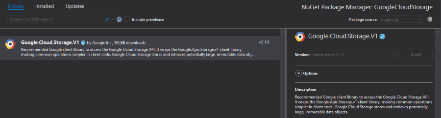

# Cloud Storage

Google Cloud Storage allows world-wide storage and retrieval of any amount of data at any time. It can be used for a range of scenarios including serving website content, storing data for archival and disaster recovery, or distributing large data objects to users via direct download.

## Enable APIs

For the purposes of this article, you will have to enable the Google Cloud Storage API and Google Cloud Storage JSON API. Please read the [Getting Started]() for more information on how you can achieve that.

## Step 1: Create the {{ site.framework_name }} Application

Create a standard {{ site.framework_name }} application and add 3 [RadButtons]() and a [RadListBox]() to it. The first button will list all of the files uploaded in our storage. The second button will upload a file and the third one will delete the selected file in the RadListBox.

__Example 1: Defining the view__
```XAML
    <Grid>
        <Grid.ColumnDefinitions>
            <ColumnDefinition Width="250" />
            <ColumnDefinition />
        </Grid.ColumnDefinitions>

        <telerik:RadListBox x:Name="radListBox" ItemsSource="{Binding FileNames}" SelectedItem="{Binding SelectedItem, Mode=TwoWay}" />

        <Grid Grid.Column="1">
            <Grid.RowDefinitions>
                <RowDefinition Height="Auto" />
                <RowDefinition Height="Auto"/>
                <RowDefinition Height="Auto"/>
            </Grid.RowDefinitions>

            <telerik:RadButton Command="{Binding ListItemsCommand}"  Content="List Items"/>
            <telerik:RadButton Command="{Binding UploadItemCommand}" Content="Upload Item" Grid.Row="1"/>
            <telerik:RadButton Command="{Binding DeleteItemCommand}" Content="Delete item" Grid.Row="2"/>
        </Grid>
    </Grid>
```

## Step 2: Install the NuGet package

Open the NuGet Package Manager and install the **Google.Cloud.Storage.V1** package.



## Step 3: Define the ViewModel

The next step is to create the ViewModel. It will need an [StorageClient](https://googlecloudplatform.github.io/google-cloud-dotnet/docs/Google.Cloud.Storage.V1/api/Google.Cloud.Storage.V1.StorageClient.html) object which will be used for uploading, deleting and listing files. We also need to implement all of the commands that the RadButtons are bound to.

__Example 2: Defining the ViewModel__

```C#
    public class ViewModel
    {
        private StorageClient storageClient;

        private const string ProjectId = "myprojectId";
        private const string BucketName = ProjectId + "-test-bucket";

        private object selectedItem;
        private ObservableCollection<string> fileNames;
        private IFileDialogService fileDialogService;

        public ViewModel(IFileDialogService fileDialogService)
        {
            this.storageClient = StorageClient.Create();
            storageClient.CreateBucket(ProjectId, BucketName);

            this.fileNames = new ObservableCollection<string>();
            this.ListItemsCommand = new DelegateCommand(OnListItems);
            this.UploadItemCommand = new DelegateCommand(OnUploadItem);
            this.DeleteItemCommand = new DelegateCommand(OnDeleteItem);
            this.fileDialogService = fileDialogService;
        }

        public object SelectedItem
        {
            get { return this.selectedItem; }
            set { this.selectedItem = value; }
        }

        public ObservableCollection<string> FileNames
        {
            get { return this.fileNames; }
            set { this.fileNames = value; }
        }

        private ICommand listItemsCommand;

        public ICommand ListItemsCommand
        {
            get { return this.listItemsCommand; }
            set { this.listItemsCommand = value; }
        }

        private ICommand deleteItemCommand;

        public ICommand DeleteItemCommand
        {
            get { return this.deleteItemCommand; }
            set { this.deleteItemCommand = value; }
        }

        private ICommand uploadItemCommand;

        public ICommand UploadItemCommand
        {
            get { return this.uploadItemCommand; }
            set { this.uploadItemCommand = value; }
        }

        private void OnDeleteItem(object obj)
        {
            if (this.SelectedItem == null)
            {
                MessageBox.Show("Please select an Item");
                return;
            }

            storageClient.DeleteObject(BucketName, this.SelectedItem.ToString());
        }

        private void OnUploadItem(object obj)
        {
            var fileName = fileDialogService.OpenFileDialog();

            Stream fileStream = File.OpenRead(fileName);
            
            var test = storageClient.UploadObject(BucketName, fileName, null, fileStream);
        }

        private void OnListItems(object obj)
        {
            var items = storageClient.ListObjects(BucketName);

            this.FileNames.Clear();

            foreach (Google.Apis.Storage.v1.Data.Object item in items)
            {
                this.FileNames.Add(item.Name);
            }
        }
    }
```
```VB.NET
    Public Class ViewModel
		Private storageClient As StorageClient

		Private Const ProjectId As String = "myprojectId"
		Private Const BucketName As String = ProjectId & "-test-bucket"


		Private _selectedItem As Object
		Private _fileNames As ObservableCollection(Of String)
		Private fileDialogService As IFileDialogService

		Public Sub New(ByVal fileDialogService As IFileDialogService)
			Me.storageClient = StorageClient.Create()
			storageClient.CreateBucket(ProjectId, BucketName)

			Me._fileNames = New ObservableCollection(Of String)()
			Me.ListItemsCommand = New DelegateCommand(AddressOf OnListItems)
			Me.UploadItemCommand = New DelegateCommand(AddressOf OnUploadItem)
			Me.DeleteItemCommand = New DelegateCommand(AddressOf OnDeleteItem)
			Me.fileDialogService = fileDialogService
		End Sub

		Public Property SelectedItem() As Object
			Get
				Return Me._selectedItem
			End Get
			Set(ByVal value As Object)
				Me._selectedItem = value
			End Set
		End Property

		Public Property FileNames() As ObservableCollection(Of String)
			Get
				Return Me._fileNames
			End Get
			Set(ByVal value As ObservableCollection(Of String))
				Me._fileNames = value
			End Set
		End Property


		Private _listItemsCommand As ICommand

		Public Property ListItemsCommand() As ICommand
			Get
				Return Me._listItemsCommand
			End Get
			Set(ByVal value As ICommand)
				Me._listItemsCommand = value
			End Set
		End Property


		Private _deleteItemCommand As ICommand

		Public Property DeleteItemCommand() As ICommand
			Get
				Return Me._deleteItemCommand
			End Get
			Set(ByVal value As ICommand)
				Me._deleteItemCommand = value
			End Set
		End Property


		Private _uploadItemCommand As ICommand

		Public Property UploadItemCommand() As ICommand
			Get
				Return Me._uploadItemCommand
			End Get
			Set(ByVal value As ICommand)
				Me._uploadItemCommand = value
			End Set
		End Property

		Private Sub OnDeleteItem(ByVal obj As Object)
			If Me.SelectedItem Is Nothing Then
				MessageBox.Show("Please select an Item")
				Return
			End If

			storageClient.DeleteObject(BucketName, Me.SelectedItem.ToString())
		End Sub

		Private Sub OnUploadItem(ByVal obj As Object)
			Dim fileName = fileDialogService.OpenFileDialog()

			Dim fileStream As Stream = File.OpenRead(fileName)

			Dim test = storageClient.UploadObject(BucketName, fileName, Nothing, fileStream)
		End Sub

		Private Sub OnListItems(ByVal obj As Object)
			Dim items = storageClient.ListObjects(BucketName)

			Me.FileNames.Clear()

			For Each item As Google.Apis.Storage.v1.Data.Object In items
				Me.FileNames.Add(item.Name)
			Next item
		End Sub
    End Class
```

> In order to locate your project id, please read the [Locate the project ID](https://support.google.com/cloud/answer/6158840?hl=en) help article.

## Step 4: Define the OpenFileDialogService

The only thing left is to define the interface through which we are opening the [RadOpenFileDialog](). We also need to define the implementation of that interface which will simply open a RadOpenFileDialog and return the path of the opened file.

__Example 3: Defining the OpenFileDialogService and IFileDialogService__

```C#
    public interface IFileDialogService
    {
        string OpenFileDialog();
    }

    public class OpenFileDialogService : IFileDialogService
    {
        public string OpenFileDialog()
        {
            RadOpenFileDialog choosefiledialog = new RadOpenFileDialog();
            choosefiledialog.Filter = "All Files (*.*)|*.*";
            choosefiledialog.FilterIndex = 1;
            choosefiledialog.Multiselect = false;
            choosefiledialog.ShowDialog();

            if (choosefiledialog.DialogResult == true)
            {
                return choosefiledialog.FileName;
            }

            return string.Empty;
        }
    }
```
```VB.NET
    Interface IFileDialogService
        Function OpenFileDialog() As String
    End Interface

    Public Class OpenFileDialogService
    Inherits IFileDialogService

        Public Function OpenFileDialog() As String
            Dim choosefiledialog As RadOpenFileDialog = New RadOpenFileDialog()
            choosefiledialog.Filter = "All Files (*.*)|*.*"
            choosefiledialog.FilterIndex = 1
            choosefiledialog.Multiselect = False
            choosefiledialog.ShowDialog()
            If choosefiledialog.DialogResult = True Then
                Return choosefiledialog.FileName
            End If

            Return String.Empty
        End Function
    End Class
```

All that is left is to set the DataContext to our ViewModel and pass an instance of the OpenFileDialogService.

__Example 4: Set the DataContext__

```C#
    public MainWindow()
    {
        InitializeComponent();
            
        this.DataContext = new ViewModel(new OpenFileDialogService());
    }
```
```VB.NET
    Public Sub New()
		InitializeComponent()

		Me.DataContext = New ViewModel(New OpenFileDialogService())
    End Sub
```

#### Figure 1: Example after uploading a file and listing it in the Office2016 theme


## See Also