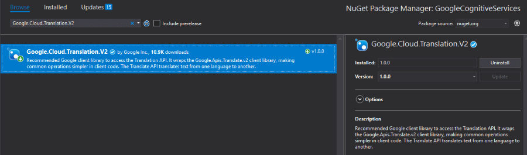
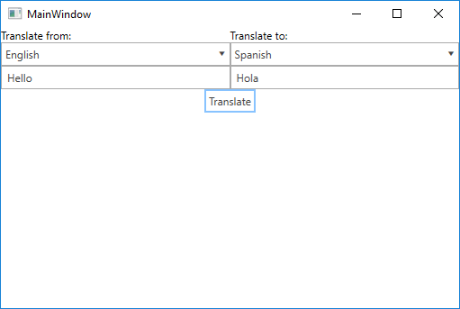

# Translation

In this article we are going to show you how to use Google's Translation API. The process of embedding the functionality in your .NET application is very easy once you have enabled the feature from your [GCP console](https://console.cloud.google.com/).

## Step 1: Create the {{ site.framework_name }} Application

Create a standard {{ site.framework_name }} application and add 2 [RadComboBoxes](), 2 [RadWaterMarkTextBoxes]() and a [RadButton](). The RadComboBoxes will provide a choice for source and target language of the translation, the RadWaterMarkTextBoxes will hold the text that has to be translated and its translation in the chosen language. The RadButton will make a call to Google's Translation API through a Command.

__Example 1: Defining the view__
```XAML
    <Grid>
        <Grid.ColumnDefinitions>
            <ColumnDefinition Width="*" />
            <ColumnDefinition />

        </Grid.ColumnDefinitions>
        <Grid.RowDefinitions>
            <RowDefinition Height="Auto" />
            <RowDefinition />
        </Grid.RowDefinitions>

        <StackPanel >
            <TextBlock Text="Translate from:" />
            <telerik:RadComboBox ItemsSource="{Binding Languages}" DisplayMemberPath="Name" SelectedValue="{Binding SourceLanguageCode}" SelectedValuePath="Code" />
            <telerik:RadWatermarkTextBox Text="{Binding SourceLanguageText, Mode=TwoWay, UpdateSourceTrigger=PropertyChanged}" WatermarkContent="Text to translate"/>
        </StackPanel>

        <StackPanel  Grid.Column="1">
            <TextBlock Text="Translate to:" />
            <telerik:RadComboBox ItemsSource="{Binding Languages}" DisplayMemberPath="Name" SelectedValue="{Binding TargetLanguageCode}" SelectedValuePath="Code"/>
            <telerik:RadWatermarkTextBox Text="{Binding TranslatedLanguageText, Mode=TwoWay}" WatermarkContent="Translated Text" IsReadOnly="True"/>
        </StackPanel>

        <telerik:RadButton Grid.Row="1" Grid.ColumnSpan="2" Content="Translate" Command="{Binding TranslateTextCommand}"  VerticalAlignment="Top" HorizontalAlignment="Center"/>
    </Grid>
```

## Step 2: Install the NuGet package

Open the NuGet Package Manager and install the **Google.Cloud.Translation.V2** package.



## Step 3: Define the ViewModel

The next step is to create the ViewModel. It will need a [TranslationClient](https://googlecloudplatform.github.io/google-cloud-dotnet/docs/Google.Cloud.Translation.V2/api/Google.Cloud.Translation.V2.TranslationClient.html) object which will be used for calling the Translation API. We also need to implement the command that will call the Translation API via the TranslationClient. 

__Example 2: Defining the ViewModel__
```C#
    public class ViewModel : ViewModelBase
    {
        TranslationClient client = null;
        private IList<Language> languages;

        private string sourceLanguageText = string.Empty;
        private string translatedLanguageText;
        private string sourceLanguageCode;
        private string targetLanguageCode;

        public ViewModel()
        {
            var credentials = GoogleCredential.GetApplicationDefault();
            this.client = TranslationClient.Create(credentials);
            this.Languages = client.ListLanguages("en");

            this.TranslateTextCommand = new DelegateCommand(OnTranslateText, OnCanTranslateText);
            this.TranslateTextCommand.InvalidateCanExecute();
        }

        public DelegateCommand TranslateTextCommand { get; set; }

        public string SourceLanguageText
        {
            get
            {
                return this.sourceLanguageText;
            }

            set
            {
                if(this.sourceLanguageText != value)
                {
                    this.sourceLanguageText = value;
                    this.OnPropertyChanged("SourceLanguageText");
                    this.TranslateTextCommand.InvalidateCanExecute();
                }
            }
        }

        public string SourceLanguageCode
        {
            get { return sourceLanguageCode; }
            set
            {
                sourceLanguageCode = value;
                this.OnPropertyChanged("SourceLanguageCode");
                this.TranslateTextCommand.InvalidateCanExecute();
            }
        }

        public string TargetLanguageCode
        {
            get { return targetLanguageCode; }
            set
            {
                targetLanguageCode = value;
                this.OnPropertyChanged("TargetLanguageCode");
                this.TranslateTextCommand.InvalidateCanExecute();
            }
        }

        public IList<Language> Languages
        {
            get { return this.languages; }
            set { this.languages = value; }
        }
        
        public string TranslatedLanguageText
        {
            get
            {
                return this.translatedLanguageText;
            }

            set
            {
                if (this.translatedLanguageText != value)
                {
                    this.translatedLanguageText = value;
                    this.OnPropertyChanged("TranslatedLanguageText");
                }
            }
        }

        private bool OnCanTranslateText(object obj)
        {
            var canTranslate = this.SourceLanguageText.Length > 0 && this.SourceLanguageCode != null && this.TargetLanguageCode != null;

            return canTranslate;
        }

        private void OnTranslateText(object obj)
        {
            this.TranslatedLanguageText = client.TranslateText(this.SourceLanguageText, this.TargetLanguageCode, sourceLanguage : this.SourceLanguageCode).TranslatedText;
        }
    }
```
```VB.NET
    Public Class ViewModel
	Inherits ViewModelBase

		Private client As TranslationClient = Nothing
		Private _languages As IList(Of Language)

		Private _sourceLanguageText As String = String.Empty
		Private _translatedLanguageText As String
		Private _sourceLanguageCode As String
		Private _targetLanguageCode As String

		Public Sub New()
			Dim credentials = GoogleCredential.GetApplicationDefault()
			Me.client = TranslationClient.Create(credentials)
			Me.Languages = client.ListLanguages("en")

			Me.TranslateTextCommand = New DelegateCommand(AddressOf OnTranslateText, AddressOf OnCanTranslateText)
			Me.TranslateTextCommand.InvalidateCanExecute()
		End Sub

		Public Property TranslateTextCommand() As DelegateCommand

		Public Property SourceLanguageText() As String
			Get
				Return Me._sourceLanguageText
			End Get

			Set(ByVal value As String)
				If Me._sourceLanguageText <> value Then
					Me._sourceLanguageText = value
					Me.OnPropertyChanged("SourceLanguageText")
					Me.TranslateTextCommand.InvalidateCanExecute()
				End If
			End Set
		End Property

		Public Property SourceLanguageCode() As String
			Get
				Return _sourceLanguageCode
			End Get
			Set(ByVal value As String)
				_sourceLanguageCode = value
				Me.OnPropertyChanged("SourceLanguageCode")
				Me.TranslateTextCommand.InvalidateCanExecute()
			End Set
		End Property

		Public Property TargetLanguageCode() As String
			Get
				Return _targetLanguageCode
			End Get
			Set(ByVal value As String)
				_targetLanguageCode = value
				Me.OnPropertyChanged("TargetLanguageCode")
				Me.TranslateTextCommand.InvalidateCanExecute()
			End Set
		End Property

		Public Property Languages() As IList(Of Language)
			Get
				Return Me._languages
			End Get
			Set(ByVal value As IList(Of Language))
				Me._languages = value
			End Set
		End Property

		Public Property TranslatedLanguageText() As String
			Get
				Return Me._translatedLanguageText
			End Get

			Set(ByVal value As String)
				If Me._translatedLanguageText <> value Then
					Me._translatedLanguageText = value
					Me.OnPropertyChanged("TranslatedLanguageText")
				End If
			End Set
		End Property

		Private Function OnCanTranslateText(ByVal obj As Object) As Boolean
			Dim canTranslate = Me.SourceLanguageText.Length > 0 AndAlso Me.SourceLanguageCode IsNot Nothing AndAlso Me.TargetLanguageCode IsNot Nothing

			Return canTranslate
		End Function

		Private Sub OnTranslateText(ByVal obj As Object)
			Me.TranslatedLanguageText = client.TranslateText(Me.SourceLanguageText, Me.TargetLanguageCode, sourceLanguage :=Me.SourceLanguageCode).TranslatedText
		End Sub
	End Class
```

Note that the ItemsSource of the RadComboBoxes is a list of [Language](https://googlecloudplatform.github.io/google-cloud-dotnet/docs/Google.Cloud.Translation.V2/api/Google.Cloud.Translation.V2.Language.html) objects returned from the **ListLanguages** method of the TranslationClient. The Language objects have two important properties: Name and Code. The Name property is used as the value for the **DisplayMemberPath** property of the RadComboBoxes. The Code property on the other hand is stored in the SourceLanguageCode and TargetLanguageCode properties which are passed as parameters to the TranslateText method of the TranslationClient.

> In order for the **GoogleCredential.GetApplicationDefault** method to get your credentials, you need to have a GOOGLE_APPLICATION_CREDENTIALS environment variable set pointing to the JSON file downloaded when creating a [service account](https://cloud.google.com/docs/authentication/getting-started#creating_a_service_account).

All that is left is to set the DataContext to the ViewModel.

__Example 3: Set the DataContext__

```C#
    public MainWindow()
	{
		InitializeComponent();

		this.DataContext = new ViewModel();
	}
```
```VB.NET
    Public Sub New()
		InitializeComponent()

		Me.DataContext = New ViewModel()
	End Sub
```

#### Figure 1: Result from example after translation in the Office2016 theme



## See Also