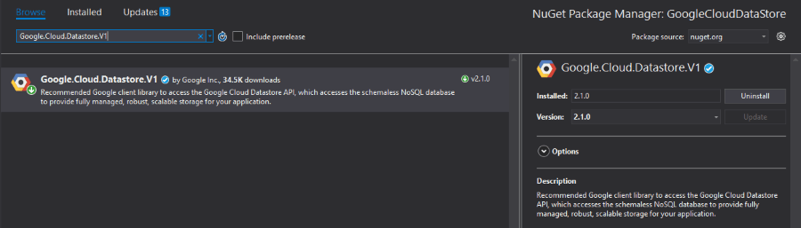
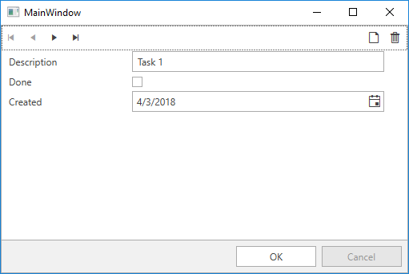

# Google Cloud Datastore(NoSQL database)

Cloud Datastore is a highly-scalable NoSQL database which Google promotes for scenarios that require high-availabilty and durability, and is capable of multiple features such as ACID transactions, SQL-like queries, indexes and many more. This in combination with the characteristic for the NoSQL database solutions of being able to handle different data types, great scalability and the great performance makes it a choice you should have in mind when considering the architecture of your application. 

>You can find more detailed information regarding the **Cloud Datastore** product on its [official documentation page](https://cloud.google.com/datastore/docs/).

The purpose of this article is to familiarize you with the .NET API designed for the product and show you how you can manipulate the database - add, retrieve and update items from it. 

## Prerequisites

For the purpose of this example, you have to enable the Google Cloud DataStore API. Please read the [Getting Started]() article for more information on how you can achieve that. You also have to set up a DataStore instance which can be done by following the [Datastore Quickstart](https://cloud.google.com/datastore/docs/quickstart#store_data) tutorial. 

## Step 1: Create the {{ site.framework_name }} Application

Create a standard {{ site.framework_name }} application and add a [RadDataForm](). It will provide an interface to update the entities in your DataStore instance. Please note that we are handling the EditEnded event with a command via the [EventToCommandBehavior]().

__Example 1: Defining the view__
```XAML
    <telerik:RadDataForm ItemsSource="{Binding Tasks}" AutoCommit="False" AutoEdit="True" AutoGeneratingField="RadDataForm_AutoGeneratingField">
        <telerik:EventToCommandBehavior.EventBindings>
            <telerik:EventBinding EventName="EditEnded" Command="{Binding EditEndedCommand}" />
        </telerik:EventToCommandBehavior.EventBindings>
    </telerik:RadDataForm>
```

## Step 2: Install the NuGet package

Open the NuGet Package Manager and install the **Google.Cloud.Datastore.V1** package.



## Step 3: Define the business object

**Example 2** shows the **Task** class which will hold the example data. The **Id** property will be used for retrieving the item from the DataStore instance.

__Example 2: Defining the Task class__
```C#
    public class Task
    {
        public long Id { get; set; }

        public string Description { get; set; }

        public bool Done { get; set; }

        public DateTime Created { get; set; }
    }
```
```VB.NET
    Public Class Task
		Public Property Id() As Long

		Public Property Description() As String

		Public Property Done() As Boolean

		Public Property Created() As Date
    End Class
```

## Step 4: Define the ViewModel

The next step is to create the ViewModel. It will need a [DatastoreDb](https://googlecloudplatform.github.io/google-cloud-dotnet/docs/Google.Cloud.Datastore.V1/api/Google.Cloud.Datastore.V1.DatastoreDb.html) object which will be responsible for adding, retrieving and updating entities from the DataStore instance and a [KeyFactory](https://googlecloudplatform.github.io/google-cloud-dotnet/docs/Google.Cloud.Datastore.V1/api/Google.Cloud.Datastore.V1.KeyFactory.html) object which will create keys.

__Example 3: Defining the ViewModel__
```C#
    public class ViewModel : ViewModelBase
    {
        private DatastoreDb db;
        private KeyFactory keyFactory;

        public ObservableCollection<Task> Tasks { get; set; }
        public ICommand EditEndedCommand { get; set; }

        public ViewModel(string projectId)
        {
            this.db = DatastoreDb.Create(projectId);
            this.keyFactory = db.CreateKeyFactory("Task");
            this.AddTasksToDataStore(5);
            this.Tasks = this.GetTasksFromDataStore();
            this.EditEndedCommand = new DelegateCommand(OnEditEnded);
        }

        private void AddTasksToDataStore(int numberOfTasks)
        {
            for (int i = 0; i < numberOfTasks; i++)
            {
                this.AddTask($"Task {i}");
            }
        }

        Google.Cloud.Datastore.V1.Key AddTask(string description)
        {
            Entity task = new Entity()
            {
                Key = keyFactory.CreateIncompleteKey(),
                ["Description"] = new Value()
                {
                    StringValue = description,
                    ExcludeFromIndexes = true
                },
                ["Created"] = DateTime.UtcNow,
                ["Done"] = false
            };
            return db.Insert(task);
        }

        private ObservableCollection<Task> GetTasksFromDataStore()
        {
            ObservableCollection<Task> tasksToReturn = new ObservableCollection<Task>();
            Query query = new Query("Task");
            DatastoreQueryResults tasks = db.RunQuery(query);

            foreach (var entity in tasks.Entities)
            {
                Task task = new Task();
                task.Done = (bool)entity["Done"];
                task.Created = (DateTime)entity["Created"];
                task.Description = (string)entity["Description"];
                task.Id = entity.Key.Path[0].Id;
                tasksToReturn.Add(task);
            }

            return tasksToReturn;
        }

        private void OnEditEnded(object obj)
        {
            foreach (var task in this.Tasks)
            {
                Google.Cloud.Datastore.V1.Key key = keyFactory.CreateKey(task.Id);
                var entity = db.Lookup(key);

                entity["Done"] = task.Done;
                entity["Description"] = task.Description;
                entity["Created"] = task.Created;

                db.Update(entity);
            }
        }
    }
```
```VB.NET
    Public Class ViewModel
	Inherits ViewModelBase

		Private db As DatastoreDb
		Private keyFactory As KeyFactory

		Public Property Tasks() As ObservableCollection(Of Task)
		Public Property EditEndedCommand() As ICommand

		Public Sub New(ByVal projectId As String)
			Me.db = DatastoreDb.Create(projectId)
			Me.keyFactory = db.CreateKeyFactory("Task")
			Me.AddTasksToDataStore(5)
			Me.Tasks = Me.GetTasksFromDataStore()
			Me.EditEndedCommand = New DelegateCommand(AddressOf OnEditEnded)
		End Sub

		Private Sub AddTasksToDataStore(ByVal numberOfTasks As Integer)
			For i As Integer = 0 To numberOfTasks - 1
				Me.AddTask($"Task {i}")
			Next i
		End Sub

		Private Function AddTask(ByVal description As String) As Google.Cloud.Datastore.V1.Key
			Dim task As New Entity() With {
				.Key = keyFactory.CreateIncompleteKey(),
				("Description") = New Value() With {
					.StringValue = description,
					.ExcludeFromIndexes = True
				},
				("Created") = Date.UtcNow,
				("Done") = False
			}
			Return db.Insert(task)
		End Function

		Private Function GetTasksFromDataStore() As ObservableCollection(Of Task)
			Dim tasksToReturn As New ObservableCollection(Of Task)()
			Dim query As New Query("Task")
			Dim tasksFromDataStore As DatastoreQueryResults = db.RunQuery(query)

			For Each entity In tasksFromDataStore.Entities
				Dim task As New Task()
				task.Done = CBool(entity("Done"))
				task.Created = CDate(entity("Created"))
				task.Description = CStr(entity("Description"))
				task.Id = entity.Key.Path(0).Id
				tasksToReturn.Add(task)
			Next entity

			Return tasksToReturn
		End Function

		Private Sub OnEditEnded(ByVal obj As Object)
			For Each task In Me.Tasks
				Dim key As Google.Cloud.Datastore.V1.Key = keyFactory.CreateKey(task.Id)
				Dim entity = db.Lookup(key)

				entity("Done") = task.Done
				entity("Description") = task.Description
				entity("Created") = task.Created

				db.Update(entity)
			Next task
		End Sub
End Class
```

In the **AddTasksToDataStore** method we are adding a couple of Task entities which have the same properties as our Task class. Then in the **GetTasksFromDataStore** method we are retrieving the entities from the DataStore instance, converting them to Task objects and adding them to an ObservableCollection which will be the ItemsSource of our RadDataForm. In the **OnEditEnded** method which is called when the EditEnded event of the RadDataForm is fired, we are using the **Id** property of the Task objects in order to retrieve the correct entity from the DataStore instance, modify it and update it. 

> In order to connect to the DataStore database, you need to have a GOOGLE_APPLICATION_CREDENTIALS environment variable set pointing to the JSON file downloaded when [creating a service account](https://cloud.google.com/docs/authentication/getting-started#creating_a_service_account).

<!-- -->

> For more information on Datastore API, check out the [Getting started with the Google Cloud Datastore API](https://cloud.google.com/datastore/docs/datastore-api-tutorial) article.

## Step 5: Set the DataContext

All that is left is to set the DataContext to the ViewModel and pass your project id as a parameter. Please note that we are preventing the generation of a field for the **Id** property of the Task objects since we only need it for retrieving the correct entity from the DataStore.

__Example 4: Set the DataContext__
```C#
    public partial class MainWindow : Window
    {
        public MainWindow()
        {
            InitializeComponent();
            string projectId = "myProjectId";
            this.DataContext = new ViewModel(projectId);
        }

        private void RadDataForm_AutoGeneratingField(object sender, Telerik.Windows.Controls.Data.DataForm.AutoGeneratingFieldEventArgs e)
        {
            if (e.PropertyName == "Id")
            {
                e.Cancel = true;
            }
        }
    }
```
```VB.NET
    Partial Public Class MainWindow
	Inherits Window

		Public Sub New()
			InitializeComponent()
			Dim projectId As String = "myProjectId"
			Me.DataContext = New ViewModel(projectId)
		End Sub

		Private Sub RadDataForm_AutoGeneratingField(ByVal sender As Object, ByVal e As Telerik.Windows.Controls.Data.DataForm.AutoGeneratingFieldEventArgs)
			If e.PropertyName = "Id" Then
				e.Cancel = True
			End If
		End Sub
    End Class
```

>In order to locate your project id, please read the [Locate the project ID](https://support.google.com/cloud/answer/6158840?hl=en) help article. 

#### Figure 1: Result from example in the Office2016 theme



## See Also

* [Google Cloud Cloud Storage]()
* [Google Cloud Translation]()