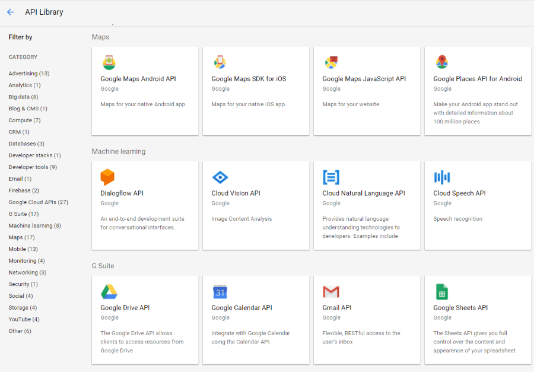

# Getting Started

This article will help you get started using Google's Cloud Services. Here are the main steps that you need to take:

1. [Create a Google Cloud account] (#create-a-google-cloud-account)
2. [Enable the APIs that you want to use](#enable-the-apis-that-you-want-to-use)

## Create a Google Cloud Account

To create an account, go to the [Google Cloud website](https://cloud.google.com/free/) and create a new account. The process is straightforward and easy. You will be prompted for a credit card number despite that there is a free option. 

## Enable the APIs that you want to use 

In order to access all of the provided APIs, first you have to enable them from the [Google Cloud's console](https://console.cloud.google.com). For more information about that please visit the [Enable and disable APIs](https://support.google.com/cloud/answer/6158841?hl=en) article.

## See Also

* [Cloud Storage]()
* [Translation]()