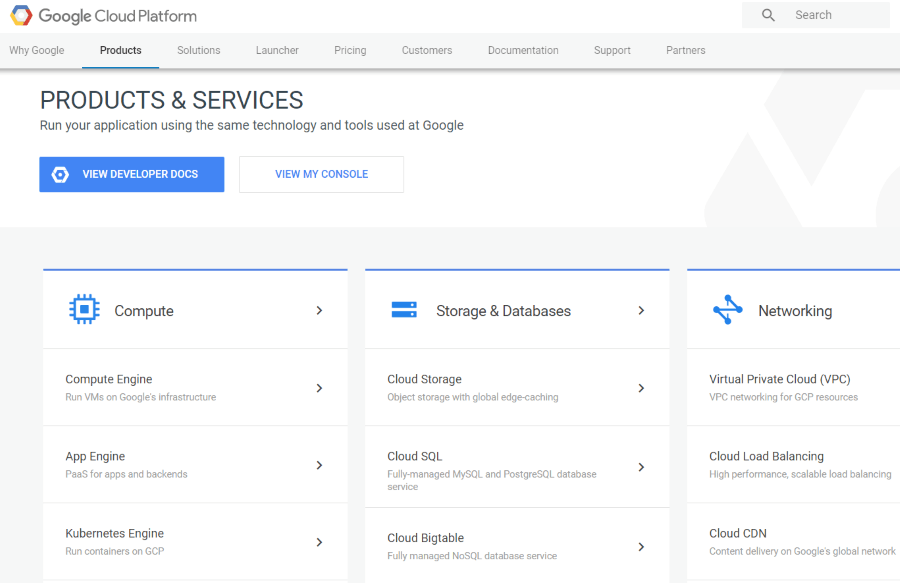

# Google Cloud Overview

Google Cloud Platform is a solution which allows businesses to leverage Google's infrastructure. The platform provides different services similar to those of the other most famous and widely-used providers such as Microsoft and Amazon. This section aims to provide an overview of some of the available services and show simple scenarios on how the platform can be integrated with the **Telerik UI for {{ site.framework_name }}** controls.

> Only few of the available services that Google Cloud Platform provides are listed here. For more detailed information and resources, please visit [Google Cloud Platform's product page](https://cloud.google.com/products/).

Here are the currently available topics:

* [Getting Started]()

* [Cloud Storage]()

* Cognitive services

    * [Translation]()

* Connect to data in the cloud

    * [DataStore]()
