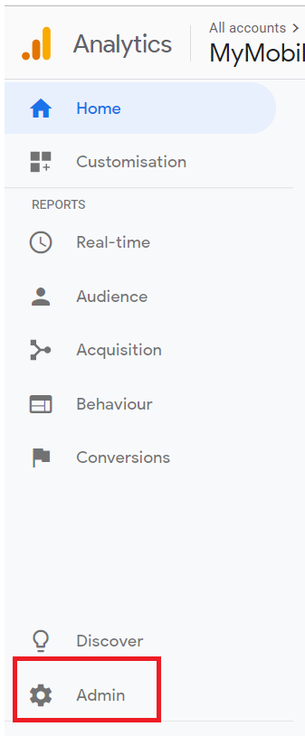
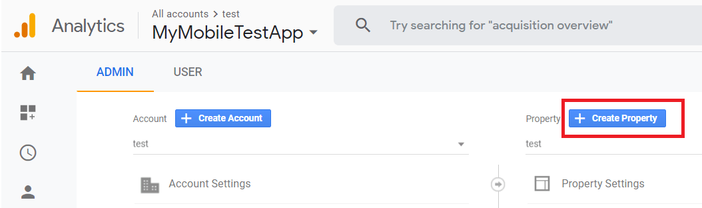
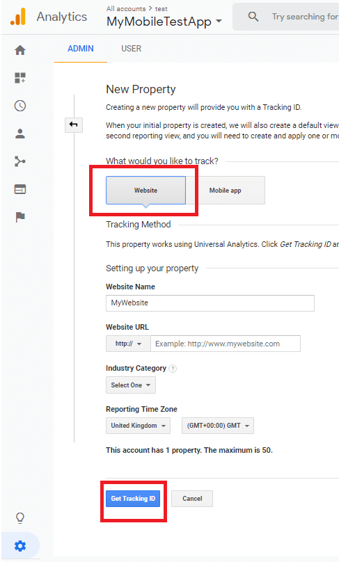
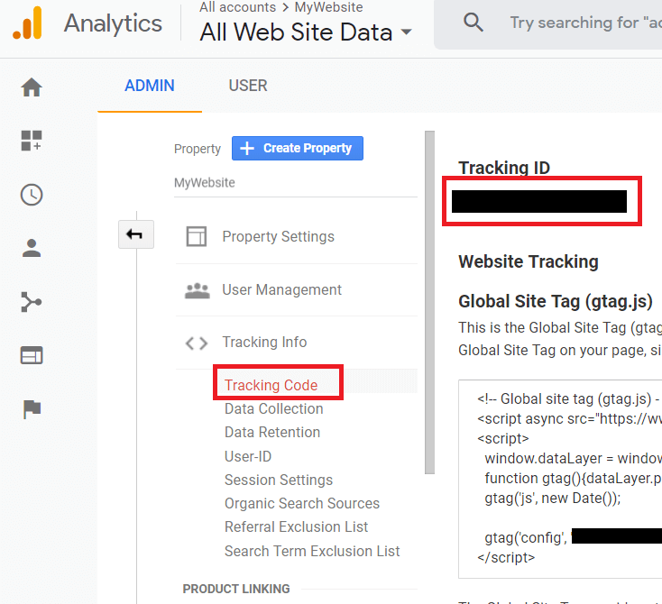
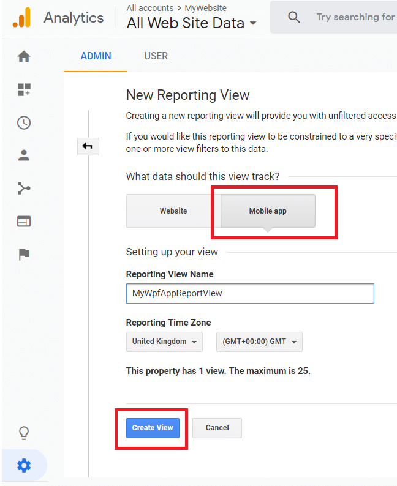
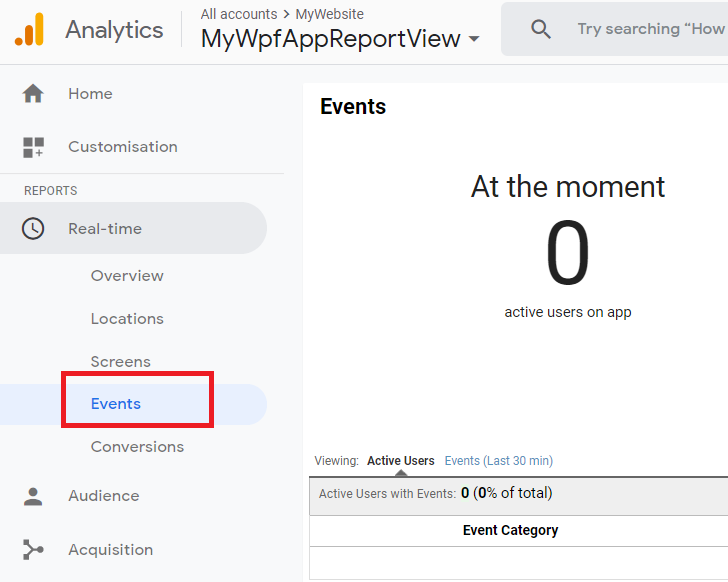
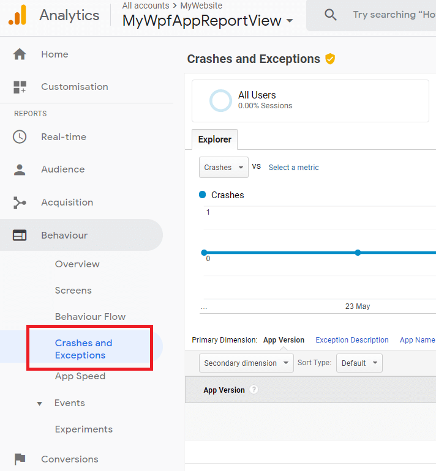
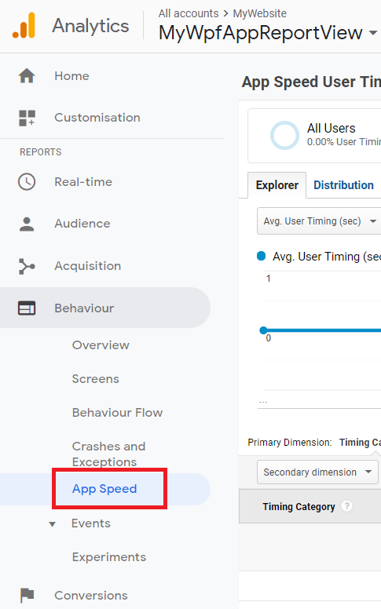

# Google Analytics Integration

This article shows how to use the Telerik Analytics API to implement a custom Google Analytics provider and send information to it.

## Setting up Google Analytics Dashboard

>important This information is relevant at the time of writing of this article (June 2019) and it may not be up-to-date at the moment you read this article.

1. Create a Google account and set up the [Analytics dashboard](https://analytics.google.com/analytics).

2. Open the __Admin__ menu from the left pane's footer.

	
	
3. From the Admin menu click on __Create Property__ and create a new property that tracks Website data. 

	
	
	
	
4. Copy the __Tracking ID__ from the Tracking Code menu that should open automatically when the new property is created.
	
	
	
5. Create a new __Mobile App__ view in the newly created property.

	

	
	
> The Tracking ID get in step 4 will be used in the .NET API shown in the [Implementing the Analytics Provider](#implementing-the-analytics-provider) section of this article.

## Setting up the Project

To get access to the dashboard set up from the previous section of this article, you can use any third party .NET library. For this example we will use the __Windows SDK for Google Analytics__.

1. Download the source code of __Windows SDK for Google Analytics__ from its [GitHub repository](https://github.com/dotnet/windows-sdk-for-google-analytics).

2. From the source code, open the __GoogleAnalytics.Core__ project and build it. This will produce the __GoogleAnalytics.Core.dll__.

3. Create a new WPF project (or use an existing one). Then reference __GoogleAnalytics.Core.dll__.

4. Add a reference to __Telerik.Windows.Controls.dll__.

## Implementing the Analytics Provider

To implement an Analytics provider that sends data to the dashboard, create a trace monitor class that implements the `ITraceMonitor` interface. To apply the new monitor use the `TrackerManager` class.

__Example 1__ demonstrates a simple implementation of the `IPlatformInfoProvider` interface that is needed by the `TrackerManager` class.

#### __[C#] Example 1: IPlatformInfoProvider implementation__  
{{region cs-google-analytics-integration_1}}
	internal class PlatformInfoProvider : IPlatformInfoProvider
    {
        public string AnonymousClientId { get; set; }

        public int? ScreenColors { get; set; }

        public Dimensions ScreenResolution { get; set; }
        public string UserAgent { get; set; }
        public string UserLanguage { get; set; }
        public Dimensions ViewPortResolution { get; set; }

        Dimensions? IPlatformInfoProvider.ScreenResolution { get; }

        Dimensions? IPlatformInfoProvider.ViewPortResolution { get; }

        public event EventHandler ScreenResolutionChanged;
        public event EventHandler ViewPortResolutionChanged;

        public void OnTracking()
        {
            throw new NotImplementedException();
        }
    }
{{endregion}}

#### __[VB.NET] Example 1: IPlatformInfoProvider implementation__  
{{region vb-google-analytics-integration_1}}
	Friend Class PlatformInfoProvider
	Implements IPlatformInfoProvider

		Public Property AnonymousClientId() As String

		Public Property ScreenColors() As Integer?

		Public Property ScreenResolution() As Dimensions
		Public Property UserAgent() As String
		Public Property UserLanguage() As String
		Public Property ViewPortResolution() As Dimensions

		Private ReadOnly Property IPlatformInfoProvider_ScreenResolution() As Dimensions? Implements IPlatformInfoProvider.ScreenResolution

		Private ReadOnly Property IPlatformInfoProvider_ViewPortResolution() As Dimensions? Implements IPlatformInfoProvider.ViewPortResolution

		Public Event ScreenResolutionChanged As EventHandler
		Public Event ViewPortResolutionChanged As EventHandler

		Public Sub OnTracking()
			Throw New NotImplementedException()
		End Sub
	End Class
{{endregion}}

You can then use this provider in your custom implementation of the `ITraceMonitor` interface. Please note that you have to pass your own Google Analytics tracking ID in the `CreateTracker` method of the `TrackerManager`. This is the __Tracking ID__ of the Google Analytics property created in __step 4__ from the [Setting up Google Analytics Dashboard](#setting-up-google-analytics-dashboard) section of this article. 

#### __[C#] Example 2: Custom ITraceMonitor implementation__ 
{{region cs-google-analytics-integration_2}}
	public class CustomAnalitycsMonitor : ITraceMonitor
    {
        private Tracker tracker;

        public CustomAnalitycsMonitor()
        {
            this.CreateGoogleTracker();
        }

        public void CreateGoogleTracker()
        {
            var trackerManager = new TrackerManager(new PlatformInfoProvider()
            {
                AnonymousClientId = "b597d28a-0d6c-42ed-9dcb-f89e98006b37", // Random UUID
                ScreenResolution = new Dimensions(1920, 1080),
                UserAgent = "Mozilla/5.0 (Windows NT 6.3; WOW64; Trident/7.0; rv:11.0) like Gecko",
                UserLanguage = "en-us",
                ViewPortResolution = new Dimensions(1920, 1080)
            });

            tracker = trackerManager.CreateTracker("YOUR_TRACKING_ID"); // your GoogleAnalytics property tracking ID goes here
            tracker.AppName = "wpf app";
        }

        public void TrackAtomicFeature(string feature)
        {
            // The value of the "feature" string consists of the whole name of the tracked feature,
            // for example : "MyGridView.Sorted.Name.Ascending", if we have performed a sorting operation in RadGridView.
            // So, we can split this string in order to pass friendlier names to the parameters of the CreateCustomEvent method which will be used in your reports.
            string category;
            string eventAction;
            this.SplitFeatureName(feature, out category, out eventAction);

            var data = HitBuilder.CreateCustomEvent(category, eventAction + " event", feature.ToString(), 1).Build();
            tracker.Send(data);
        }

        public void TrackError(string feature, Exception exception)
        {
            var data = HitBuilder.CreateException(feature + ":" + exception.ToString(), true).Build();
            tracker.Send(data);
        }

        public void TrackFeatureCancel(string feature)
        {
            string category;
            string eventAction;
            this.SplitFeatureName(feature, out category, out eventAction);

            var data = HitBuilder.CreateCustomEvent(category, eventAction + " event.Cancelled", feature.ToString(), 1).Build();
            tracker.Send(data);
        }

        public void TrackFeatureStart(string feature)
        {
            // Measuring timings provides a native way to measure a period of time in Google Analytics. 
            // This can be useful to measure resource load times, for example.
            TimeSpan ts = TimeSpan.FromSeconds(2.2);
            var loadTiming = HitBuilder.CreateTiming("Loaded", "MainWindow", ts).Build();
            tracker.Send(loadTiming);
        }

        public void TrackFeatureEnd(string feature)
        {
            TimeSpan ts = TimeSpan.FromSeconds(2.2);
            var unLoadTiming = HitBuilder.CreateTiming("Loaded", "MainWindow", ts).Build();
            tracker.Send(unLoadTiming);
        }

        public void TrackValue(string feature, long value)
        {
            string category;
            string eventAction;
            this.SplitFeatureName(feature, out category, out eventAction);

            var data = HitBuilder.CreateCustomEvent(category, eventAction + " event", feature.ToString(), value).Build();
            tracker.Send(data);
        }

        private void SplitFeatureName(string feature, out string category, out string eventAction)
        {
            string[] parameters = feature.Split('.');
            category = parameters[0];
            eventAction = parameters[1];
        }
    }
{{endregion}}

#### __[VB.NET] Example 2: Custom ITraceMonitor implementation__  
{{region vb-google-analytics-integration_2}}
	Public Class CustomAnalitycsMonitor
	Implements ITraceMonitor

		Private tracker As Tracker

		Public Sub New()
			Me.CreateGoogleTracker()
		End Sub

		Public Sub CreateGoogleTracker()
			Dim trackerManager = New TrackerManager(New PlatformInfoProvider() With {
				.AnonymousClientId = "b597d28a-0d6c-42ed-9dcb-f89e98006b37",
				.ScreenResolution = New Dimensions(1920, 1080),
				.UserAgent = "Mozilla/5.0 (Windows NT 6.3; WOW64; Trident/7.0; rv:11.0) like Gecko",
				.UserLanguage = "en-us",
				.ViewPortResolution = New Dimensions(1920, 1080)
			})

			tracker = trackerManager.CreateTracker("YOUR_TRACKING_ID") ' your GoogleAnalytics property tracking ID goes here
			tracker.AppName = "wpf app"
		End Sub

		Public Sub TrackAtomicFeature(ByVal feature As String)
			' The value of the "feature" string consists of the whole name of the tracked feature,
			' for example : "MyGridView.Sorted.Name.Ascending", if we have performed a sorting operation in RadGridView.
			' So, we can split this string in order to pass friendlier names to the parameters of the CreateCustomEvent method which will be used in your reports.
			Dim category As String = Nothing
			Dim eventAction As String = Nothing
			Me.SplitFeatureName(feature, category, eventAction)

			Dim data = HitBuilder.CreateCustomEvent(category, eventAction & " event", feature.ToString(), 1).Build()
			tracker.Send(data)
		End Sub

		Public Sub TrackError(ByVal feature As String, ByVal exception As Exception)
			Dim data = HitBuilder.CreateException(feature & ":" & exception.ToString(), True).Build()
			tracker.Send(data)
		End Sub

		Public Sub TrackFeatureCancel(ByVal feature As String)
			Dim category As String = Nothing
			Dim eventAction As String = Nothing
			Me.SplitFeatureName(feature, category, eventAction)

			Dim data = HitBuilder.CreateCustomEvent(category, eventAction & " event.Cancelled", feature.ToString(), 1).Build()
			tracker.Send(data)
		End Sub

		Public Sub TrackFeatureStart(ByVal feature As String)
			' Measuring timings provides a native way to measure a period of time in Google Analytics. 
			' This can be useful to measure resource load times, for example.
			Dim ts As TimeSpan = TimeSpan.FromSeconds(2.2)
			Dim loadTiming = HitBuilder.CreateTiming("Loaded", "MainWindow", ts).Build()
			tracker.Send(loadTiming)
		End Sub

		Public Sub TrackFeatureEnd(ByVal feature As String)
			Dim ts As TimeSpan = TimeSpan.FromSeconds(2.2)
			Dim unLoadTiming = HitBuilder.CreateTiming("Loaded", "MainWindow", ts).Build()
			tracker.Send(unLoadTiming)
		End Sub

		Public Sub TrackValue(ByVal feature As String, ByVal value As Long)
			Dim category As String = Nothing
			Dim eventAction As String = Nothing
			Me.SplitFeatureName(feature, category, eventAction)

			Dim data = HitBuilder.CreateCustomEvent(category, eventAction & " event", feature.ToString(), value).Build()
			tracker.Send(data)
		End Sub

		Private Sub SplitFeatureName(ByVal feature As String, ByRef category As String, ByRef eventAction As String)
			Dim parameters() As String = feature.Split("."c)
			category = parameters(0)
			eventAction = parameters(1)
		End Sub
	End Class
{{endregion}}

To apply the custom monitor, set the static `TraceMonitor.AnalyticsMonitor` property, possibly in the constructor of your application.

#### __[C#] Example 3: Set TraceMonitor.AnalyticsMonitor__  
{{region cs-google-analytics-integration_3}}
	public App()
	{
		InitializeComponent();
		TraceMonitor.AnalyticsMonitor = new CustomAnalitycsMonitor();
	}
{{endregion}}

#### __[VB.NET] Example 3: Set TraceMonitor.AnalyticsMonitor__  
{{region vb-google-analytics-integration_3}}
	Public Sub New()
		InitializeComponent()
		TraceMonitor.AnalyticsMonitor = New CustomAnalitycsMonitor()
	End Sub
{{endregion}}

## Observing Data in Google Analytics

After the sucessfull set up of the custom Analytics monitor, the user interaction with the application will be updated in the [Google Analytics](https://analytics.google.com/analytics) dashboard. The information and statistics for the registered features are shown as in __Figure 1__.

#### __Figure 1: Google Analytics Dashboard__  

Any actions created with the `HitBuilder.CreateCustomEvent` method will be shown in the __Real-Time-->Events__ menu of the Google Analytics dashboard, a few seconds after the sending.

Any actions created with the `HitBuilder.CreateException` method will be shown in the __Behaviour-->Crashes and Exceptions__ menu of the Google Analytics dashboard.

Any actions created with the `HitBuilder.CreateTiming` method will be shown in the __Behaviour-->App Speed__ menu of the Google Analytics dashboard. In order to view the data make sure to provide some time for the dashboard to be refreshed and that you have selected a time range including the current date. 

>tip For any other methods of the HitBuilder which is part of the __Windows SDK for Google Analytics__, please check its [documentation on GitHub](https://github.com/dotnet/windows-sdk-for-google-analytics/wiki/Getting-Started).

>tip Read in details how to setup the Google Analytics dashboards in its [documentation](https://support.google.com/analytics/).

## See Also  
* [Analytics Support]()
