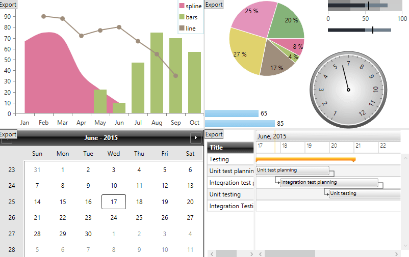

# Export Support

More often than not, it is a good idea to be able to preserve the data that the different controls show and edit during the life cycle of the application even after the application is closed. There are different ways to save this information and various approaches can be adopted depending on the type of the content.


## Built-In Export


Several of the controls in the Telerik UI for WPF suite come with built-in export capabilities. Among those are  __RadDiagram__, __RadGridView__ and __RadRichTextBox__. 


To learn more about these abilities take a look at the *Export* article in the desired control's documentation. 


## Document Processing Integration


The Telerik UI for WPF suite includes the **Telerik Document Processing** libraries specifically designed for import, export and document editing.


* [RadPdfProcessing](https://docs.telerik.com/devtools/document-processing/libraries/radpdfprocessing/overview): Supports export to PDF.

* [RadSpreadProcessing](https://docs.telerik.com/devtools/document-processing/libraries/radspreadprocessing/overview): Supports export to XLSX, CSV, PDF and plain text (TXT).


* [RadSpreadStreamProcessing](https://docs.telerik.com/devtools/document-processing/libraries/radspreadstreamprocessing/overview): Supports export to XLSX and CSV. Allows you create big spreadsheet documents with minimal resources usage.

* [RadWordsProcessing](https://docs.telerik.com/devtools/document-processing/libraries/radwordsprocessing/overview): Supports export to DOCX, RTF, HTML, PDF and plain text(TXT).


The libraries give you the ability to create a document from scratch and export it to its supported file formats. This means you can export practically any control either by exporting it to an image and adding the image to the resulting document or by creating an appropriate for the context structure (for example, a table when exporting RadGridView to DOCX).


There are several controls that already provide sample code which you can use as the base of export functionality, you could take a look at them in the Telerik XAML SDK repository:


*  [RadDiagram Export to PDF](https://github.com/telerik/xaml-sdk/tree/master/Diagram/ExportToPDF)
*  [RadPivotGrid Export to XLSX, DOCX, HTML and PDF](https://github.com/telerik/xaml-sdk/blob/master/PivotGrid/ExportPivotGrid/Example.xaml.cs)
*  [RadPdfProcessing Export UI Element to PDF](https://github.com/telerik/xaml-sdk/tree/master/PdfProcessing/ExportUIElement)


### Export XAML UI Elements to PDF


The API of __RadPdfProcessing__ is designed to resemble XAML and this allows you easy conversion of UI elements to PDF by converting any XAML primitive to a PDF instruction. For base of such conversion you can use the  [RadPdfProcessing Export UI Element to PDF](https://github.com/telerik/document-processing-sdk/tree/2d32fd229282a1f7101d6f9b0961a650e89a1dc1/PdfProcessing/ExportUIElement) example which demonstrates how to export several of the controls in the Telerik UI for WPF suite, including a combination of several controls in the same view.


 

 
The code operates with a set of renderers deriving from the base __UIElementRendererBase__ - __TextBlockRenderer__, __BorderRenderer__, etc. This allows separation, since each concrete render is responsible for drawing the element it is intended for without dependencies to the other renderers, and gives you the ability to extend the sample code to fit your precise needs if you need to.


Take a look at the [source code of the example on GitHub](https://github.com/telerik/document-processing-sdk/tree/2d32fd229282a1f7101d6f9b0961a650e89a1dc1/PdfProcessing/ExportUIElement) and the documentation of the relevant [FixedDocumentEditor](https://docs.telerik.com/devtools/document-processing/libraries/radpdfprocessing/editing/fixedcontenteditor) class.


## Export Images With ExportExtensions


Some controls can be exported directly using the __ExportExtensions__ class which is part of the __Telerik.Windows.Controls__ assembly. It allows you to export in several image formats listed below:


 __Image formats__

* __Png:__ Portable Netwok Graphic. Use __ExportToImage(FrameworkElement, Stream)__ method.

* __Bmp:__ Bitmap file. Use __ExportToImage(FrameworkElement, Stream, BitmapEncoder)__ where the encoder is of type __BmpBitmapEncoder__.

* __Xps:__ XML Paper Specification file. Use __ExportToXpsImage(FrameworkElement, Stream)__ method to export content as an XPS image.


This approach is convenient for controls which have a size that allows direct export on one page, such as a __RadGauge__ for example.



>There are overloads for the methods listed above, which take as parameter the name of the file you want to export to, instead of a stream. This allows you to easily export your control directly to the file system.



__Example 1__ demonstrates how to export __RadGauge__ to PNG file format. The physical path to the image is provided run-time via __SaveFileDialog__:



__Example 1: Export Control to PNG__

```C#
	 private void Button_Click(object sender, RoutedEventArgs e)
	  {
		string extension = "png";
		SaveFileDialog dialog = new SaveFileDialog()
		{
			DefaultExt = extension,
			Filter = "Png (*.png)|*.png"
		};
	
		if (dialog.ShowDialog() == true)
		{
			using (Stream stream = dialog.OpenFile())
			{
				Telerik.Windows.Media.Imaging.ExportExtensions.ExportToImage(
					 this.radGauge, stream, new Telerik.Windows.Media.Imaging.PngBitmapEncoder());
			}
		}
	}
```
```VB.NET
	 Private Sub Button_Click(ByVal sender As Object, ByVal e As RoutedEventArgs)
		Dim extension As String = "png"
		Dim dialog As New SaveFileDialog() With {.DefaultExt = extension, .Filter = "Png (*.png)|*.png"}
	
		If dialog.ShowDialog() = True Then
			Using stream As Stream = dialog.OpenFile()
				Telerik.Windows.Media.Imaging.ExportExtensions.ExportToImage(Me.radGauge, stream, New Telerik.Windows.Media.Imaging.PngBitmapEncoder())
			End Using
		End If
	 End Sub
```



__Example 1: Export Control to PNG__

```C#
	 private void Button_Click(object sender, RoutedEventArgs e)
	  {
		string extension = "png";
		SaveFileDialog dialog = new SaveFileDialog()
		{
			DefaultExt = extension,
			Filter = "Png (*.png)|*.png"
		};
	
		if (dialog.ShowDialog() == true)
		{
			using (Stream stream = dialog.OpenFile())
			{
				Telerik.Windows.Media.Imaging.ExportExtensions.ExportToImage(
					 this.radGauge, stream, new System.Windows.Media.Imaging.PngBitmapEncoder());
			}
		}
	}
```
```VB.NET
	 Private Sub Button_Click(ByVal sender As Object, ByVal e As RoutedEventArgs)
		Dim extension As String = "png"
		Dim dialog As New SaveFileDialog() With {.DefaultExt = extension, .Filter = "Png (*.png)|*.png"}
	
		If dialog.ShowDialog() = True Then
			Using stream As Stream = dialog.OpenFile()
				Telerik.Windows.Media.Imaging.ExportExtensions.ExportToImage(Me.radGauge, stream, New System.Windows.Media.Imaging.PngBitmapEncoder())
			End Using
		End If
	 End Sub
```


>tipExporting a control to an image requires that the control is measured and arranged. Otherwise, unexpected results may occur.

## See Also

* [RadPdfProcessing](https://docs.telerik.com/devtools/document-processing/libraries/radpdfprocessing/overview)

* [RadSpreadProcessing](https://docs.telerik.com/devtools/document-processing/libraries/radspreadprocessing/overview)


* [RadWordsProcessing](https://docs.telerik.com/devtools/document-processing/libraries/radwordsprocessing/overview)


* [RadGridView Export]()

* [Export UI Element to PDF](https://github.com/telerik/xaml-sdk/tree/master/PdfProcessing/ExportUIElement)
