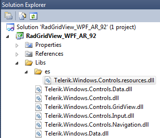
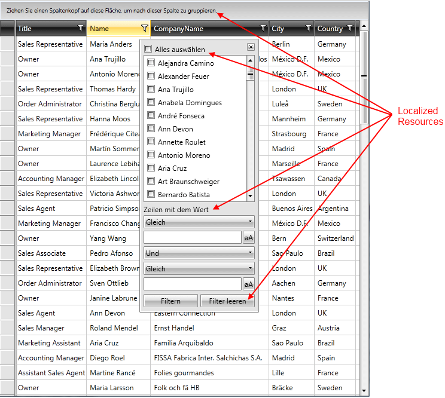
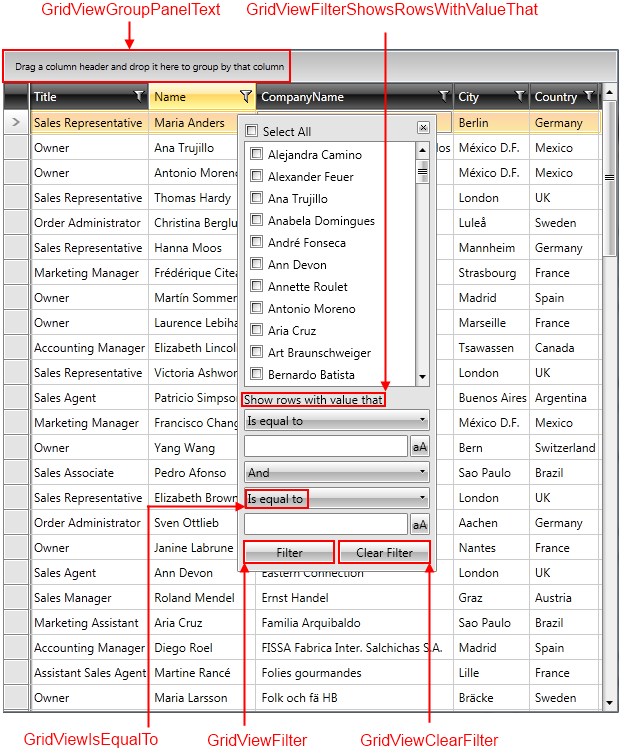
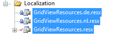
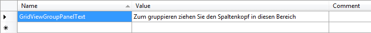

# Localization

When you limit your product's availability to only one language, you limit your potential customer base to a fraction of the world population. If you want your application to reach a global audience, cost-effective __localization__ of your product is one of the best and most economical ways to reach more customers.

>__Localization__ is the translation of application resources into localized versions for the specific cultures that the application supports.

This article will show you how to localize any resource string used by Telerik UI controls. We will discuss the following topics:

* [Localization Using Built-in Resources](#localization-using-built-in-resources)

* [Resource keys](#resource-keys)

* [Localization Using ResourceManager](#localization-using-resourcemanager)

* [Localization using custom localization manager](#localization-using-custom-localization-manager)

* [LocalizableResourceExtension](#localizableresourceextension)

* [Dynamic Localization](#dynamic-localization)

>All examples in this article are demonstrated in the context of the Telerik __RadGridView__ control. However, the techniques and principles used for the localization of the string resources are valid for all the other Telerik __{{ site.framework_name }} controls__.

## Localization Using Built-in Resources

The built-in localization mechanism in {{ site.framework_name }} provides the possibility to easily set the used Telerik {{ site.framework_name }} controls in one of the following supported languages:

* **English**

* **German**

* **Spanish**

* **French**

* **Italian**

* **Dutch**

* **Turkish**

The default is English, but you can find a separate file for each of the other languages in a corresponding folder together with the other binaries in your local installation.

>If you need to translate your control into a different language, you should use a [Custom Localization Manager](#localization-using-custom-localization-manager).

To localize your controls using the built-in localization mechanism, you first have to place the resource folders along with the binaries you have referenced as shown in **Figure 3**.

#### __Figure 1: Placing the resource folders in your project__

Or you should install the corresponding NuGet package. For example `Telerik.Windows.Controls.for.Wpf.es`.

The next step for defining the language settings of the application is changing the __Current Culture__ of the application:
         
#### __[C#] Setting the current culture of the application__  
{{region common-localization_9}}
	public App()
	{
	    Thread.CurrentThread.CurrentCulture = new CultureInfo("de");
	    Thread.CurrentThread.CurrentUICulture = new CultureInfo("de");
	}
{{endregion}}

#### __[VB.NET] Setting the current culture of the application__  
{{region common-localization_10}}
	Public Sub New()
	    Thread.CurrentThread.CurrentCulture = New CultureInfo("de")
	    Thread.CurrentThread.CurrentUICulture = New CultureInfo("de")
	End Sub
{{endregion}}

That's it. Your controls should now be localized in the preferred language.

#### __Figure 2: RadGridView localized in German__

## Resource Keys

Some of the controls are complex user interface controls (e.g., __RadGridView__, __RadScheduleView__) and their strings for localization are numerous. In order to be able to distinguish these resources, a unique identifier called __resource key__ is assigned to each localizable string.

In Figure 3 you can see some resource keys and the strings they are associated with.

#### __Figure 3: Some of RadGridView's resource keys and their values__

>tip For a full list of __resource keys__, check out the __Localization__ topic for the specific control.

>tip You can find the ".resx" files containing the translations for the supported languages inside the "Core\Controls" directory of the [source code](#source-code).

## Localization Using ResourceManager

If you need to modify the default strings for a chosen language, you can base your localization on the standard resource files. For that purpose, you will have to create a separate __.resx__ file for each of the languages that your application will support.
        
Imagine that you want to translate your control, RadGridView for example, into English, German and Dutch. You will have to add three new resource files to your project:

* __GridViewResources.resx__ - this resource file will store the __English(default)__ resources for the grid control. Set the __AccessModifier__ property to __Public__.
          
* __GridViewResources.de.resx__ - this resource file will store the __German__ resources for the grid control. Set the __AccessModifier__ property to  __No code generation__.
          
* __GridViewResources.nl.resx__ - this resource file will store the __Dutch__ resources for the grid control. Set the __AccessModifier__ property to __No code generation__.

#### __Figure 4: Creating separate .resx files for each of the supported languages__
          

Now that you have the needed files, it's time to localize only the text for the group panel. For that purpose, you need to create a single resource string in each one of the three resource files and translate it to the appropriate language.
      
>Note that the name of the resource string should be the same as the resource key for the string that you are localizing. The resource key for RadGridView's group panel is __GridViewGroupPanelText__.
          
>tip For a full list of __resource keys__, check out the __Localization__ topic for the specific control.

Figure 5 shows the content of the __GridViewResources.de.resx__ file. The resource __Name__ (**GridViewGroupPanelText**) of the other two files should be the same. The __Value__ column will contain the translation for the appropriate language.

#### __Figure 5: The content of GridViewResources.de.resx__

The last step is to instantiate the __LocalizationManager__ class, which allows you to easily localize any Telerik UI controls, by going through all resource keys and returning the appropriate translation. You then set its __ResourceManager__ to the resources that have just  been created (you can do this in the default constructor of the Application class).

#### __[C#] Setting the LocalizationManager's ResourceManager__
{{region common-localization_2}}
	LocalizationManager.Manager = new LocalizationManager()
	{
	   ResourceManager = GridViewResources.ResourceManager
	};
{{endregion}}

#### __[VB.NET] Setting the LocalizationManager's ResourceManager__
{{region common-localization_3}}
	LocalizationManager.Manager = New LocalizationManager()
	LocalizationManager.Manager.ResourceManager = GridViewResources.ResourceManager
{{endregion}}

>If you rely on culture settings to load the right resources automatically, you have to write some code inside your application's project file. For example, if you have to support English and Dutch languages, you can store the localized strings in __Resources.resx__ and __Resources.nl.resx__ files. For the __Resources.resx__ file, you can set __ResXFileCodeGenerator__ to __Internal__ or __Public__ and for others, to __No code generation__.         

## Localization Using Custom Localization Manager

If you want to translate your controls to a language different from the default available ones, you will need to create a custom **LocalizationManager**. To do so, create a class that derives from __LocalizationManager__ and override its __GetStringOverride()__ method. The logic is pretty simple - you just have to create a switch statement and return the correct translation for each resource key, as shown below:        

#### __[C#] Overriding the LocalizationManager's GetStringOverride() method__
{{region common-localization_5}}
	public class CustomLocalizationManager : LocalizationManager
	{
	  public override string GetStringOverride(string key)
	  {
	      switch( key )
	      {
	          case "GridViewGroupPanelText":
	              return "Zum gruppieren ziehen Sie den Spaltenkopf in diesen Bereich.";
	          //---------------------- RadGridView Filter Dropdown items texts:
	          case "GridViewClearFilter":
	              return "Filter löschen";
	          case "GridViewFilterShowRowsWithValueThat":
	              return "Anzeigen der Werte mit Bedingung:";
	          case "GridViewFilterSelectAll":
	              return "Alles anzeigen";
	          case "GridViewFilterContains":
	              return "Enthält";
	          case "GridViewFilterEndsWith":
	              return "Endet mit";
	          case "GridViewFilterIsContainedIn":
	              return "Enthalten in";
	          case "GridViewFilterIsEqualTo":
	              return "Gleich";
	          case "GridViewFilterIsGreaterThan":
	              return "Grösser als ";
	          case "GridViewFilterIsGreaterThanOrEqualTo":
	              return "Grösser oder gleich";
	          case "GridViewFilterIsLessThan":
	              return "Kleiner als";
	          case "GridViewFilterIsLessThanOrEqualTo":
	              return "Kleiner oder gleich";
	          case "GridViewFilterIsNotEqualTo":
	              return "Ungleich";
	          case "GridViewFilterStartsWith":
	              return "Beginnt mit";
	          case "GridViewFilterAnd":
	              return "Und";
	          case "GridViewFilter":
	              return "Filter";
	      }
	      return base.GetStringOverride(key);
	  }
{{endregion}}

#### __[VB.NET] Overriding the LocalizationManager's GetStringOverride() method__
{{region common-localization_6}}
	Public Class CustomLocalizationManager
	 Inherits LocalizationManager
	 Public Overrides Function GetStringOverride(key As String) As String
	  Select Case key
	   Case "GridViewGroupPanelText"
	    Return "Zum gruppieren ziehen Sie den Spaltenkopf in diesen Bereich."
	   '---------------------- RadGridView Filter Dropdown items texts:'
	   Case "GridViewClearFilter"
	    Return "Filter löschen"
	   Case "GridViewFilterShowRowsWithValueThat"
	    Return "Anzeigen der Werte mit Bedingung:"
	   Case "GridViewFilterSelectAll"
	    Return "Alles anzeigen"
	   Case "GridViewFilterContains"
	    Return "Enthält"
	   Case "GridViewFilterEndsWith"
	    Return "Endet mit"
	   Case "GridViewFilterIsContainedIn"
	    Return "Enthalten in"
	   Case "GridViewFilterIsEqualTo"
	    Return "Gleich"
	   Case "GridViewFilterIsGreaterThan"
	    Return "Grösser als "
	   Case "GridViewFilterIsGreaterThanOrEqualTo"
	    Return "Grösser oder gleich"
	   Case "GridViewFilterIsLessThan"
	    Return "Kleiner als"
	   Case "GridViewFilterIsLessThanOrEqualTo"
	    Return "Kleiner oder gleich"
	   Case "GridViewFilterIsNotEqualTo"
	    Return "Ungleich"
	   Case "GridViewFilterStartsWith"
	    Return "Beginnt mit"
	   Case "GridViewFilterAnd"
	    Return "Und"
	   Case "GridViewFilter"
	    Return "Filter"
	  End Select
	  Return MyBase.GetStringOverride(key)
	 End Function
	End Class
{{endregion}} 

Of course, if you don't want to hard-code your translation inside your source code, you can always use resource files:

#### __[C#] Using resource files in the GetStringOverride() method__
{{region common-localization_7}}
	public override string GetStringOverride(string key)
	{
	   switch( key )
	   {
	       //----------------------
	       case "GridViewClearFilter":
	           return GridViewResources.GridViewClearFilter;
	       //----------------------
	   }
	   return base.GetStringOverride(key);
	}
{{endregion}}

#### __[VB.NET] Using resource files in the GetStringOverride() method__
{{region common-localization_8}}
	Public Overloads Overrides Function GetStringOverride(ByVal key As String) As String
	    Select Case key
	        '----------------------'
	        Case "GridViewClearFilter"
	            Return GridViewResources.GridViewClearFilter
	        '----------------------'
	    End Select
	    Return MyBase.GetStringOverride(key)
	End Function
{{endregion}}

All that's left to do is to set our CustomLocalizationManager to the static Manager property of the LocalizationManager. Please note that you need to do this assingnment prior to invoking the InitializeComponent method of the affected controls.

#### __[C#] Applying the custom LocalizationManager__
{{region common-localization_0}}
	LocalizationManager.Manager = new CustomLocalizationManager();
    InitializeComponent();
{{endregion}}

#### __[VB.NET] Applying the custom LocalizationManager__
{{region common-localization_1}}
	LocalizationManager.Manager = New CustomLocalizationManager()
	InitializeComponent()
{{endregion}}

## LocalizableResourceExtension

The LocalizableResourceExtension is a handy markup extension that returns a localization string based on a given key.

#### __[XAML] Using the LocalizableResourceExtension__
{{region common-localization_12}}
	<telerik:RadButton Content="{telerik:LocalizableResource Key=GridViewClearFilter}" Click="GridView_ClearFilter" />
{{endregion}}

In the example above, it uses the GridViewClearFilter key provided by the default ResourceManager of the LocalizationManager, however, you can easily use your own keys by specifying a [custom ResourceManager](#localization-using-resourcemanager).

#### __[XAML] Get custom localization string__
{{region common-localization_13}}
	<telerik:Label Content="{telerik:LocalizableResource Key=EmployeeString}" />
{{endregion}}

## Dynamic Localization

The LocalizationManager class also exposes a static boolean **UseDynamicLocalization** property which you can set to **True** to update your controls if a culture change occurs during runtime.

#### __[C#] Get custom localization string__
{{region common-localization_14}}
    LocalizationManager.UseDynamicLocalization = true;
{{endregion}}

#### __[VB.NET] Applying the custom LocalizationManager__
{{region common-localization_14}}
    LocalizationManager.UseDynamicLocalization = True
{{endregion}}

With this setting, changing the **Culture** of the LocalizationManager will update any strings localized using the LocalizableResource extension.

#### __[C#] Applying the custom LocalizationManager__
{{region common-localization_15}}
    LocalizationManager.Manager.Culture = new CultureInfo("de");
{{endregion}}

#### __[VB.NET] Applying the custom LocalizationManager__
{{region common-localization_15}}
    LocalizationManager.Manager.Culture = New CultureInfo("de")
{{endregion}}

>Please note that not all controls from the UI for {{ site.framework_name }} suite support dynamic localization out-of-the box. You can, however, [edit the control templates]() of unsupported controls and use the LocalizableResourceExtension wherever possible.

## See Also
* [Extract the Default Telerik Localization Resources]()
