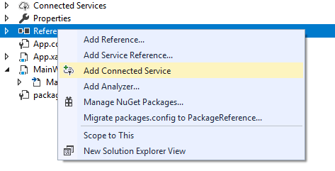
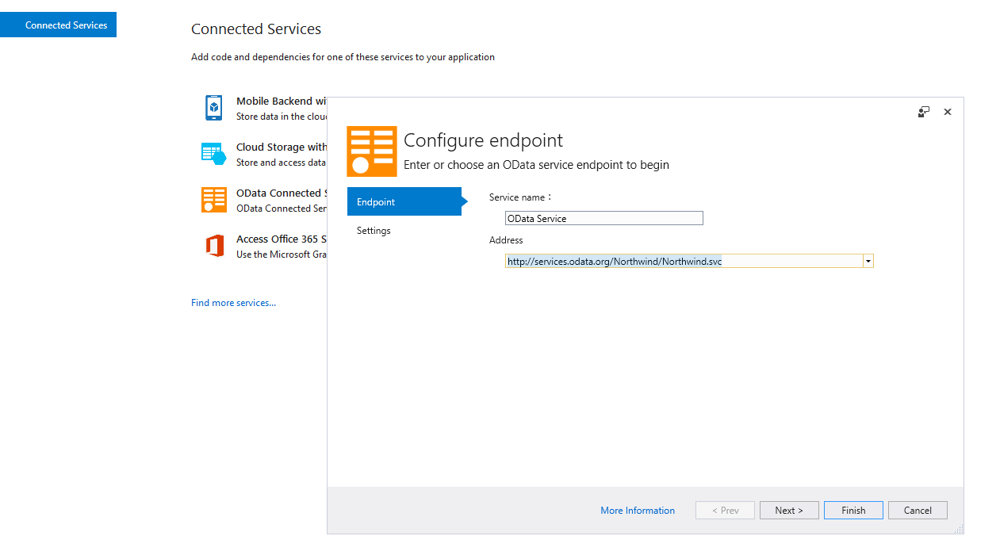

# Consuming WCF Data Service

The purpose of this tutorial is to show you how to make a call to an ADO.NET Data Service in the context of a SilverlightWPF application. The following common tasks will be examined:

>tip You can check the Telerik [RadDataServiceDataSource]() which provides seamless integration between an user interface and data coming from a WCF Data Service.

* Adding a reference.

* Creating a new instance of the exposed entity.

* Making asynchronous call to the service and consuming the service result.

This tutorial will use the __Northwind__ database, which can be accessed from [http://services.odata.org/Northwind/Northwind.svc](http://services.odata.org/v4/Northwind/Northwind.svc)

>The process of developing an ADO.NET Data Service is beyond the scope of this tutorial. For more information read [here](http://msdn.microsoft.com/en-us/library/cc907912.aspx).

## Adding Reference

The first step is to add a new connected service to your application. In order to add the needed connected service, you will need to add the [OData Connected Service](https://marketplace.visualstudio.com/items?itemName=laylaliu.ODataConnectedService) Visual Studio extension. After adding this extension you can follow the steps below.

>tipThe __OData Connected Service__ tool works only with __Visual Studio 2017 and 2019__.

#### __Figure 1: Select the "References" folder, right click with your mouse button and choose "Add Connected Service"__ 


#### __Figure 2: A new tab will be opened with the available conntected services. Click on the OData Connected Service.__


#### __Figure 3: A popup window will appear. In the Address TextBox, type the Northwind URL address and click on the Finish button below.__


When a service reference is added to a project, any types defined in the service are generated in the local project. 

Once the ADO.NET data service is added all needed assemblies will be included in your project automatically.

## Creating New Instance of the exposed Entities

__Example 1: Create new instance of the NorthwindEntities__

```C#
	public partial class MainWindow : Window
    {
        public MainWindow()
        {
            InitializeComponent();
            NorthwindEntities serviceClient = new NorthwindEntities(new Uri("http://services.odata.org/Northwind/Northwind.svc"));
        }
    }
```
```VB.NET
	Public Partial Class MainWindow
		Inherits Window

		Public Sub New()
			InitializeComponent()
			Dim serviceClient As NorthwindEntities = New NorthwindEntities(New Uri("http://services.odata.org/Northwind/Northwind.svc"))
		End Sub
	End Class
```

__NorthwindEntities__ represents the runtime context of a given data service. While data services themselves are stateless, the context is not, so state on the client is maintained between interactions in order to support features such as identity resolution and optimistic concurrency.  

## Making a Call to the Service and Consuming the Result

Making a call to an ADO.NET Data Service is a simple process. Here is a sample code, demonstrating how to load all categories from the Categories table in the Northwind database: 


```C#
	public partial class MainWindow : Window
	{
		public ObservableCollection<Category> Categories { get; set; }
		public MainWindow()
		{
			InitializeComponent();
			NorthwindEntities serviceClient = new NorthwindEntities(new Uri("http://services.odata.org/Northwind/Northwind.svc"));				
			foreach (Category c in serviceClient.Categories.Execute())
			{
				this.Categories.Add(c);
			}
		}
	}
```


```VB.NET
	Public Partial Class MainWindow
		Inherits Window

		Public Property Categories As ObservableCollection(Of Category)

		Public Sub New()
			InitializeComponent()
			Dim serviceClient As NorthwindEntities = New NorthwindEntities(New Uri("http://services.odata.org/Northwind/Northwind.svc"))

			For Each c As Category In serviceClient.Categories.Execute()
				Me.Categories.Add(c)
			Next
		End Sub
	End Class
```
