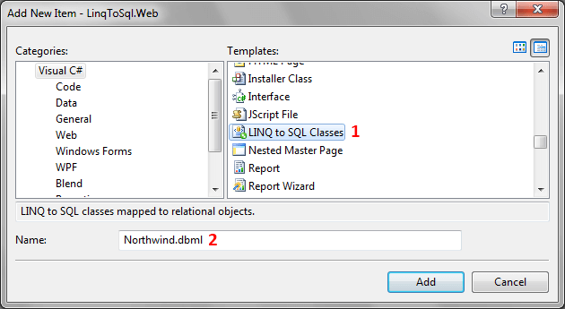
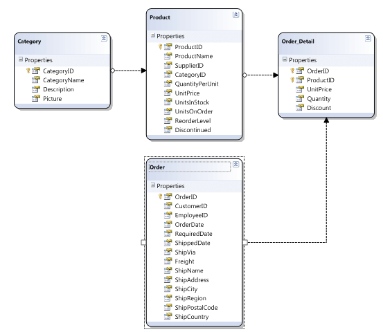

# Using LINQ to SQL Classes


The purpose of this tutorial is to show you how to use __LINQ to SQL Classes__. __LINQ to SQL__ is an [ORM](http://en.wikipedia.org/wiki/Object-relational_mapping) (object relational mapping) implementation, which allows you to model a relational database using .NET classes. You can then query the database using __LINQ__, as well as update\insert\delete data from it. __LINQ to SQL__fully supports transactions, views, and stored procedures.

This topic will cover how to:

* [Query an entity from the database](#Query_an_Entity_from_the_Database)

* [Update an entity in the database](#Update_an_Entity_in_the_Database)

* [Insert a new record(s) in the database](#Insert_a_New_Record(s)_in_the_Database)

* [Delete a record from the database](#Delete_a_Record_from_the_Database)

* [Retreive a record with Server Side Paging](#Retreive_a_Records_with_Server_Side_Paging)

>tipFor the purpose of this tutorial the __Northwind__ database will be used, which can be downloaded from [here](http://www.microsoft.com/downloads/details.aspx?FamilyID=06616212-0356-46A0-8DA2-EEBC53A68034&displaylang=en)

Add a new LINQ to SQL mapping.


Using the LINQ to SQL designer you can easily create a representation of the sample Northwind database like the one below:


## Query an Entity from the Database

The next code-snippet uses LINQ query syntax to retreive an __IEnumerable__ sequence of __Product__ objects.

#### __C#__

```C#
	NortwindDataContext dbContext = new NortwindDataContext();
	var query = from p in dbContext.Products
	               where p.Category.CategoryName == "Seafood"
	               select p;
	IEnumerable<Product> products = query.ToList();
	```


#### __VB.NET__

```VB.NET
	Dim dbContext As New NortwindDataContext()
	Dim query = From p In dbContext.Products _
	    Where p.Category.CategoryName = "Seafood" _
	    Select p
	Dim products As IEnumerable(Of Product) = query.ToList()
	```


## Update an Entity in the Database

The code below demonstrates how to grab a single __Product__ object from the database, update its price, and then save the changes back to the database.

#### __C#__

```C#
	NortwindDataContext dbContext = new NortwindDataContext();
	Product product = dbContext.Products.Single( p => p.ProductName == "Aniseed Syrup" );
	product.UnitPrice = 1000;
	dbContext.SubmitChanges();
	```


#### __VB.NET__

```VB.NET
	Dim dbContext As New NortwindDataContext()
	Dim query = From p In dbContext.Products _
	            Where p.ProductName = "Aniseed Syrup" _
	            Select p
	product.UnitPrice = 1000
	dbContext.SubmitChanges()
	```


## Insert a New Record(s) in the Database

The code below shows you how to create a new __Category__ object. Then how to create two new __Products__ and associate them with the __Category__. Finally, all three objects are saved in the database.

#### __C#__

```C#
	NortwindDataContext dbContext = new NortwindDataContext();
	
	Category category = new Category();
	category.CategoryName = "Test Category";
	
	Product firstProduct = new Product();
	firstProduct.ProductName = "Test Product 1";
	
	Product secondProduct = new Product();
	secondProduct.ProductName = "Test Product 2";
	
	category.Products.Add( firstProduct );
	category.Products.Add( secondProduct );
	
	dbContext.Categories.InsertOnSubmit( category );
	dbContext.SubmitChanges();
	```


#### __VB.NET__

```VB.NET
	Dim dbContext As New NortwindDataContext()
	
	Dim category As New Category()
	category.CategoryName = "Test Category"
	
	Dim firstProduct As New Product()
	firstProduct.ProductName = "Test Product 1"
	
	Dim secondProduct As New Product()
	secondProduct.ProductName = "Test Product 2"
	
	category.Products.Add(firstProduct)
	category.Products.Add(secondProduct)
	
	dbContext.Categories.InsertOnSubmit(category)
	dbContext.SubmitChanges()
	```


## Delete a Record from the Database

The code below demonstrates you how to delete all "Test" products from the database.

#### __C#__

```C#
	NortwindDataContext dbContext = new NortwindDataContext();
	var query = from p in dbContext.Products
	            where p.ProductName.Contains( "Test" )
	            select p;
	dbContext.Products.DeleteAllOnSubmit( query );
	dbContext.SubmitChanges();
	```


#### __VB.NET__

```VB.NET
	Dim dbContext As New NortwindDataContext()
	Dim query = From p In dbContext.Products _
	    Where p.ProductName.Contains("Test") _
	    Select p
	dbContext.Products.DeleteAllOnSubmit(query)
	dbContext.SubmitChanges()
	```


## Retreive a Record with Server Side Paging

The next example shows you how to implement efficient server-side database paging. By using the __Skip()__ and __Take()__ methods, you will return 15 rows from the database - starting with row 300.

#### __C#__

```C#
	NortwindDataContext dbContext = new NortwindDataContext();
	var query = ( from p in dbContext.Products
	              where p.Category.CategoryName == "Aniseed Syrup"
	              select p ).Skip( 300 ).Take( 15 );
	IEnumerable<Product> products = query.ToList();
	```


#### __VB.NET__

```VB.NET
	NortwindDataContext dbContext = new NortwindDataContext();
	Dim query = (From p In dbContext.Products _
	            Where p.ProductName == "Aniseed Syrup" _
	            Select p).Skip(300).Take(15)
	Dim products As IEnumerable(Of Product) = query.ToList()
	```


## See Also

 * [Consuming WCF Service]()

 * [Consuming WCF Data Service]()

 * [Consuming Web (asmx) Service]()
