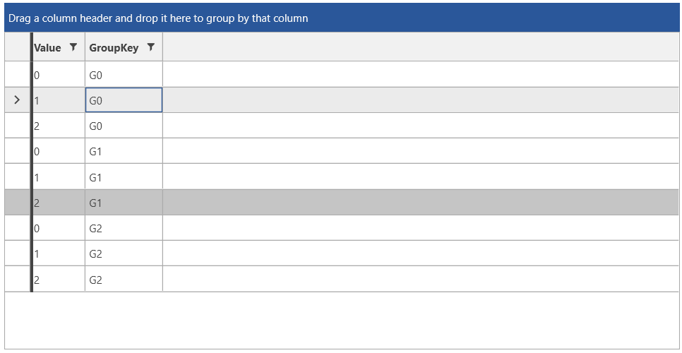
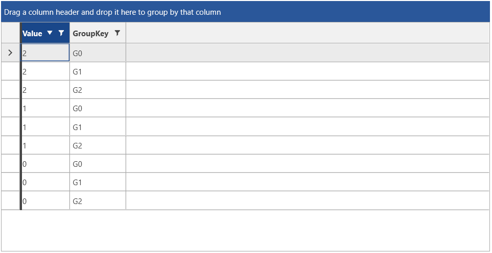
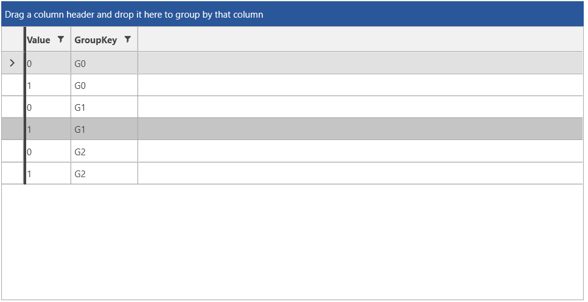
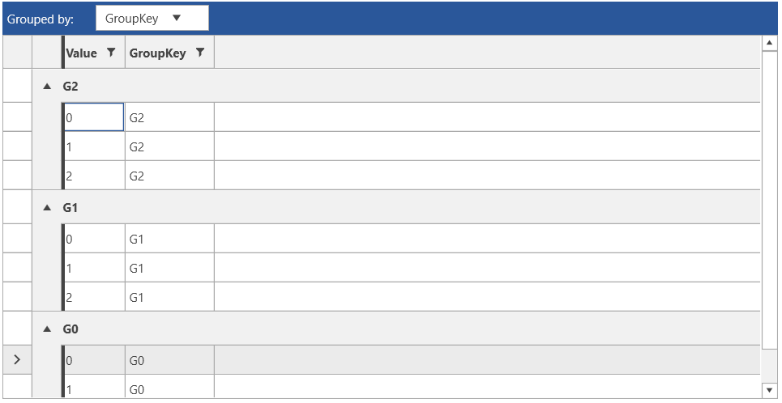
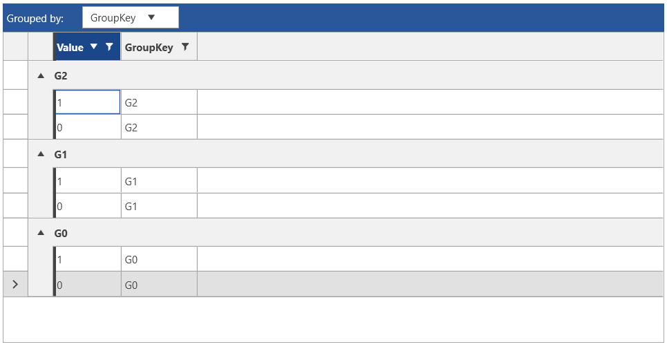

# QueryableCollectionView

`QueryableCollectionView` enables а collection to have the functionalities of sorting, filtering, grouping, and paging. 

This article descibes the features and provides examples on the QueryableCollectionView (QCV) usage.

The QCV requires an `IEnumerable` source for the data and it works with three major properties to enable sorting, filtering and grouping. The `GroupDescriptors`, `FilterDescriptors`, and `SortDescriptors`. For paging, check the [Paging](#paging) section of this article.

## Defining and Using QueryableCollectionView

The following example shows a basic QueryableCollectionView definintion without any sorting, filtering, grouping or paging applied.

#### __[C#] Defining a collection item model__
{{region consuming-data-queryablecollectionview-0}}
	public class DataInfo
    {
        public int Value { get; set; }
        public string GroupKey { get; set; }
    }
{{endregion}}  

#### __[C#] Defining QueryableCollectionView and populating it with data__
{{region consuming-data-queryablecollectionview-1}}
	public MainWindow()
	{	  
		InitializeComponent();
		var source = new ObservableCollection<DataInfo>();
		for (int i = 0; i < 3; i++)
		{
			for (int k = 0; k < 3; k++)
			{
				source.Add(new DataInfo() { Value = k, GroupKey = "G" + i });
			}
		}
		var qcv = new QueryableCollectionView(source);
		this.DataContext = qcv;
	}
{{endregion}}  

#### __[XAML] Defining RadGridView and consuming the collection view__
{{region consuming-data-queryablecollectionview-2}}
	<telerik:RadGridView ItemsSource="{Binding}"/>
{{endregion}}  

__RadGridView populate with QueryableCollectionView__

## Sorting

The `SortDescriptors` collection of the view allows you to define a set of [SortDescriptor](https://docs.telerik.com/devtools/wpf/api/telerik.windows.data.sortdescriptor) objects. The SortDescriptor class provides `Member` and `SortDirection` properties that are used to define the property name being used as the sorting criteria and the sort direction (ascending or descending).

#### __[C#] Defining a SortDescriptor__
{{region consuming-data-queryablecollectionview-3}}
	var qcv = new QueryableCollectionView(source);
	qcv.SortDescriptors.Add(new SortDescriptor() { Member = "Value", SortDirection = ListSortDirection.Descending });            
{{endregion}}  

__RadGridView sorted with QueryableCollectionView SortDescriptors__

Generic sorting is supported too, using the `SortDescriptor<TElement, TKey>` class. 

#### __[C#] Using generic sort descriptor__
{{region consuming-data-queryablecollectionview-4}}
	var qcv = new QueryableCollectionView(source);
	qcv.SortDescriptors.Add(new SortDescriptor<DataInfo, int>() 
	{
		SortingExpression = info => info.Value,
		SortDirection = ListSortDirection.Descending 
	});
{{endregion}}

## Filtering

The `FilterDescriptors` collection of the view allows you to define a set of [FilterDescriptor](https://docs.telerik.com/devtools/wpf/api/telerik.windows.data.filterdescriptor) objects. The FilterDescriptor class provides `Member`, `Operator`, and `Value` properties that are used to define the filtering criteria.

#### __[C#] Defining a FilterDescriptor__
{{region consuming-data-queryablecollectionview-5}}
	var qcv = new QueryableCollectionView(source);
	qcv.FilterDescriptors.Add(new FilterDescriptor()
	{
		Member = "Value",
		Operator = FilterOperator.IsLessThanOrEqualTo,
		Value = 1
	});
{{endregion}}  

__RadGridView filtered with QueryableCollectionView FilterDescriptors__

Generic filtering is supported too, using the `FilterDescriptor<Element>` class. 

#### __[C#] Using generic filter descriptor__
{{region consuming-data-queryablecollectionview-6}}
	var qcv = new QueryableCollectionView(source);
	qcv.FilterDescriptors.Add(new FilterDescriptor<DataInfo>()
	{
		FilteringExpression = info => info.Value <= 1
	});
{{endregion}}  

## Grouping  

The `GroupDescriptors` collection of the view allows you to define a set of [GroupDescriptor](https://docs.telerik.com/devtools/wpf/api/telerik.windows.data.groupdescriptor) objects. The GroupDescriptor class provides `Member` and `SortDirection` properties that are used to define the property name being used as the grouping criteria and the sort direction of the groups (ascending or descending).

#### __[C#] Defining a GroupDescriptor__
{{region consuming-data-queryablecollectionview-7}}
	var qcv = new QueryableCollectionView(source);
	qcv.GroupDescriptors.Add(new GroupDescriptor()
	{
		Member = "GroupKey",
		SortDirection = ListSortDirection.Descending
	});
{{endregion}}  

__RadGridView grouped with QueryableCollectionView GroupDescriptors__

Generic grouping is supported too, using the `GroupDescriptor<TElement, TKey, TSortingKey>` class. 

#### __[C#] Using generic group descriptor__
{{region consuming-data-queryablecollectionview-8}}
	var qcv = new QueryableCollectionView(source);
	qcv.GroupDescriptors.Add(new GroupDescriptor<DataInfo, string, string>()
	{
		GroupingExpression = info => info.GroupKey,
		SortDirection = ListSortDirection.Descending
	});
{{endregion}}

## Paging

The QueryableCollectionView class provides an out-of-the-box ability to apply paging.

To make full use of the paging functionality, you can utilize the following API:

* `PageSize`&mdash;Specifies the number of items to display on a page.
* `PageIndex`&mdash;This property retrieves the index of the current page.
* `IsPageChanging`&mdash;Property of type __bool_ that indicates if a page index change is in process.
* `CanChangePage`&mdash;Specifies if the PageIndex value can change.
* `IsPaged`&mdash;This property indicates whether paging is applied to the QueryableCollectionView instance.
* `ShouldRefreshOrDeferOnPageSizeChange`&mdash;Indicates whether this instance should call the `RefreshOrDefer` method when the PageSize property changes. Its default value of __true__. This is a virtual property, which means that you can override it and set it to __false__ in a new class that derives from QueryableCollectionView. Then, you can work with this new custom QueryableCollectionView collection.

The QueryableCollectionView exposes the following two events when it comes to the paging functionality:

* `PageChanging`&mdash;This event occurs when the PageIndex property is changing. The event arguments are of the type `PageChangingEventArgs`, which provides information about the new page index. PageChangingEventArgs derives from the `CancelEventArgs` class and allows you to cancel the changing of the page index. To do so, set the `Cancel` property to __true__ in the added handler for the PageChanging event.
* `PageChanged`&mdash;This event will occur when the PageIndex property is changed. The event arguments are of the type `EventArgs`.

QueryableCollectionView provides several methods for moving through the pages. These methods target the general functionality that a paging API should have, which is moving to the first/last and to the next/previous page. This is achieved by utilizing the following methods:

* `MoveToFirstPage`&mdash;Sets the first page as the current one. Returns a __bool__ value that indicates if this operation was successful or not.
* `MoveToLastPage`&mdash;Sets the last page as the current one. Returns a __bool__ value that indicates if this operation was successful or not.
* `MoveToNextPage`&mdash;Sets the next page as the current one. Returns a __bool__ value that indicates if this operation was successful or not.
* `MoveToPreviousPage`&mdash;Sets the previous page as the current one. Returns a __bool__ value that indicates if this operation was successful or not.

## Using QueryableCollectionView in XAML 

`QueryableCollectionViewSource` is an abstraction of QueryableCollectionView that internally uses it. It allows you to take advantage of QueryableCollectionView and its features in XAML.

QueryableCollectionViewSource can be defined as a resource in XAML and allows you to provide it with a collection using its `Source` property. If the Source is an object of type QueryableCollectionView, the QueryableCollectionViewSource sync its descriptors directly with it. If the Source is another collection type, it is wrapped into a QueryableCollectionView which is used by the view source internally.

QueryableCollectionViewSource provides the same descriptor collections like QueryableCollectionView&mdash;`GroupDescriptors`, `SortDescriptors`, and `FilterDescriptors`. To access the underlying QueryableCollectionView object use the `View` property of the view source.

The following example shows how to setup basic view model and use QueryableCollectionViewSource with RadGridView.

#### __[C#] Defining the view model__
{{region consuming-data-queryablecollectionview-9}}
	public class MainViewModel
    {
        public ObservableCollection<DataInfo> Items { get; set; }
        public MainViewModel()
        {
            Items = new ObservableCollection<DataInfo>();
            for (int i = 0; i < 3; i++)
            {
                for (int k = 0; k < 3; k++)
                {
                    Items.Add(new DataInfo() { Value = k, GroupKey = "G" + i  });
                }
            }
        }
    }
{{endregion}}  

See the first example from the beginning of this article for the definition of the __DataInfo__ class.

#### __[XAML] Defining QueryableCollectionViewSource in XAML__
{{region consuming-data-queryablecollectionview-10}}
	<Window.Resources>
        <local:MainViewModel x:Key="viewModel" />
        <telerik:QueryableCollectionViewSource x:Key="qcvSource" Source="{Binding Source={StaticResource viewModel}, Path=Items}"/>
    </Window.Resources>
{{endregion}}  

#### __[XAML] Consuming the QueryableCollectionViewSource's view in XAML__
{{region consuming-data-queryablecollectionview-11}}
	<telerik:RadGridView ItemsSource="{Binding Source={StaticResource qcvSource}, Path=View}" />
{{endregion}}  

To use grouping, sorting, and filtering set the corresponding descriptors of the view source object.

#### __[XAML]  Adding descriptors in XAML__
{{region consuming-data-queryablecollectionview-12}}
	<Window.Resources>
        <local:MainViewModel x:Key="viewModel" />
        <telerik:QueryableCollectionViewSource x:Key="qcvSource" Source="{Binding Source={StaticResource viewModel}, Path=Items}">
            <telerik:QueryableCollectionViewSource.SortDescriptors>
                <telerik:SortDescriptor Member="Value" SortDirection="Descending" />
            </telerik:QueryableCollectionViewSource.SortDescriptors>
            <telerik:QueryableCollectionViewSource.GroupDescriptors>
                <telerik:GroupDescriptor Member="GroupKey" SortDirection="Descending" />
            </telerik:QueryableCollectionViewSource.GroupDescriptors>
            <telerik:QueryableCollectionViewSource.FilterDescriptors>
                <telerik:FilterDescriptor Member="Value" Operator="IsLessThanOrEqualTo" Value="1"/>
            </telerik:QueryableCollectionViewSource.FilterDescriptors>
        </telerik:QueryableCollectionViewSource>
    </Window.Resources>
{{endregion}} 

__RadGridView populated using QueryableCollectionViewSource__

## See Also
* [Consuming Data Overview]()
* [In-Memory Data]()