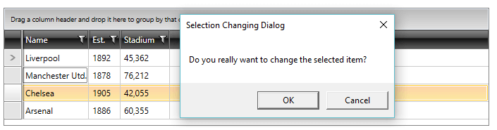

# Attached Behavior/Properties

Ever found your self in a situation where a control is missing the one feature that would make it perfect for your requirements? Or maybe you want to modify its default behavior in a specific scenario? This is where attached properties come handy.

[Attached properties](https://msdn.microsoft.com/en-us/library/ms749011(v=vs.110).aspx) could be used to extend the functionality of a control with very little implementation on our side. A great benefit is that an additional behavior can be added without performing the logic in the code-behind of the window where the control is situated.

* [Example](#example)

* [TextBoxBehavior](#textboxbehavior)

## Example

The following example uses the **RadGridView** control, however, the approach can be applied to any other dependency object.

Let's assume you would like to ask your users for confirmation when changing the selected item of the RadGridView control. Usually, in such case, you can handle the **SelectionChanging** event and cancel it when a specific condition is met. This can be easily done through an attached behavior. Here are the steps you need to follow.

**1.** Create the class that will hold the attached property:

#### **[C#] Example 1: Create the attached property**
```C#
	public class SelectionChangingBehavior
    {
        public static bool GetShouldShowConfirmationDialog(DependencyObject obj)
        {
            return (bool)obj.GetValue(ShouldShowConfirmationDialogProperty);
        }

        public static void SetShouldShowConfirmationDialog(DependencyObject obj, bool value)
        {
            obj.SetValue(ShouldShowConfirmationDialogProperty, value);
        }
        
        public static readonly DependencyProperty ShouldShowConfirmationDialogProperty =
            DependencyProperty.RegisterAttached("ShouldShowConfirmationDialog", typeof(bool), typeof(SelectionChangingBehavior), new PropertyMetadata(OnShouldShowConfirmationDialogChanged));
	}
```

**2.** In the callback method passed to the PropertyMetadata of the attached property subscribe to the **SelectionChanging** event by using the **DependencyObject** argument:

#### **[C#] Example 2: Handle the SelectionChangingEvent of RadGridView on activating the behavior**
```C#
	private static void OnShouldShowConfirmationDialogChanged(DependencyObject d, DependencyPropertyChangedEventArgs e)
    {
        RadGridView gridView = d as RadGridView;
        if ((bool)e.NewValue == true)
        {
            gridView.SelectionChanging += GridView_SelectionChanging;
        }
    }

    private static void GridView_SelectionChanging(object sender, SelectionChangingEventArgs e)
    {
        MessageBoxResult result = MessageBox.Show("Do you want to change the selection?", "Selection Changing Dialog", MessageBoxButton.OKCancel);
        if (result == MessageBoxResult.Cancel)
        {
            e.Cancel = true;
        }
    }
```

**3.** Activate the attached behavior for the RadGridView instance:

####  **[XAML] Example 3: Set the attached behavior to the specific RadGridView**
```XAML
		<telerik:RadGridView Grid.Row="0" 
                             Name="clubsGrid" 
                             ItemsSource="{Binding Clubs}"
                             my:SelectionChangingBehavior.ShouldShowConfirmationDialog="True"
                             AutoGenerateColumns="False"
                             Margin="5">
```

Applying these steps will result in a confirmation dialog through which you can cancel the selection changing in your application, as shown in **Figure 1**.

#### **Figure 1: Confirmation dialog on changing the selected item of the RadGridView**



Another implementation can be found on the following blog post - [Extending the Functionalities of RadControls with Attached Properties.](http://www.telerik.com/blogs/extending-the-functionality-of-radcontrols-with-attached-properties)

There is a demo available in our **SDK repository located at GitHub** - [ListBox SelectedItems](https://github.com/telerik/xaml-sdk/tree/master/ListBox/SelectedItems). The example is also available in the [SDK Samples Browser](https://demos.telerik.com/xaml-sdkbrowser/) labeled **"Create Attached Property for SelectedItems"**.

## TextBoxBehavior

The built-in behavior of the standard TextBox control can be manipulated through as set of members exposed by the __TextBoxBehavior__ class. It is defined in the __Telerik.Windows.Controls__ namespace. 

* __SelectAllOnGotFocus__: Selects the whole Text when the TextBox receives focus.
* __SelectAllOnTripleClick__: Selects the whole Text when the user performs a triple mouse click.
* __UpdateTextOnEnter__: Updates the bound property when the user presses Enter key.
* __UpdateTextOnTextChanged__: Updates the bound property on each user input.

__Example 4: Applying the TextBoxBehavior__
```XAML
	<TextBox Text="{Binding Name}" telerik:TextBoxBehavior.SelectAllOnGotFocus="True" />
```

## See Also

* [EventToCommandBehavior]()
* [ViewModelBase Class]()
* [DelegateCommand]()
