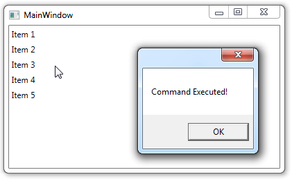
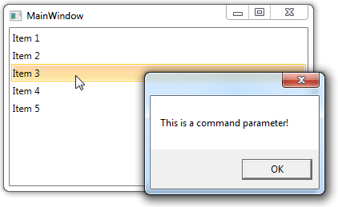
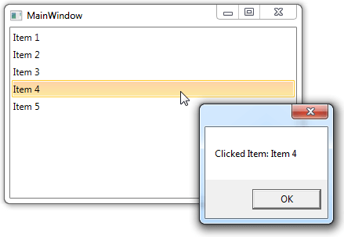

# EventToCommandBehavior

When working in more advanced development scenarios we often find ourselves leaning towards the MVVM pattern for producing cleaner, loosely coupled, easier to test code, but along with this comes the responsibility of ensuring that all controls we are using can follow this pattern. While it is very easy to work with the event-based model that exists across the .Net framework, events do not play well into the mindset of reducing traditional code-behind and instead handling logic within a viewmodel. This is where the Telerik __EventToCommandBehavior__ comes into use to allow your events to fire and your code to respond accordingly, all in the ViewModel without touching the code-behind of the UserControls.
      
## Getting Started

Let's imagine that you need to use a __RadListBox__ event in the ViewModel in order to execute some custom logic there. If you have the following __RadListBox__:
        
__Example 1: Declare the RadListBox control__

```XAML
	<telerik:RadListBox ItemsSource="{Binding ListBoxItems}" />
```

Which DataContext is the ViewModel below:
        
__Example 2: Create the ViewModel class__

```C#
	public class ViewModel: ViewModelBase
	{
	    public ObservableCollection<string> ListBoxItems { get; set; }
	
	    public ViewModel()
	    {
	        this.ListBoxItems = new ObservableCollection<string> { "Item 1", "Item 2", "Item 3", "Item 4", "Item 5" };
	    }
	}
```

And you need to handle the MouseEnter event of the ListBox, the __EventToCommandBehavior__ will easily allow you to bind that event to a command in the ViewModel. You would just need to add object of type __EventBinding__ to the __EventToCommandBehavior.EventBindings__ collection. The __EventBinding__ object contains few properties, in this case you will need to use the Command property which should be bound to the desired Command and the Event property which represents the event you want to handle:
       
__Example 3: Bind a specific event to a desired command__

```XAML
	<telerik:RadListBox x:Name="ListBox" ItemsSource="{Binding ListBoxItems}">
	    <telerik:EventToCommandBehavior.EventBindings>
	        <telerik:EventBinding Command="{Binding CustomCommand}" EventName="MouseEnter" />
	    </telerik:EventToCommandBehavior.EventBindings>
	</telerik:RadListBox>
```

The last thing you should do is to define the custom command in the ViewModel as shown below:
        
__Example 4: Define the custom command__

```C#
	public ICommand CustomCommand { get; set; }
	    ...
	public ViewModel()
	{
	    ...
	    this.CustomCommand = new DelegateCommand(OnCustomCommandExecuted);
	}
	
	private void OnCustomCommandExecuted(object obj)
	{
	    MessageBox.Show("Command Executed!");
	}
```

**Figure 1** shows the final result.
#### __Figure 1: Execute a command through the EventToCommandBehavior__


## RaiseOnHandledEvents

Sometimes it appears that the event you need to handle is already handled in the code of the control. In the previous example the event wasn't handled in the code so there weren't any problems. However if you need to handle the MouseLeftButtonDown for an example you won't be able unless you set the __RaiseOnHandledEvents__ property to True which allows you to raise handled events:
       
__Example 5: Set the RasedOnHandledEvents property__

```XAML
	<telerik:EventToCommandBehavior.EventBindings>
	    <telerik:EventBinding Command="{Binding CustomCommand}" EventName="MouseLeftButtonDown" RaiseOnHandledEvents="True" />
	</telerik:EventToCommandBehavior.EventBindings>
```

The result will be the same command executed when the ListBox is Clicked.

## Command Parameters

When binding to a command you will probably need to pass some data to the method that executes the command. The __EventToCommandBehavior__ provides you with two options in this case - to pass whatever you need with the __CommandParameter__ property or to pass the event arguments of handled event with the __PassEventArgsToCommand__ property set to True.          
        
>Note that if you set both the properties at the same time, the __CommandParameter__ is with higher priority than the __PassEventArgsToCommand__ property.
          

### CommandParameter

With the __CommandParameter__ property you can easily pass an object or bind it to property of another control. Let's upgrade the example above by including a CommandParameter which will pass a simple string to the method in the ViewModel:
                
__Example 6: Set the CommandParameter__

```XAML
	<telerik:EventToCommandBehavior.EventBindings>
	    <telerik:EventBinding Command="{Binding CustomCommand}" EventName="MouseLeftButtonDown" RaiseOnHandledEvents="True"
	                          CommandParameter="This is a command parameter!"/>
	</telerik:EventToCommandBehavior.EventBindings>
```

And the method in the ViewModel should look as follows:
              
__Example 7: Modify the method in the ViewModel class__

```C#
	private void OnCustomCommandExecuted(object obj)
	{
	    MessageBox.Show(obj.ToString());
	}
```

The result is shown in **Figure 2**.
#### **Figure 2: Modified method to use the command parameter**


### PassEventArgsToCommand

You can also pass the event arguments to the method by setting the __PassEventArgsToCommand__ property to True. This will allow you to get the clicked element in same example and to use it as required.
                  

__Example 8: Set the PassEventArgsToCommand property__

```XAML
	<telerik:EventToCommandBehavior.EventBindings>
	    <telerik:EventBinding Command="{Binding CustomCommand}" EventName="MouseLeftButtonDown" RaiseOnHandledEvents="True"
	                        PassEventArgsToCommand="True" />
	</telerik:EventToCommandBehavior.EventBindings>
```

__Example 9: Modify the method to use the EventArgs__

```C#
	private void OnCustomCommandExecuted(object obj)
	{
	    var clickedItem = (obj as MouseButtonEventArgs).OriginalSource as TextBlock;
	    if (clickedItem != null)
	    {
	        MessageBox.Show("Clicked Item: " + clickedItem.Text);
	    }
	}
```

The result is shown in **Figure 3**.

#### **Figure 3: Pass the EventArgs to the method**


## CommandTarget

The __CommandTarget__ property of the __EventBinding__ specifies the element where the command occurs. If __CommandTarget__ is not set, the element that has keyboard focus will receive the command. For more details about the __CommandTarget__ please check the [CommandTarget Property topic](http://msdn.microsoft.com/en-us/library/system.windows.input.icommandsource.commandtarget%28v=vs.110%29.aspx).
        
## Multiple Commands

The __EventToCommandBehavior__ gives you the ability to add multiple __EventBinidings__. You can easily bind multiple commands to a single event as well as a single command to multiple events. For example we can execute two commands in the ViewModel when the MouseLeftButtonDown event of __RadListBox__ is fired:
        
__Example 10: Set multiple event bindings__

```XAML
	<telerik:EventToCommandBehavior.EventBindings>
	    <telerik:EventBinding Command="{Binding CustomCommand}" EventName="MouseLeftButtonDown" RaiseOnHandledEvents="True" />
	    <telerik:EventBinding Command="{Binding AnotherCommand}" EventName="MouseLeftButtonDown" RaiseOnHandledEvents="True" />
	</telerik:EventToCommandBehavior.EventBindings>
```

>If you have multiple commands attached to a single event, the commands will be executed in the order they are defined in the __EventBindings__ collection (from top to bottom).

## Failing Bindings

There are some cases where an event could be raised before the __Command__ binding of the __EventBinding__ is evaluated. Thus, the events would not be handled. There are a couple solutions for such scenarios. For the purpose of the examples, the __AutoGeneratingColumn__ event of __RadGridView__ will be used.

### Use ElementName for the Command binding

__Example 11: Set ElementName binding for the Command__
```XAML
	<telerik:EventBinding Command="{Binding ElementName=gridView, Path=DataContext.AutoGeneratingColumnCommand}" EventName="AutoGeneratingColumn" PassEventArgsToCommand="True"/>
```

### Set the DataContext of the Window in XAML

__Example 12: Set the DataContext of the Window in XAML__
```XAML
	<Window.DataContext>
    		<local:MainWindowViewModel />
	</Window.DataContext>
```

### Add the EventBinding programmatically

__Example 13: Add the EventBinding programmatically__
```XAML
	public MainWindow()
	{
		InitializeComponent();
		this.DataContext = new MainWindowViewModel();
		EventToCommandBehavior.GetEventBindings(gridView).Add(new Telerik.Windows.Controls.EventBinding()
		{
			EventName = "AutoGeneratingColumn",
			Command = (gridView.DataContext as MainWindowViewModel).AutoGeneratingColumnCommand,
			PassEventArgsToCommand = true
		});
	}
```

## See Also

* [Attached Behavior]()
* [ViewModelBase]()
* [DelegateCommand]()
