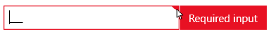

# Validation Error Visual


The Telerik controls that support text input provide a validation error visual that is displayed when an error occurs. Examples of such controls are `RadMaskedTextInput`, editable `RadComboBox`, `RadWatermarkTextBox`, `TextBox` (when styled with our custom styles) and more.

When the control has validation errors, the border around the control turns red and an error message is visualized. 



The message visualization can vary based on the applied display mode.

## Display Modes 

The Telerik validation error template supports few different visualizations. To change between the visualizations, set the `ValidationErrorTemplateHelper.DisplayMode` attached property on the corresponding input control. 

__Setting the display mode__
```XAML
	<telerik:RadMaskedTextInput telerik:ValidationErrorTemplateHelper.DisplayMode="Static" />
```

The property supports the following modes:

* `ToolTip`&mdash;Little ribbon element appears in the upper right corner of the control. When the ribbon gets hovered the validation message is displayed in a tooltip. This is the default behavior in most Telerik themes.

* `Static`&mdash;The red rectangle that shows the error message is displayed as a static element, next to the validated control.

* `StaticOnFocus`&mdash;The red rectangle that shows the error message is displayed as a static element, next to the validated control. This happens only when the input control is focused. The error message disappears when the focus is lost.

* `Default`&mdash;This mode behaves as ToolTip or Static, based on the applied Telerik theme. Most themes use the ToolTip behavior.

## Error Template

The validation error visual is defined using the [Validation.ErrorTemplate](https://learn.microsoft.com/en-us/dotnet/api/system.windows.controls.validation.errortemplate?view=windowsdesktop-6.0) attached property. Telerik uses this API to define the error's appearance for most input components.

The default visual can be modified by setting a custom template using the `Validation.ErrorTemplate` property. The default template can be found in the `Telerik.Windows.Controls.xaml` file. See how to get the file the [Editing Control Templates]() article.

The following example shows how to create a custom error template and assign it via the `Validation.ErrorTemplate` property.

__Defining custom ControlTemplate__
```XAML
	<ControlTemplate x:Key="CustomErrorTemplate">
		<!-- define whatever UI needed here -->
	</ControlTemplate>
```

__Setting the custom template__
```XAML
	<telerik:RadMaskedNumericInput Validation.ErrorTemplate="{StaticResource CustomErrorTemplate}" />
```


When the control has validation errors, the border around the control will turn red and a little element will appear in the upper right corner of the control. When you hover over the element you can read the validation message. The visual appereance of the validation error comes from the __Validation.ErrorTemplate__ attached property. Most of our controls have a predefined template for this property. The visual appearance of the error is defined inside the default template of the controls. 

If you want to modify the default one, you can extract the default __Validation.ErrorTemplate__ for the specified control and modify it per your needs. You can check the [Editing Control Templates]() help article which describes how you can get the template of our controls.

In a case, you want to create your own error template, you can create custom __ControlTemplate__ and assign it to the __Validation.ErrorTemplate__ attached property.

__Example 1: Custom ControlTemplate__
```XAML
	<ControlTemplate x:Key="CustomErrorTemplate">
		<!-- define whatever UI needed here -->
	</ControlTemplate>
```

__Example 2: Custom ControlTemplate__
```XAML
	<telerik:RadMaskedNumericInput Validation.ErrorTemplate="{StaticResource CustomErrorTemplate}" />
```

## ValidationErrorTemplateHelper

By default, the validation error tooltip message will appear only when the mouse is over this element. To make the validation message appears when the control is focused, you can set the __ValidationErrorTemplateHelper.ShowWhenFocused__ attached property to true. Its default value is false.

__Show Validation Message on Focus__
```XAML
	<telerik:RadWatermarkTextBox telerik:ValidationErrorTemplateHelper.ShowWhenFocused="True" />
```	


## See Also 
* [Introduction]()
* [Getting Started with XAML]()
