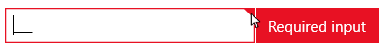

# Validation Error Visual

The Telerik controls that support text input provide a validation error visual that is displayed when an error occurs. Examples of such controls are `RadMaskedTextInput`, editable `RadComboBox`, `RadWatermarkTextBox`, `TextBox` (when styled with our custom styles) and more.

When the control has validation errors, the border around the control turns red and an error message is visualized. 



The message visualization can vary based on the applied display mode.

## Display Modes 

The Telerik validation error template supports few different visualizations. To change between the visualizations, set the `ValidationErrorTemplateHelper.DisplayMode` attached property on the corresponding input control. 

__Setting the display mode__
```XAML
<telerik:RadMaskedTextInput telerik:ValidationErrorTemplateHelper.DisplayMode="Static" />
```

The property supports the following modes:

* `ToolTip`&mdash;Little ribbon element appears in the upper right corner of the control. When the ribbon gets hovered the validation message is displayed in a tooltip. This is the default behavior in most Telerik themes.

* `Static`&mdash;The red rectangle that shows the error message is displayed as a static element, next to the validated control.

* `StaticOnFocus`&mdash;The red rectangle that shows the error message is displayed as a static element, next to the validated control. This happens only when the input control is focused. The error message disappears when the focus is lost.

* `Default`&mdash;This mode behaves as ToolTip or Static, based on the applied Telerik theme. Most themes use the ToolTip behavior.

## Error Template

The validation error visual is defined using the [Validation.ErrorTemplate](https://learn.microsoft.com/en-us/dotnet/api/system.windows.controls.validation.errortemplate?view=windowsdesktop-6.0) attached property. Telerik uses this API to define the error's appearance for most input components.

The default visual can be modified by setting a custom template using the `Validation.ErrorTemplate` property. The default template can be found in the `Telerik.Windows.Controls.xaml` file. See how to get the file the [Editing Control Templates]() article.

The following example shows how to create a custom error template and assign it via the `Validation.ErrorTemplate` property.

__Defining custom ControlTemplate__
```XAML
<ControlTemplate x:Key="CustomErrorTemplate">
	<!-- define whatever UI needed here -->
</ControlTemplate>
```

__Setting the custom template__
```XAML
<telerik:RadMaskedNumericInput Validation.ErrorTemplate="{StaticResource CustomErrorTemplate}" />
```

## See Also 
* [Introduction]()
