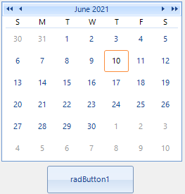
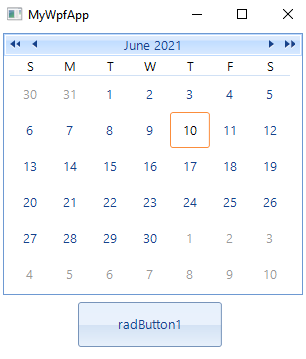

# Telerik UI for WinForms Controls in WPF Application

This article demonstrates how the Telerik UI for WinForms controls can be integrated in a {{ site.framework_name }} application.

## Creating the WinForms Project

Let's start by creating the Windows Forms Class Library.

1\. Launch Visual Studio, and open the **New Project** dialog box.

2\. In Visual C# and the Windows category, select the **Windows Forms Control Library** template.

3\. Name the new project **TelerikWinFormsControls**.

4\. For the location, specify a conveniently named top-level folder, such as WpfHostingWinFormsControl. Later, you will put the host application in this folder.

5\. Click OK to create the project. The default project contains a single control named **UserControl1**.

Your project should have references to the following system assemblies. If any of these dlls are not included by default, add them to your project.

* **System**
* **System.Data**
* **System.Drawing**
* **System.Windows.Forms**
* **System.Xml**

In addition, add a reference to the **Telerik.WinControls**, **Telerik.WinControls.UI** and **Telerik.Common** assemblies from your Telerik UI for WinForms installation or use the respective NuGet package.

Drag a **RadCalendar** and a **RadButton** to the designer from the Toolbox.

#### Figure 1: The Telerik WinForms controls in the designer



## Create the WPF Application

To create the hosting WPF application:

1\. Launch Visual Studio, and open the **New Project** dialog box.

2\. In Visual C# and the Windows category, select the **WPF Application** template.

3\. Name the new project **WPFHost**.

4\. For the location, specify the same top-level folder that contains the **TelerikWinFormsControls** project.

5\. Click OK to create the project.

You also need to add references to the DLL that contains UserControl1 and other assemblies.

1\. Right-click the project name in **Solution Explorer**, and select **Add Reference**.

2\. Add a project reference to the **TelerikWinFormsControls** project.

3\. Add a reference to the **WindowsFormsIntegration** assembly, which is named WindowsFormsIntegration.dll.

## Include the WinForms Controls in the WPF Application

Define the following XAML in the MainWindow.xaml file:

__Example 1: The XAML layout in UserControl1.xaml__
```XAML
	<WindowsFormsHost>
		<wfcontrols:UserControl1 />
	</WindowsFormsHost>
```

__Example 2: The wfcontrols namespace__
```XAML
	xmlns:wfcontrols="clr-namespace:TelerikWinFormsControls;assembly=TelerikWinFormsControls"
```

WindowsFormsHost represents the [WindowsFormsHost](https://docs.microsoft.com/en-us/dotnet/api/system.windows.forms.integration.windowsformshost) element that enables you to host a Windows Forms control in a WPF application. The UserControl1 is then added to the WindowsFormsHost element's child collection.

As a result, the Telerik Windows Forms controls are rendered as part of the WPF window, and you can communicate with them from the application.

#### Figure 2: The Telerik WinForms controls in the WPF application



## See Also 
* [Telerik UI for WPF Controls in WinForms Application]()