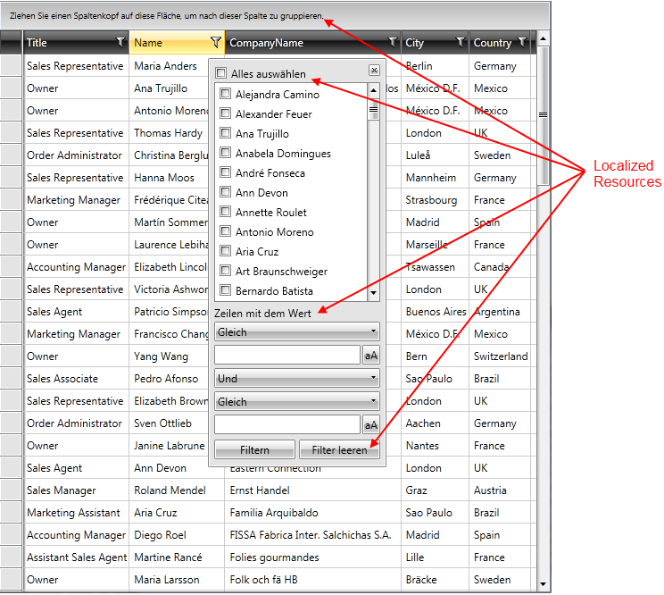
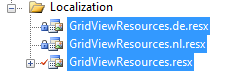
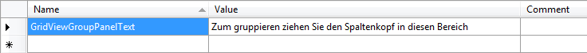

# Localization

When you limit your product's availability to only one language, you limit your potential customer base to a fraction of the world population. If you want your application to reach a global audience, cost-effective __localization__ of your product is one of the best and most economical ways to reach more customers. 

>tip__Localization__ is the translation of application resources into localized versions for the specific cultures that the application supports.

The built-in localization mechanism in WPFSilverlight allows you to localize any string resource used by a standard __RadControl__. Once translated you might use your resources in your WPFSilverlight project without changing anything.

The purpose of this tutorial is to show you how to localize any resource string used by a __RadControl__.

>tipAll examples in this tutorial are demonstrated in the context of the Telerik __RadGridView__ control. However, the techniques and principles used for the localization of the string resources are valid for all the other Telerik __WPFSilverlight controls__.

This topic contains the following sections:

* [What is LocalizationManager?](#what-is-localizationmanager)

* [Resource keys](#resource-keys)

* [Localization using ResourceManager](#localization-using-resourcemanager)

* [Localization using custom localization manager](#localization-using-custom-localization-manager)

## What is LocalizationManager?

The __Telerik.Windows.Controls.LocalizationManager__ allows you to easily localize any of the Telerik controls.

To apply [custom localization](#Localization_Using_Custom_Localization_Manager) to your controls just instantiate your custom __LocalizationManager__ and set it to the static property __LocalizationManager.Manager__, before the creation of the UI.

#### __C#__

{{region common-localization_0}}
	LocalizationManager.Manager = new CustomLocalizationManager();
{{endregion}}

#### __VB.NET__

{{region common-localization_1}}
	LocalizationManager.Manager = New CustomLocalizationManager()
{{endregion}}

>__Note that you have to set the localization manager before the creation of the UI, otherwise some parts might remain not-localized.__

## Resource Keys

Some of the controls are complex user interface controls (e.g. __RadGridView__, __RadScheduleView__) and their strings for localization are numerous. In order to be able to distinguish these resources, an unique identifier called __resource key__, is assigned to each localizable string.

On the picture below you can see some resource keys and the strings they are associated with.         

>tipFor a full list of __Resource Keys__, check out the __Localization__ topic for the specific control.

## Localization Using Built-in Resources

The built-in localization mechanism in  WPFSilverlight provides the possibility to set the used Telerik WPFSilverlight controls in one of the following supported languages:

* English            

* German
              
* Spanish
              
* French
 
* Italian              

* Dutch             

* Turkish
              
They are located in separate files (each for every language). You can find them in the corresponding folders together with the other binaries in your local installation.
        
>Not all the controls support each of those languages.
          
Note that, the resource folders are supposed to be placed along with the binaries you have referenced.


Firstly, you must defined your preferred language in the <Supported Cultures> tag, like so: 

#### __XAML__

{{region common-localization_4}}
	<SupportedCultures>en;nl</SupportedCultures>
{{endregion}}

The next step for defining the language settings of the application is changing the __Current Culture__ of the application.
            
#### __C#__

{{region common-localization_11}}
	private void Application_Startup(object sender, StartupEventArgs e)
	{
	    Thread.CurrentThread.CurrentCulture = new CultureInfo("es");
	    Thread.CurrentThread.CurrentUICulture = new CultureInfo("es");
	
	    this.RootVisual = new MainPage();
	}
{{endregion}}

#### __VB.NET__

{{region common-localization_12}}
	Private Sub Application_Startup(sender As Object, e As StartupEventArgs)
	    Thread.CurrentThread.CurrentCulture = New CultureInfo("es")
	    Thread.CurrentThread.CurrentUICulture = New CultureInfo("es")
	
	    Me.RootVisual = New MainPage()
	End Sub
{{endregion}}

You could check [this help article](http://www.telerik.com/help/silverlight/gridview-localization-setting-default-startup-language3.html), where you can find detailed explanation about how to achieve this.




The thing that you must do for defining the language settings of the application, is to change the current culture of the application. Locate the application initialization logic and add some code in the method for Startup in App.xaml.cs:
            
#### __C#__

{{region common-localization_9}}
	public App()
	{
	    Thread.CurrentThread.CurrentCulture = new CultureInfo("de");
	    Thread.CurrentThread.CurrentUICulture = new CultureInfo("de");
	}
{{endregion}}

#### __VB.NET__

{{region common-localization_10}}
	Public Sub New()
	    Thread.CurrentThread.CurrentCulture = New CultureInfo("de")
	    Thread.CurrentThread.CurrentUICulture = New CultureInfo("de")
	End Sub
{{endregion}}

You could check [this help article](http://www.telerik.com/help/wpf/gridview-localization-setting-default-startup-language3.html), where you can find detailed explanation about how to achieve this.


If you want to translate your __RadControl__ in another language, you should use the [Custom Localization Manager.](#Localization_Using_Custom_Localization_Manager)

## Localization Using ResourceManager

You can base your localization on the standard resource files provided by the .NET framework. For that purpose you will have to create a separate __.ResX file__ for each one of the languages that your application will support.
        
Imagine that you want to translate your control (for example: __RadGridView__ control) into English, German and Dutch. For that purpose you will have to add three new resource files to your project:
        

* __GridViewResources.resx__ - this resource file will store the __English(default)__ resources for the grid control. Set the __AccessModifier__ property to __Public__.
          
* __GridViewResources.de.resx__ - this resource file will store the __German__ resources for the grid control. Set the __AccessModifier__ property to  __No code generation__.
          
* __GridViewResources.nl.resx__ - this resource file will store the __Dutch__ resources for the grid control. Set the __AccessModifier__ property to __No code generation__.
          

Now, having the needed files, it's time to illustrate the idea and localize only the text for the group panel. For that purpose you need to create a single resource string in each one of the three resource files and translate it to the appropriate language.
      
>Note that the name of the resource string should be the same as the resource key for the string that you are localizing. The resource key for the group panel is __GridViewGroupPanelText__.
          
>tipFor a full list of __Resource Keys__, check out the __Localization__ topic for the specific control.
        
The snapshot below shows the content of the __GridViewResources.de.resx__ file. The resource name of the other two files should be the same. The __Value__ column will contain the translation for the appropriate language.

The last step is to instantiate the __LocalizationManager__ class and set its __ResourceManager__ to the resources that have been just created (you can do this in the default constructor of the Application class)        

#### __C#__

{{region common-localization_2}}
	LocalizationManager.Manager = new LocalizationManager()
	{
	   ResourceManager = GridViewResources.ResourceManager
	};
{{endregion}}

#### __VB.NET__

{{region common-localization_3}}
	LocalizationManager.Manager = New LocalizationManager()
	LocalizationManager.Manager.ResourceManager = GridViewResources.ResourceManager
{{endregion}}



>If you rely on culture settings to load the right resources automatically, you have to write some code inside your application's project file. For example, if you have to support English and Dutch languages, you can store the localized strings in __Resources.resx__ and __Resources.nl.resx__ files. For the __Resources.resx__ file you can set __ResXFileCodeGenerator__ to __Internal__ or __Public__ and for others - to __No code generation__.         



>If you rely on culture settings to load the right resources automatically, you have to write some code inside your application's project file. For example, if you have to support English and Dutch languages, you can store the localized strings in __Resources.resx__ and __Resources.nl.resx__ files. For the __Resources.resx__ file you can set __ResXFileCodeGenerator__ to __Internal__ or __Public__ and for others - to __No code generation__. Then, open the project file in a text-mode and insert the code below into the __<PropertyGroup>__ section. In this way you notify the framework about the supported cultures.
              
#### __XAML__

{{region common-localization_4}}
	<SupportedCultures>en;nl</SupportedCultures>
{{endregion}}


## Localization Using Custom Localization Manager

The other way to localize your __RadControl__ is to create a class that derives from the __LocalizationManager__ object and to override its method __GetStringOverride()__. The logic is pretty simple, you just have to create a switch statement and return the correct translation for each resource key, as it is shown below:
        

#### __C#__

{{region common-localization_5}}
	public class CustomLocalizationManager : LocalizationManager
	{
	  public override string GetStringOverride( string key )
	  {
	      switch( key )
	      {
	          case "GridViewGroupPanelText":
	              return "Zum gruppieren ziehen Sie den Spaltenkopf in diesen Bereich.";
	          //---------------------- RadGridView Filter Dropdown items texts:
	          case "GridViewClearFilter":
	              return "Filter löschen";
	          case "GridViewFilterShowRowsWithValueThat":
	              return "Anzeigen der Werte mit Bedingung:";
	          case "GridViewFilterSelectAll":
	              return "Alles anzeigen";
	          case "GridViewFilterContains":
	              return "Enthält";
	          case "GridViewFilterEndsWith":
	              return "Endet mit";
	          case "GridViewFilterIsContainedIn":
	              return "Enthalten in";
	          case "GridViewFilterIsEqualTo":
	              return "Gleich";
	          case "GridViewFilterIsGreaterThan":
	              return "Grösser als ";
	          case "GridViewFilterIsGreaterThanOrEqualTo":
	              return "Grösser oder gleich";
	          case "GridViewFilterIsLessThan":
	              return "Kleiner als";
	          case "GridViewFilterIsLessThanOrEqualTo":
	              return "Kleiner oder gleich";
	          case "GridViewFilterIsNotEqualTo":
	              return "Ungleich";
	          case "GridViewFilterStartsWith":
	              return "Beginnt mit";
	          case "GridViewFilterAnd":
	              return "Und";
	          case "GridViewFilter":
	              return "Filter";
	      }
	      return base.GetStringOverride( key );
	  }
{{endregion}}

#### __VB.NET__

{{region common-localization_6}}
	Public Class CustomLocalizationManager
	 Inherits LocalizationManager
	 Public Overrides Function GetStringOverride(key As String) As String
	  Select Case key
	   Case "GridViewGroupPanelText"
	    Return "Zum gruppieren ziehen Sie den Spaltenkopf in diesen Bereich."
	   '---------------------- RadGridView Filter Dropdown items texts:'
	   Case "GridViewClearFilter"
	    Return "Filter löschen"
	   Case "GridViewFilterShowRowsWithValueThat"
	    Return "Anzeigen der Werte mit Bedingung:"
	   Case "GridViewFilterSelectAll"
	    Return "Alles anzeigen"
	   Case "GridViewFilterContains"
	    Return "Enthält"
	   Case "GridViewFilterEndsWith"
	    Return "Endet mit"
	   Case "GridViewFilterIsContainedIn"
	    Return "Enthalten in"
	   Case "GridViewFilterIsEqualTo"
	    Return "Gleich"
	   Case "GridViewFilterIsGreaterThan"
	    Return "Grösser als "
	   Case "GridViewFilterIsGreaterThanOrEqualTo"
	    Return "Grösser oder gleich"
	   Case "GridViewFilterIsLessThan"
	    Return "Kleiner als"
	   Case "GridViewFilterIsLessThanOrEqualTo"
	    Return "Kleiner oder gleich"
	   Case "GridViewFilterIsNotEqualTo"
	    Return "Ungleich"
	   Case "GridViewFilterStartsWith"
	    Return "Beginnt mit"
	   Case "GridViewFilterAnd"
	    Return "Und"
	   Case "GridViewFilter"
	    Return "Filter"
	  End Select
	  Return MyBase.GetStringOverride(key)
	 End Function
	End Class
{{endregion}}

Of course, if you don't want to hard-code your translation inside your source code, you can always use resource files:
        
#### __C#__

{{region common-localization_7}}
	public override string GetStringOverride( string key )
	{
	   switch( key )
	   {
	       //----------------------
	       case "GridViewClearFilter":
	           return GridViewResources.GridViewClearFilter;
	       //----------------------
	   }
	   return base.GetStringOverride( key );
	}
{{endregion}}

#### __VB.NET__

{{region common-localization_8}}
	Public Overloads Overrides Function GetStringOverride(ByVal key As String) As String
	    Select Case key
	        '----------------------'
	        Case "GridViewClearFilter"
	            Return GridViewResources.GridViewClearFilter
	        '----------------------'
	    End Select
	    Return MyBase.GetStringOverride(key)
	End Function
{{endregion}}

# See Also

 * [DataBinding - Overview]()

 * [Consuming Data - Overview]()
