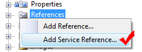
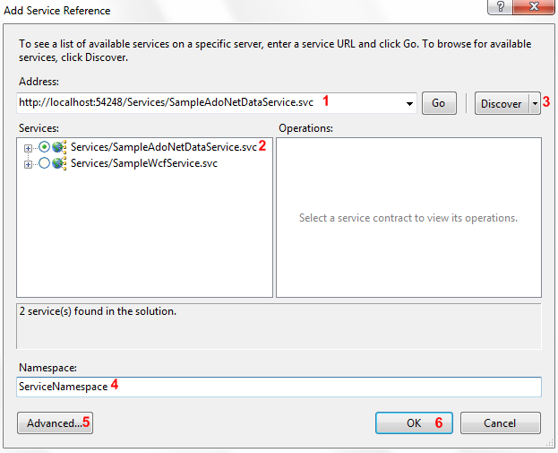

# Consuming WCF Data Service

The purpose of this tutorial is to show you how to make a call to an ADO.NET Data Service in the context of a SilverlightWPF application. The following common tasks will be examined:

* Adding a reference.

* Creating a new instance of the exposed entity.

* Making asynchronous call to the service and consuming the service result.

>The process of developing an ADO.NET Data Service is beyond the scope of this tutorial. For more information read [here](http://msdn.microsoft.com/en-us/library/cc907912.aspx).

>

This tutorial will use the following product and technology:

* __Northwind__ database, which can be downloaded from [here](http://www.microsoft.com/downloads/details.aspx?FamilyID=06616212-0356-46A0-8DA2-EEBC53A68034&displaylang=en).

* ADO.NET Entity Framework - used to create an Entity Data Model representation of the Northwind database.

>tipThe Telerik __OpenAccess__ ORM also supports excellent integration with ADO.NET Data Services.

## Adding Reference

The first step is to add a new service reference to your application. In order to do that you need to perform the following steps:

* Select the "__References__" folder, right click with your mouse button and choose "__Add Service Reference...__"

         
      

* A popup window appears, hit the __Discover__ button to find the web service or enter the service location. Press OK to add it. 

         
      

>

You have the ability to choose the type of the collections that the service returns. In order to do that you need to open the __Service Reference Settings__ dialog from the __Advanced__ button.

         
      

When a service reference is added to a project, any types defined in the service are generated in the local project. In many cases, this creates duplicate types when a service uses common .NET Framework types or when types are defined in a shared library. To avoid this problem, types in referenced assemblies are shared by default. If you want to disable type sharing for one or more assemblies, you can do so in the __Service Reference Settings__ dialog.

Once the ADO.NET data service is added all needed assemblies will be included in your project automatically.

## Creating New Instance of the Exposed Entity

#### __C#__

{{region consuming-data-ado-net-data-service_0}}
	NorthwindEntities northwindEntity = new NorthwindEntities( new Uri( "http://localhost:54248/Services/SampleAdoNetDataService.svc/" ) );
	{{endregion}}

__{{region consuming-data-ado-net-data-service_1}}
	Dim northwindEntity As New NorthwindEntities(New Uri("http://localhost:54248/Services/SampleAdoNetDataService.svc/"))
	{{endregion}}__

__NorthwindEntities__ represents the runtime context of a given data service. While data services themselves are stateless, the context is not, so state on the client is maintained between interactions in order to support features such as identity resolution and optimistic concurrency.  

## Making Asynchronous Call to the Service and Consuming the Result

In Silverlight all service calls are performed asynchronously. In order to make an asynchronous call to your service you need to do the following steps:

* Create a new __DataServiceQuery.__

* Execute the __DataServiceQuery__ asynchronously.

Here is a sample code showing how this can be achieved:

#### __C#__

{{region consuming-data-ado-net-data-service_2}}
	public static void BeginLoadingProducts( Categories category )
	{
	    DataServiceQuery<Products> categoryProducts = northwindEntity
	        .CreateQuery<Products>( string.Format( "Categories({0})/Products", category.CategoryID ) )
	        .Expand( "Suppliers" )
	        .Expand( "Categories" );
	    categoryProducts.BeginExecute(
	        ( IAsyncResult result ) => EntitiesLoaded<Products>( result, category.Products ),
	        categoryProducts );
	}
	private static void EntitiesLoaded<T>( IAsyncResult result, Collection<T> entities )
	{
	    DataServiceQuery<T> query = result.AsyncState as DataServiceQuery<T>;
	    foreach ( T entity in query.EndExecute( result ) )
	    {
	        entities.Add( entity );
	    }
	}
	{{endregion}}

#### __VB.NET__

{{region consuming-data-ado-net-data-service_3}}
	Public Shared Sub BeginLoadingProducts(ByVal category As Categories)
	    Dim categoryProducts As DataServiceQuery(Of Products) = northwindEntity.CreateQuery(Of Products)(String.Format("Categories({0})/Products", category.CategoryID)).Expand("Suppliers").Expand("Categories")
	
	    categoryProducts.BeginExecute(Function(ByVal result As IAsyncResult) EntitiesLoaded(Of Products)(result, category.Products), categoryProducts)
	End Sub
	Private Shared Sub EntitiesLoaded(Of T)(ByVal result As IAsyncResult, ByVal entities As Collection(Of T))
	    Dim query As DataServiceQuery(Of T) = TryCast(result.AsyncState, DataServiceQuery(Of T))
	    For Each entity As T In query.EndExecute(result)
	        entities.Add(entity)
	    Next
	End Sub
	{{endregion}}

Practically all the work about the consuming the result is done in the __EntitesLoaded<T>__ method.

Making a call to an ADO.NET Data Service is a simple process. Here is a sample code, demonstrating how to load all categories from the Categories table in the Northwind database: 

#### __C#__

{{region consuming-data-ado-net-data-service_4}}
	foreach( Categories c in northwindEntity.Categories.Execute() )
	{
	    this.Categories.Add( c );
	}
	{{endregion}}

#### __VB.NET__

{{region consuming-data-ado-net-data-service_5}}
	For Each c As Categories In northwindEntity.Categories.Execute()
	    Me.Categories.Add(c)
	Next
	{{endregion}}


