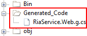

# Consuming .NET RIA Service

The purpose of this tutorial is to show you how to make a call to an .NET RIA Service in the context of a Silverlight application. The following common tasks will be examined:

* Creating a new instance of the RIA Service context

* Loading data.

* Consuming the result. 

>The process of developing a .NET RIA Service is beyond the scope of this tutorial. For more information read [here](http://msdn.microsoft.com/en-us/magazine/dd695920.aspx).

>

This tutorial will use the following product and technology:

* __Northwind__database, which can be downloaded from [here](http://www.microsoft.com/downloads/details.aspx?FamilyID=06616212-0356-46A0-8DA2-EEBC53A68034&displaylang=en). 

* ADO.NET Entity Framework - used to create an Entity Data Model representation of the Northwind database.

## Overview

When using __.NET RIA Services__there is no need to add reference to the server project, as you should do with the other types of services for example. The __DomainService__class is available on the client thanks to the code, generated by the server in the __GeneratedCode__ folder. This is one of the features of the .NET RIA Services Framework - it allows to create a link between the server and the client.

>

The __GeneratedCode__is not included in the project, that's why you should enable the Show All Files button in the Solution Explorer.

         
      

## Creating Instance of the RIA Service Context

#### __C#__

{{region consuming-data-net-ria-service_0}}
	SampleRiaContext riaContext = new SampleRiaContext();
	{{endregion}}

#### __VB.NET__

{{region consuming-data-net-ria-service_1}}
	Dim riaContext As New SampleRiaContext()
	{{endregion}}

The __SampleRiaContext__ represents your __DomainService__.  

## Loading Data

In Silverlight all service calls are performed asynchronously. In order to make an asynchronous call to your service you need to do the following steps:

* Create a new __EntityQuery.__

* Load the data using the created __EntityQuery.__

* Attach to the event fired when the loaded operation completes.

Here is a sample code showing how this can be achieved: 

#### __C#__

{{region consuming-data-net-ria-service_2}}
	LoadOperation<Categories> loadOperation = riaContext.Load<Categories>( riaContext.GetCategoriesQuery() );
	loadOperation.Completed += new EventHandler( loadOperation_Completed );
	{{endregion}}

#### __VB.NET__

{{region consuming-data-net-ria-service_3}}
	Dim loadOperation As LoadOperation(Of Categories) = riaContext.Load(Of Categories)(riaContext.GetCategoriesQuery())
	AddHandler loadOperation.Completed, AddressOf loadOperation_Completed
	{{endregion}}

## Consuming the Service Result

Once the load operation is completed accessing the result is an extremely simple process:

#### __C#__

{{region consuming-data-net-ria-service_4}}
	private void loadOperation_Completed( object sender, EventArgs e )
	{
	    //Consume the result
	    List<Categories> result = riaContext.Categories.ToList();
	}
	{{endregion}}

#### __VB.NET__

{{region consuming-data-net-ria-service_5}}
	Private Sub loadOperation_Completed(ByVal sender As Object, ByVal e As EventArgs)
	    'Consume the result
	    Dim result As List(Of Categories) = riaContext.Categories.ToList()
	End Sub
	{{endregion}}

# See Also

 * [Consuming WCF Service]()

 * [Consuming WCF Data Service]()

 * [Consuming Web (asmx) Service]()
