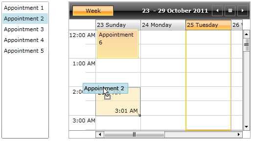

# Customizing the DragVisual

## 

By default the drag-drop behaviors will not display drag visual, only the mouse cursor will change according the allowed drag-drop effects in the current moment. To create custom drag visuals the ListBoxDragDrop behavior should receive an instance of a IDragVisualProvider interface implementation.

Follows an example demonstrating how to use the default implementations of the IDragVisualProvider interface:

#### __XAML__

{{region dragdropmanager-behaviors-customizingdragvisual_0}}
	<ListBox Margin="20" ItemsSource="{Binding CustomersSource}" 
		DisplayMemberPath="Name"
		ItemContainerStyle="{StaticResource DraggableListBoxItem}">
		<drag:ListBoxDragDrop.Behavior>
			<drag:ListBoxDragDropBehavior />
		</drag:ListBoxDragDrop.Behavior>
		<drag:ListBoxDragDrop.DragVisualProvider>
			<drag:ScreenshotDragVisualProvider />
		</drag:ListBoxDragDrop.DragVisualProvider>
	</ListBox>
	{{endregion}}

Now to customize it, you have to create a custom DragVisualProvider, and use it instead:
        

#### __C#__

{{region dragdropmanager-behaviors-customizingdragvisual_1}}
	    public class DragVisualProvider : DependencyObject, IDragVisualProvider
	    {
	        public DataTemplate DraggedItemTemplate
	        {
	            get
	            {
	                return (DataTemplate)GetValue(DraggedItemTemplateProperty);
	            }
	            set
	            {
	                SetValue(DraggedItemTemplateProperty, value);
	            }
	        }
	
	        public static readonly DependencyProperty DraggedItemTemplateProperty =
	        DependencyProperty.Register("DraggedItemTemplate", typeof(DataTemplate), typeof(DragVisualProvider), new PropertyMetadata(null));
	
	        public FrameworkElement CreateDragVisual(DragVisualProviderState state)
	        {
	            var visual = new DragVisual();
	
	            var theme = StyleManager.GetTheme(state.Host);
	            if (theme != null)
	            {
	                StyleManager.SetTheme(visual, theme);
	            }
	
	            visual.Content = state.DraggedItems.OfType<object>().FirstOrDefault();
	            visual.ContentTemplate = this.DraggedItemTemplate;
	
	            return visual;
	        }
	
	        public Point GetDragVisualOffset(DragVisualProviderState state)
	        {
	            return state.RelativeStartPoint;
	        }
	
	        public bool UseDefaultCursors { get; set; }
	    }
	{{endregion}}

Here is the result:
