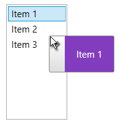

# Customizing the DragVisual

This article demonstrates how to create a custom drag visual element for the [DragDropBehavior]() by implementing the __IDragVisualProvider__ interface.

The interface exposes the following members.

* __UseDefaultCursors__: A property that determines whether the drag/drop effects will change the mouse cursor or not.
* __CreateDragVisual__: A method that receives information about the dragged items and returns a FrameworkElement used as the drag visual.
* __GetDragVisualOffset__: A method that receives information about the dragged items and returns the drag visual offset relative to the mouse position, as a Point structure.

## Implementing IDragVisualProvider

This section shows how to create a custom drag visual provider that allows you to define a custom DataTemplate and use it with any DragDropBehavior implementation.

__Example 1: Creating a custom drag visual provider__
<snippet id='dragdropmanager-behaviors-customizingdragvisual-example_1_creating_a_custom_drag_visual_provider-cs' />

>important This approach is applicable for all controls that use a DragDropBehavior. For example, ScheduleViewDragDropBehavior, or a custom implementation of the DragDropBehavior class.

## Using the Custom Drag Visual Provider

This section shows how to setup a ListBoxDragDropBehavior that will use the custom drag visual provider implemented in the previous section.

__Example 2: Using the custom drag visual provider__
<snippet id='dragdropmanager-behaviors-customizingdragvisual-example_2_using_the_custom_drag_visual_provider-xaml' />

#### Figure 1: Custom drag visual provider 

