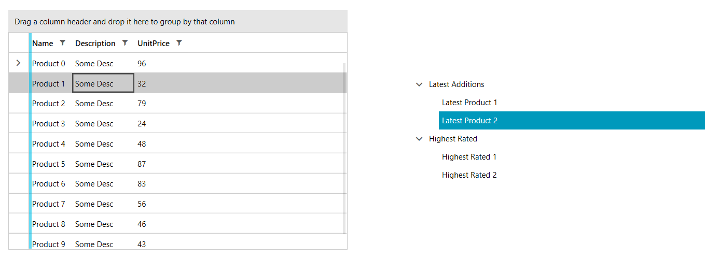

# Drag-drop between GridView and TreeView



The purpose of this tutorial is to show you how to implement drag and drop between RadGridView and RadTreeView, giving the user feedback where the dragged item will be dropped.

>Please note that the examples in this tutorial are showcasing the Telerik [Fluent theme](). In the [Setting a Theme]() article, you can find more information on how to set an application-wide theme.

First, we will specify the following classes, which are going to be used to populate the RadGridView and RadTreeView controls. 

* __Product__: A class that will be our business object. The RadGridView will be bound to an ObservableCollection of Products.
* __Category__: A class that will be used as a group for the Product. This class will have a collection of Products. It will be used to show hierarchy in the RadTreeView. 
* __MainViewModel__: The main ViewModel class of the application.
* __DropIndicationDetails__: A helper class that will hold information for the current dragged item, current drag over item and current drop position.

#### __[C#] Example 1: Creating ViewModels__
	{{region dragdropmanager-behaviors-gridviewandtreeview_0}}	
		public class Product
		{
			public string Name { get; set; }
			public string Description { get; set; }
			public decimal UnitPrice { get; set; }
		}
		public class Category
		{
			public Category()
			{
				Items = new ObservableCollection<Product>();
			}
			public string Name { get; set; }
			public IList Items { get; set; }
		}
		public class MainViewModel
		{
			Random rnd = new Random();
			public ObservableCollection<Product> Products { get; set; }
			public ObservableCollection<Category> Categories { get; set; }
			
			public MainViewModel()
			{
				Categories = new ObservableCollection<Category>();
				Products = new ObservableCollection<Product>();
				GetData();
			}

			private void GetData()
			{
				Category latest = new Category();
				latest.Name = "Latest Additions";
				latest.Items.Add(new Product() { Name="Latest Product 1", Description="Desc 1",  UnitPrice=999 });
				latest.Items.Add(new Product() { Name="Latest Product 2", Description="Desc 2",  UnitPrice=666 }); 

				Category highestRated = new Category();
				highestRated.Name = "Highest Rated";
				highestRated.Items.Add(new Product() { Name = "Highest Rated 1", Description = "Desc 1", UnitPrice = 2000 });
				highestRated.Items.Add(new Product() { Name = "Highest Rated 2", Description = "Desc 2", UnitPrice = 1999 });

				Categories.Add(latest);
				Categories.Add(highestRated);

				for (int i = 0; i < 10; i++)
				{
					Product product = new Product();
					product.Name = "Product "+i;
					product.Description = "Some Desc";
					product.UnitPrice = rnd.Next(10,99);                
					Products.Add(product);
				}
			}
		}
		public class DropIndicationDetails : ViewModelBase
		{
			private object currentDraggedItem;
			private DropPosition currentDropPosition;
			private object currentDraggedOverItem;

			public object CurrentDraggedOverItem
			{
				get
				{
					return currentDraggedOverItem;
				}
				set
				{
					if (this.currentDraggedOverItem != value)
					{
						currentDraggedOverItem = value;
						OnPropertyChanged("CurrentDraggedOverItem");
					}
				}
			}
			public int DropIndex { get; set; }
			public DropPosition CurrentDropPosition
			{
				get
				{
					return this.currentDropPosition;
				}
				set
				{
					if (this.currentDropPosition != value)
					{
						this.currentDropPosition = value;
						OnPropertyChanged("CurrentDropPosition");
					}
				}
			}

			public object CurrentDraggedItem
			{
				get
				{
					return this.currentDraggedItem;
				}
				set
				{
					if (this.currentDraggedItem != value)
					{
						this.currentDraggedItem = value;
						OnPropertyChanged("CurrentDraggedItem");
					}
				}
			}
		}
	{{endregion}}
	
Next, we can go ahead and define the __RadGridView__ and __RadTreeView__ controls in our view:

#### __[XAML] Example 2: Defining RadTreeView and RadGridView in XAML__

{{region dragdropmanager-behaviors-gridviewandtreeview_1}}
	<Grid>
        <Grid.ColumnDefinitions>
            <ColumnDefinition Width="\*" />
            <ColumnDefinition Width="\*" />
        </Grid.ColumnDefinitions>
        
         <telerik:RadGridView x:Name="orderView"  
                             AllowDrop="True" 
                             ItemsSource="{Binding Products}" >       
        </telerik:RadGridView>
        
        <telerik:RadTreeView x:Name="allProductsView" Grid.Column="1"
                             VerticalAlignment="Center" Margin="50 0 0 0"
                             ItemsSource="{Binding Categories}"   
                             AllowDrop="True">
            <telerik:RadTreeView.ItemTemplate>
                <HierarchicalDataTemplate ItemsSource="{Binding Items}">
                    <TextBlock Text="{Binding Name}"/>
                </HierarchicalDataTemplate>
            </telerik:RadTreeView.ItemTemplate>
            <telerik:RadTreeView.ItemContainerStyle>            
        </telerik:RadTreeView>       
    </Grid>
{{endregion}}

And finally, we need to set the DataContext of the MainWindow:

#### __[C#] Example 3: Setting DataContext__
	{{region dragdropmanager-behaviors-gridviewandtreeview_2}}	
		public MainWindow()
        {
            InitializeComponent();
            this.DataContext = new MainViewModel();
        }
	{{endregion}}	

If you run the application now, you should get a structure like in **Figure 1**:

#### Figure 1: RadGridView and RadTreeView

You can observe that you still can't drag-drop a row from the RadGridView to the RadTreeView and back. This is expected as the drag-drop functionality is still not implemented.

The next step is to make sure that the GridViewRows and RadTreeViewItems are draggable. We can do so by applying an implicit style that sets the DragDropManager.AllowCapturedDrag attached property to True on every GridViewRow and RadTreeViewItem.

#### __[XAML] Example 4: Setting AllowDrag attached property__
{{region dragdropmanager-behaviors-gridviewandtreeview_3}}	
	<telerik:RadGridView.RowStyle>
		
	</telerik:RadGridView.RowStyle>	
	. . . . .
	<telerik:RadTreeView.ItemContainerStyle>
		
	</telerik:RadTreeView.ItemContainerStyle>
{{endregion}}

We will use a custom behavior to define the RadGridView and RadTreeView DragDrop behavior. Essentially the behavior will attach handlers for the following events:

* __DragInitialize__
* __GiveFeedback__
* __Drop__
* __DragDropCompleted__
* __DragOver__

#### __[C#] Example 5: Creating custom attached property for RadGridView__
{{region dragdropmanager-behaviors-gridviewandtreeview_4}}	
	public class GridViewDragDropBehavior
    {
        private const string DropPositionFeedbackElementName = "DragBetweenItemsFeedback";
        private ContentPresenter dropPositionFeedbackPresenter;
        private Grid dropPositionFeedbackPresenterHost;

        private RadGridView _associatedObject;

        /// 
  
        /// AssociatedObject Property  
        /// 
  
        public RadGridView AssociatedObject
        {
            get
            {
                return _associatedObject;
            }
            set
            {
                _associatedObject = value;
            }
        }

        private static Dictionary<RadGridView, GridViewDragDropBehavior> instances;

        static GridViewDragDropBehavior()
        {
            instances = new Dictionary<RadGridView, GridViewDragDropBehavior>();
        }

        public static bool GetIsEnabled(DependencyObject obj)
        {
            return (bool)obj.GetValue(IsEnabledProperty);
        }

        public static void SetIsEnabled(DependencyObject obj, bool value)
        {
            GridViewDragDropBehavior behavior = GetAttachedBehavior(obj as RadGridView);

            behavior.AssociatedObject = obj as RadGridView;

            if (value)
            {
                behavior.Initialize();
            }
            else
            {
                behavior.CleanUp();
            }
            obj.SetValue(IsEnabledProperty, value);
        }

        // Using a DependencyProperty as the backing store for IsEnabled.  This enables animation, styling, binding, etc...  
        public static readonly DependencyProperty IsEnabledProperty =
            DependencyProperty.RegisterAttached("IsEnabled", typeof(bool), typeof(GridViewDragDropBehavior),
                new PropertyMetadata(new PropertyChangedCallback(OnIsEnabledPropertyChanged)));

        public static void OnIsEnabledPropertyChanged(DependencyObject dependencyObject, DependencyPropertyChangedEventArgs e)
        {
            SetIsEnabled(dependencyObject, (bool)e.NewValue);
        }

        private static GridViewDragDropBehavior GetAttachedBehavior(RadGridView gridview)
        {
            if (!instances.ContainsKey(gridview))
            {
                instances[gridview] = new GridViewDragDropBehavior();
                instances[gridview].AssociatedObject = gridview;
            }

            return instances[gridview];
        }

        public GridViewDragDropBehavior()
        {

        }

        protected virtual void Initialize()
        {
            this.AssociatedObject.RowLoaded -= this.AssociatedObject_RowLoaded;
            this.AssociatedObject.RowLoaded += this.AssociatedObject_RowLoaded;
            this.UnsubscribeFromDragDropEvents();
            this.SubscribeToDragDropEvents();

            this.AssociatedObject.Dispatcher.BeginInvoke((Action)(() =>
            {
                this.dropPositionFeedbackPresenter = new ContentPresenter();
                this.dropPositionFeedbackPresenter.Name = DropPositionFeedbackElementName;
                this.dropPositionFeedbackPresenter.HorizontalAlignment = HorizontalAlignment.Left;
                this.dropPositionFeedbackPresenter.VerticalAlignment = VerticalAlignment.Top;
                this.dropPositionFeedbackPresenter.RenderTransformOrigin = new Point(0.5, 0.5);

                this.AttachDropPositionFeedback();
            }));
        }

        protected virtual void CleanUp()
        {
            this.AssociatedObject.RowLoaded -= this.AssociatedObject_RowLoaded;
            this.UnsubscribeFromDragDropEvents();
            this.DetachDropPositionFeedback();
        }

        void AssociatedObject_RowLoaded(object sender, Telerik.Windows.Controls.GridView.RowLoadedEventArgs e)
        {
            if (e.Row is GridViewHeaderRow || e.Row is GridViewNewRow || e.Row is GridViewFooterRow)
                return;

            GridViewRow row = e.Row as GridViewRow;
            this.InitializeRowDragAndDrop(row);
        }

        private void InitializeRowDragAndDrop(GridViewRow row)
        {
            if (row == null)
                return;

            DragDropManager.RemoveDragOverHandler(row, OnRowDragOver);
            DragDropManager.AddDragOverHandler(row, OnRowDragOver);
        }

        private void SubscribeToDragDropEvents()
        {
            DragDropManager.AddDragInitializeHandler(this.AssociatedObject, OnDragInitialize);
            DragDropManager.AddGiveFeedbackHandler(this.AssociatedObject, OnGiveFeedback);
            DragDropManager.AddDropHandler(this.AssociatedObject, OnDrop);
            DragDropManager.AddDragDropCompletedHandler(this.AssociatedObject, OnDragDropCompleted);
        }

        private void UnsubscribeFromDragDropEvents()
        {
            DragDropManager.RemoveDragInitializeHandler(this.AssociatedObject, OnDragInitialize);
            DragDropManager.RemoveGiveFeedbackHandler(this.AssociatedObject, OnGiveFeedback);
            DragDropManager.RemoveDropHandler(this.AssociatedObject, OnDrop);
            DragDropManager.RemoveDragDropCompletedHandler(this.AssociatedObject, OnDragDropCompleted);
        }

        private void OnDragDropCompleted(object sender, DragDropCompletedEventArgs e)
        {
            this.HideDropPositionFeedbackPresenter();
            if (e.Effects != DragDropEffects.None)
            {
                object data = DragDropPayloadManager.GetDataFromObject(e.Data, "DraggedItem");
                AssociatedObject.Items.Remove(data);
            }
        }

        private void OnDragInitialize(object sender, DragInitializeEventArgs e)
        {
            var sourceRow = e.OriginalSource as GridViewRow ?? (e.OriginalSource as FrameworkElement).ParentOfType<GridViewRow>();
            if (sourceRow != null && sourceRow.Name != "PART_RowResizer")
            {
                DropIndicationDetails details = new DropIndicationDetails();
                var item = sourceRow.Item;
                details.CurrentDraggedItem = item;

                IDragPayload dragPayload = DragDropPayloadManager.GeneratePayload(null);

                dragPayload.SetData("DraggedItem", item);
                dragPayload.SetData("DropDetails", details);

                e.Data = dragPayload;

                e.DragVisual = new DragVisual()
                {
                    Content = details,
                    ContentTemplate = this.AssociatedObject.Resources["DraggedItemTemplate"] as DataTemplate
                };
                e.DragVisualOffset = e.RelativeStartPoint;
                e.AllowedEffects = DragDropEffects.All;
            }
        }

        private void OnGiveFeedback(object sender, Telerik.Windows.DragDrop.GiveFeedbackEventArgs e)
        {
            e.SetCursor(Cursors.Arrow);
            e.Handled = true;
        }

        private void OnDrop(object sender, Telerik.Windows.DragDrop.DragEventArgs e)
        {
            var draggedItem = DragDropPayloadManager.GetDataFromObject(e.Data, "DraggedItem");
            var details = DragDropPayloadManager.GetDataFromObject(e.Data, "DropDetails") as DropIndicationDetails;

            if (details == null || draggedItem == null)
            {
                return;
            }

            if (e.Effects == DragDropEffects.Move || e.Effects == DragDropEffects.All)
            {
                ((sender as RadGridView).ItemsSource as IList).Remove(draggedItem);
            }

            if (e.Effects != DragDropEffects.None)
            {
                var collection = (sender as RadGridView).ItemsSource as IList;
                int index = details.DropIndex < 0 ? 0 : details.DropIndex;
                index = details.DropIndex > collection.Count - 1 ? collection.Count : index;

                collection.Insert(index, draggedItem);
            }

            HideDropPositionFeedbackPresenter();
        }

        private void OnRowDragOver(object sender, Telerik.Windows.DragDrop.DragEventArgs e)
        {
            var row = sender as GridViewRow;
            var details = DragDropPayloadManager.GetDataFromObject(e.Data, "DropDetails") as DropIndicationDetails;

            if (details == null || row == null)
            {
                return;
            }

            details.CurrentDraggedOverItem = row.DataContext;

            if (details.CurrentDraggedItem == details.CurrentDraggedOverItem)
            {
                e.Effects = DragDropEffects.None;
                e.Handled = true;
                return;
            }

            details.CurrentDropPosition = GetDropPositionFromPoint(e.GetPosition(row), row);
            int dropIndex = (this.AssociatedObject.Items as IList).IndexOf(row.DataContext);
            int draggedItemIdex = (this.AssociatedObject.Items as IList).IndexOf(DragDropPayloadManager.GetDataFromObject(e.Data, "DraggedItem"));

            if (dropIndex >= row.GridViewDataControl.Items.Count - 1 && details.CurrentDropPosition == DropPosition.After)
            {
                details.DropIndex = dropIndex;
                this.ShowDropPositionFeedbackPresenter(this.AssociatedObject, row, details.CurrentDropPosition);
                return;
            }

            dropIndex = draggedItemIdex > dropIndex ? dropIndex : dropIndex - 1;
            details.DropIndex = details.CurrentDropPosition == DropPosition.Before ? dropIndex : dropIndex + 1;

            this.ShowDropPositionFeedbackPresenter(this.AssociatedObject, row, details.CurrentDropPosition);
        }

        public virtual DropPosition GetDropPositionFromPoint(Point absoluteMousePosition, GridViewRow row)
        {
            if (row != null)
            {
                return absoluteMousePosition.Y < row.ActualHeight / 2 ? DropPosition.Before : DropPosition.After;
            }

            return DropPosition.Inside;
        }

        private bool IsDropPositionFeedbackAvailable()
        {
            return
                  this.dropPositionFeedbackPresenterHost != null &&
                  this.dropPositionFeedbackPresenter != null;
        }

        private void ShowDropPositionFeedbackPresenter(GridViewDataControl gridView, GridViewRow row, DropPosition lastRowDropPosition)
        {
            if (!this.IsDropPositionFeedbackAvailable())
                return;
            var yOffset = this.GetDropPositionFeedbackOffset(row, lastRowDropPosition);
            this.dropPositionFeedbackPresenter.Visibility = Visibility.Visible;
            this.dropPositionFeedbackPresenter.Width = row.ActualWidth;
            this.dropPositionFeedbackPresenter.RenderTransform = new TranslateTransform()
            {
                Y = yOffset
            };
        }

        private void HideDropPositionFeedbackPresenter()
        {
            this.dropPositionFeedbackPresenter.RenderTransform = new TranslateTransform()
            {
                X = 0,
                Y = 0
            };
            this.dropPositionFeedbackPresenter.Visibility = Visibility.Collapsed;
           
        }

        private double GetDropPositionFeedbackOffset(GridViewRow row, DropPosition dropPosition)
        {
            var yOffset = row.TransformToVisual(this.dropPositionFeedbackPresenterHost).Transform(new Point(0, 0)).Y;
            if (dropPosition == DropPosition.After)
                yOffset += row.ActualHeight;
            yOffset -= (this.dropPositionFeedbackPresenter.ActualHeight / 2.0);
            return yOffset;
        }

        private void DetachDropPositionFeedback()
        {
            if (this.IsDropPositionFeedbackAvailable())
            {
                this.dropPositionFeedbackPresenterHost.Children.Remove(this.dropPositionFeedbackPresenter);
                this.dropPositionFeedbackPresenter = null;
            }
        }

        private void AttachDropPositionFeedback()
        {
            this.dropPositionFeedbackPresenterHost = this.AssociatedObject.ParentOfType<Grid>();

            if (this.dropPositionFeedbackPresenterHost != null)
            {
                this.dropPositionFeedbackPresenter.Content = CreateDefaultDropPositionFeedback();
                if (dropPositionFeedbackPresenterHost != null && dropPositionFeedbackPresenterHost.FindName(this.dropPositionFeedbackPresenter.Name) == null)
                {
                    this.dropPositionFeedbackPresenterHost.Children.Add(this.dropPositionFeedbackPresenter);
                }
            }
            this.HideDropPositionFeedbackPresenter();
        }

        private static UIElement CreateDefaultDropPositionFeedback()
        {
            Grid grid = new Grid()
            {
                Height = 8,
                HorizontalAlignment = HorizontalAlignment.Stretch,
                IsHitTestVisible = false,
                VerticalAlignment = VerticalAlignment.Stretch
            };
            grid.ColumnDefinitions.Add(new ColumnDefinition()
            {
                Width = new GridLength(8)
            });
            grid.ColumnDefinitions.Add(new ColumnDefinition());
            Ellipse ellipse = new Ellipse()
            {
                Stroke = new SolidColorBrush(Colors.Orange),
                StrokeThickness = 2,
                Fill = new SolidColorBrush(Colors.Orange),
                HorizontalAlignment = HorizontalAlignment.Stretch,
                VerticalAlignment = VerticalAlignment.Stretch,
                Width = 8,
                Height = 8
            };
            Rectangle rectangle = new Rectangle()
            {
                Fill = new SolidColorBrush(Colors.Orange),
                RadiusX = 2,
                RadiusY = 2,
                VerticalAlignment = VerticalAlignment.Stretch,
                HorizontalAlignment = HorizontalAlignment.Stretch,
                Height = 2
            };
            Grid.SetColumn(ellipse, 0);
            Grid.SetColumn(rectangle, 1);
            grid.Children.Add(ellipse);
            grid.Children.Add(rectangle);

            Canvas.SetZIndex(grid, 10000);

            return grid;
        }
    }
{{endregion}}

#### __[C#] Example 6: Creating custom attached property for RadTreeView__
{{region dragdropmanager-behaviors-gridviewandtreeview_4}}	
	public class TreeViewDragDropBehavior
    {
        public double TreeViewItemHeight { get; set; }
        private bool isTreeSource = false;

        private RadTreeView _associatedObject;
        public RadTreeView AssociatedObject
        {
            get => _associatedObject;
            set => _associatedObject = value;
        }

        private static Dictionary<RadTreeView, TreeViewDragDropBehavior> instances;

        static TreeViewDragDropBehavior()
        {
            instances = new Dictionary<RadTreeView, TreeViewDragDropBehavior>();
        }

        public static bool GetIsEnabled(DependencyObject obj)
        {
            return (bool)obj.GetValue(IsEnabledProperty);
        }

        public static void SetIsEnabled(DependencyObject obj, bool value)
        {
            TreeViewDragDropBehavior behavior = GetAttachedBehavior(obj as RadTreeView);

            behavior.AssociatedObject = obj as RadTreeView;

            if (value)
            {
                behavior.Initialize();
            }
            else
            {
                behavior.CleanUp();
            }
            obj.SetValue(IsEnabledProperty, value);
        }

        // Using a DependencyProperty as the backing store for IsEnabled.  This enables animation, styling, binding, etc...
        public static readonly DependencyProperty IsEnabledProperty =
            DependencyProperty.RegisterAttached("IsEnabled", typeof(bool), typeof(TreeViewDragDropBehavior),
                new PropertyMetadata(new PropertyChangedCallback(OnIsEnabledPropertyChanged)));

        public static void OnIsEnabledPropertyChanged(DependencyObject dependencyObject, DependencyPropertyChangedEventArgs e)
        {
            SetIsEnabled(dependencyObject, (bool)e.NewValue);
        }

        private static TreeViewDragDropBehavior GetAttachedBehavior(RadTreeView gridview)
        {
            if (!instances.ContainsKey(gridview))
            {
                instances[gridview] = new TreeViewDragDropBehavior
                {
                    AssociatedObject = gridview
                };
            }

            return instances[gridview];
        }

        protected virtual void Initialize()
        {
            DragDropManager.AddDragInitializeHandler(AssociatedObject, OnDragInitialize);
            DragDropManager.AddGiveFeedbackHandler(AssociatedObject, OnGiveFeedback);
            DragDropManager.AddDragDropCompletedHandler(AssociatedObject, OnDragDropCompleted);
            DragDropManager.AddDropHandler(AssociatedObject, OnDrop);
            TreeViewItemHeight = 24.0;

            AssociatedObject.ItemPrepared += AssociatedObject_ItemPrepared;
        }

        protected virtual void CleanUp()
        {
            DragDropManager.RemoveDragInitializeHandler(AssociatedObject, OnDragInitialize);
            DragDropManager.RemoveGiveFeedbackHandler(AssociatedObject, OnGiveFeedback);
            DragDropManager.RemoveDragDropCompletedHandler(AssociatedObject, OnDragDropCompleted);
            DragDropManager.RemoveDropHandler(AssociatedObject, OnDrop);
        }

        private void AssociatedObject_ItemPrepared(object sender, RadTreeViewItemPreparedEventArgs e)
        {
            DragDropManager.RemoveDragOverHandler(e.PreparedItem, OnItemDragOver);
            DragDropManager.AddDragOverHandler(e.PreparedItem, OnItemDragOver);
        }

        private IList sourceItems = null;
        private IList destinationItems = null;
        private object sourceItem = null;

        private void OnDragInitialize(object sender, DragInitializeEventArgs e)
        {
            RadTreeViewItem treeViewItem = e.OriginalSource as RadTreeViewItem ?? (e.OriginalSource as FrameworkElement).ParentOfType<RadTreeViewItem>();
            object data = treeViewItem != null ? treeViewItem.Item : (sender as RadTreeView).SelectedItem;
            Telerik.Windows.DragDrop.Behaviors.IDragPayload payload = DragDropPayloadManager.GeneratePayload(null);
            DropIndicationDetails dropDetails = new DropIndicationDetails
            {
                CurrentDraggedItem = data
            };
            DragVisual visual = new DragVisual()
            {
                Content = dropDetails,
                ContentTemplate = AssociatedObject.Resources["ItemDragTemplate"] as DataTemplate
            };
            payload.SetData("DraggedItem", data);
            payload.SetData("DropDetails", dropDetails);
            e.DragVisual = visual;
            e.DragVisualOffset = e.RelativeStartPoint;
            e.Data = payload;
            e.AllowedEffects = DragDropEffects.All;
            FrameworkElement sourceItem = e.OriginalSource as RadTreeViewItem ?? (e.OriginalSource as FrameworkElement).ParentOfType<RadTreeViewItem>();
            if (sourceItem == null)
            {
                sourceItems = (IList)AssociatedObject.ItemsSource;
            }
            else
            {
                sourceItems = (sourceItem as RadTreeViewItem).ParentItem != null ?
                    (IList)(sourceItem as RadTreeViewItem).ParentItem.ItemsSource : (IList)AssociatedObject.ItemsSource;
            }
            this.sourceItem = sourceItem.DataContext;
            destinationItems = AssociatedObject.ItemsSource as IList;
            isTreeSource = true;
        }

        private void OnGiveFeedback(object sender, Telerik.Windows.DragDrop.GiveFeedbackEventArgs e)
        {
            e.SetCursor(Cursors.Arrow);
            e.Handled = true;
        }

        private void OnDragDropCompleted(object sender, DragDropCompletedEventArgs e)
        {
            if (e.Effects != DragDropEffects.None && isTreeSource)
            {
                object data = DragDropPayloadManager.GetDataFromObject(e.Data, "DraggedItem");
                sourceItems.Remove(data);
            }
        }
        private void OnDrop(object sender, Telerik.Windows.DragDrop.DragEventArgs e)
        {
            if (isTreeSource)
            {
                object data = DragDropPayloadManager.GetDataFromObject(e.Data, "DraggedItem");

                sourceItems.Remove(data);
            }
            if (e.Effects != DragDropEffects.None)
            {
                RadTreeViewItem destinationItem = (e.OriginalSource as FrameworkElement).ParentOfType<RadTreeViewItem>();
                DropIndicationDetails dropDetails = DragDropPayloadManager.GetDataFromObject(e.Data, "DropDetails") as DropIndicationDetails;
                object data = DragDropPayloadManager.GetDataFromObject(e.Data, "DraggedItem");

                if (destinationItems != null)
                {
                    int dropIndex = dropDetails.DropIndex >= destinationItems.Count ? destinationItems.Count :
                        dropDetails.DropIndex < 0 ? 0 : dropDetails.DropIndex;

                    destinationItems.Insert(dropIndex, data);
                }
            }
            IEnumerable source = AssociatedObject.ItemsSource;
            AssociatedObject.ItemsSource = null;
            AssociatedObject.ItemsSource = source;
            if (isTreeSource)
            {
                isTreeSource = false;
                sourceItem = null;
                sourceItems = null;
                destinationItems = null;
            }
        }

        private void OnItemDragOver(object sender, Telerik.Windows.DragDrop.DragEventArgs e)
        {
            object draggedData = DragDropPayloadManager.GetDataFromObject(e.Data, "DraggedItem");
            DropIndicationDetails dropDetails = DragDropPayloadManager.GetDataFromObject(e.Data, "DropDetails") as DropIndicationDetails;
            RadTreeViewItem item = (e.OriginalSource as FrameworkElement).ParentOfType<RadTreeViewItem>();

            DropPosition position = GetPosition(item, e.GetPosition(item));
            if (position != DropPosition.Inside)
            {
                e.Effects = DragDropEffects.All;
                destinationItems = item.Level > 0 ? (IList)item.ParentItem.ItemsSource : (IList)AssociatedObject.ItemsSource;
                int index = destinationItems.IndexOf(item.Item);
                dropDetails.DropIndex = position == DropPosition.Before ? index : index + 1;
            }
            else
            {
                destinationItems = (IList)item.ItemsSource;
                int index = 0;

                if (destinationItems == null)
                {
                    e.Effects = DragDropEffects.None;
                }
                else
                {
                    e.Effects = DragDropEffects.All;
                    dropDetails.DropIndex = index;
                }
            }
            dropDetails.CurrentDraggedOverItem = item.Item;
            dropDetails.CurrentDropPosition = position;
            if (isTreeSource && IsChildOfSource(item))
            {
                e.Effects = DragDropEffects.None;
            }
            e.Handled = true;
        }

        private bool IsChildOfSource(FrameworkElement item)
        {
            FrameworkElement currentItem = item;

            while (currentItem != null)
            {
                if ((currentItem as RadTreeViewItem).Item == sourceItem)
                {
                    return true;
                }

                currentItem = currentItem.ParentOfType<RadTreeViewItem>();
            }
            return false;
        }

        private DropPosition GetPosition(RadTreeViewItem item, Point point)
        {
            if (point.Y < TreeViewItemHeight / 4)
            {
                return DropPosition.Before;
            }
            else if (point.Y > TreeViewItemHeight * 3 / 4)
            {
                return DropPosition.After;
            }
            return DropPosition.Inside;
        }
    }
{{endregion}}

The final XAML should look like in Example 7.

#### __[XAML] Example 7: Final XAML__

{{region dragdropmanager-behaviors-gridviewandtreeview_1}}
	<Grid>
        <Grid.ColumnDefinitions>
            <ColumnDefinition Width="\*" />
            <ColumnDefinition Width="\*" />
        </Grid.ColumnDefinitions>

        <telerik:RadGridView x:Name="orderView"  
                             AllowDrop="True" 
                             ItemsSource="{Binding Products}" 
                             local:GridViewDragDropBehavior.IsEnabled="True">
            <telerik:RadGridView.RowStyle>
                
            </telerik:RadGridView.RowStyle>
            <telerik:RadGridView.Resources>
                <DataTemplate x:Key="DraggedItemTemplate">
                    <StackPanel>
                        <StackPanel Orientation="Horizontal">
                            <TextBlock Text="Dragging:"/>
                            <TextBlock Text="{Binding CurrentDraggedItem.Name}" FontWeight="Bold"/>
                        </StackPanel>
                        <StackPanel Orientation="Horizontal">
                            <TextBlock Text="{Binding CurrentDropPosition}" FontWeight="Bold" MinWidth="45"/>
                            <TextBlock Text=", (" Foreground="Gray" />
                            <TextBlock Text="{Binding CurrentDraggedOverItem.Name}"/>
                            <TextBlock Text=")" Foreground="Gray" />
                        </StackPanel>
                    </StackPanel>
                </DataTemplate>
            </telerik:RadGridView.Resources>
        </telerik:RadGridView>

        <telerik:RadTreeView x:Name="allProductsView" Grid.Column="1"
                             VerticalAlignment="Center" Margin="50 0 0 0"
                             ItemsSource="{Binding Categories}"   
                             local:TreeViewDragDropBehavior.IsEnabled="True"
                             AllowDrop="True">
            <telerik:RadTreeView.ItemTemplate>
                <HierarchicalDataTemplate ItemsSource="{Binding Items}">
                    <TextBlock Text="{Binding Name}"/>
                </HierarchicalDataTemplate>
            </telerik:RadTreeView.ItemTemplate>
            <telerik:RadTreeView.ItemContainerStyle>
                
            </telerik:RadTreeView.ItemContainerStyle>
            <telerik:RadTreeView.Resources>
                <DataTemplate x:Key="ItemDragTemplate">
                    <StackPanel>
                        <StackPanel Orientation="Horizontal">
                            <TextBlock Text="Dragging:"/>
                            <TextBlock Text="{Binding CurrentDraggedItem.Name}" FontWeight="Bold"/>
                        </StackPanel>
                        <StackPanel Orientation="Horizontal">
                            <TextBlock Text="{Binding CurrentDropPosition}" FontWeight="Bold" MinWidth="45"/>
                            <TextBlock Text=", (" Foreground="Gray" />
                            <TextBlock Text="{Binding CurrentDraggedOverItem.Name}"/>
                            <TextBlock Text=")" Foreground="Gray" />
                        </StackPanel>
                    </StackPanel>
                </DataTemplate>
            </telerik:RadTreeView.Resources>
        </telerik:RadTreeView>
    </Grid>
{{endregion}}



You can find a runnable example showing drag and drop between RadGridView and RadTreeView in the [Tree to Grid Drag](https://demos.telerik.com/wpf)[Tree to Grid Drag](https://demos.telerik.com/silverlight/#DragAndDrop/TreeToGrid) demo.

## See Also
* [DragDropManager]()
* [Populating GridView with Data]()      
