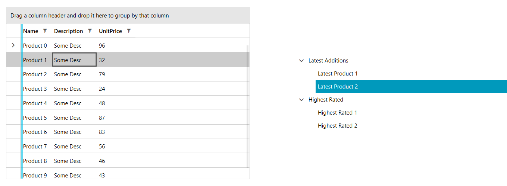

# Drag-drop between GridView and TreeView

The purpose of this tutorial is to show you how to implement drag and drop between RadGridView and RadTreeView, giving the user feedback where the dragged item will be dropped.

>Please note that the examples in this tutorial are showcasing the Telerik [Fluent theme](). In the [Setting a Theme]() article, you can find more information on how to set an application-wide theme.

First, we will specify the following classes, which are going to be used to populate the RadGridView and RadTreeView controls. 

* __Product__: A class that will be our business object. The RadGridView will be bound to an ObservableCollection of Products.
* __Category__: A class that will be used as a group for the Product. This class will have a collection of Products. It will be used to show hierarchy in the RadTreeView. 
* __MainViewModel__: The main ViewModel class of the application.
* __DropIndicationDetails__: A helper class that will hold information for the current dragged item, current drag over item and current drop position.

__Example 1: Creating ViewModels__

<snippet id='dragdropmanager-behaviors-gridviewandtreeview-example_1_creating_viewmodels-cs' />
	
Next, we can go ahead and define the __RadGridView__ and __RadTreeView__ controls in our view:

__Example 2: Defining RadTreeView and RadGridView in XAML__

<snippet id='dragdropmanager-behaviors-gridviewandtreeview-example_2_defining_radtreeview_and_radgridview_in_xaml-xaml' />

And finally, we need to set the DataContext of the MainWindow:

__Example 3: Setting DataContext__
<snippet id='dragdropmanager-behaviors-gridviewandtreeview-example_3_setting_datacontext-cs' />

If you run the application now, you should get a structure like in **Figure 1**:

#### Figure 1: RadGridView and RadTreeView

You can observe that you still can't drag-drop a row from the RadGridView to the RadTreeView and back. This is expected as the drag-drop functionality is still not implemented.

The next step is to make sure that the GridViewRows and RadTreeViewItems are draggable. We can do so by applying an implicit style that sets the DragDropManager.AllowCapturedDrag attached property to True on every GridViewRow and RadTreeViewItem.

__Example 4: Setting AllowDrag attached property__
<snippet id='dragdropmanager-behaviors-gridviewandtreeview-example_4_setting_allowdrag_attached_property-xaml' />

We will use a custom behavior to define the RadGridView and RadTreeView DragDrop behavior. Essentially the behavior will attach handlers for the following events:

* __DragInitialize__
* __GiveFeedback__
* __Drop__
* __DragDropCompleted__
* __DragOver__

__Example 5: Creating custom attached property for RadGridView__
<snippet id='dragdropmanager-behaviors-gridviewandtreeview-example_5_creating_custom_attached_property_for_radgridview-cs' />

__Example 6: Creating custom attached property for RadTreeView__
<snippet id='dragdropmanager-behaviors-gridviewandtreeview-example_6_creating_custom_attached_property_for_radtreeview-cs' />

The final XAML should look like in Example 7.

__Example 7: Final XAML__

<snippet id='dragdropmanager-behaviors-gridviewandtreeview-example_7_final_xaml-xaml' />

You can find a runnable example showing drag and drop between RadGridView and RadTreeView in the [Tree to Grid Drag](https://demos.telerik.com/wpf) demo.

## See Also
* [DragDropManager]()
* [Populating GridView with Data]()      
