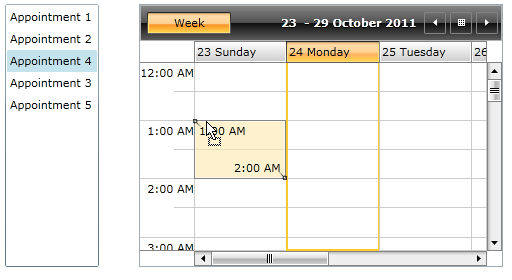

# Drag-drop between ListBox and ScheduleView

To enable drag-drop between a ListBox and a RadScheduleView, on the ListBox should be attached a ListBoxDragDropBehavior and a DataConverter. The DataConverter should convert the dragged items from the ListBox into a ScheduleViewDragDropPayload and vice versa.          

Following is an example demonstrating how to convert appointments between a ListBox and a ScheduleView:

* Create the DataConverter:

	```C#
		public class ScheduleViewToAppointmentConverter : DataConverter
		{		
			public override string[] GetConvertToFormats()
			{
				return new string[] { typeof(ScheduleViewDragDropPayload).FullName};
			}
		
			public override object ConvertTo(object data, string format)
			{
					
				if (format == typeof(ScheduleViewDragDropPayload).FullName && DataObjectHelper.GetDataPresent(data, typeof(Appointment), false))
				{
					var appointments = (IEnumerable)DataObjectHelper.GetData(data, typeof(Appointment), false);
					if (appointments != null)
					{
						return new ScheduleViewDragDropPayload(null, appointments.OfType<IOccurrence>().ToList());
					}
				}			
				return null;
			}
		}
	```

* Add CustomScheduleViewDragDropBehavior class which inherits ScheduleViewDragDropBehavior:      	

	```C#
		public class CustomScheduleViewDragDropBehavior : ScheduleViewDragDropBehavior
		{
			public override IEnumerable<IOccurrence> ConvertDraggedData(object data)
			{
				if (DataObjectHelper.GetDataPresent(data, typeof(Appointment), false))
				{
					var appointments = DataObjectHelper.GetData(data, typeof(Appointment), true) as IEnumerable;
					if (appointments != null)
					{
						return appointments.OfType<IOccurrence>();
					}
				}
		
				return base.ConvertDraggedData(data);
			}
		}
	```

* The final configuration of the two controls in XAML should look like:

	```XAML	
		<telerik:RadScheduleView ...>
			<telerik:RadScheduleView.ViewDefinitions>
				<telerik:WeekViewDefinition />
			</telerik:RadScheduleView.ViewDefinitions>
			<telerik:RadScheduleView.DragDropBehavior>
				<local:CustomScheduleViewDragDropBehavior />
			</telerik:RadScheduleView.DragDropBehavior>
		</telerik:RadScheduleView>
		
		<ListBox ...>
			<drag:ListBoxDragDrop.DataConverter>
				<local:ScheduleViewToAppointmentConverter />
			</drag:ListBoxDragDrop.DataConverter>
			<drag:ListBoxDragDrop.Behavior>
				<drag:ListBoxDragDropBehavior />
			</drag:ListBoxDragDrop.Behavior>	
		</ListBox>
	```

Here is the result:


