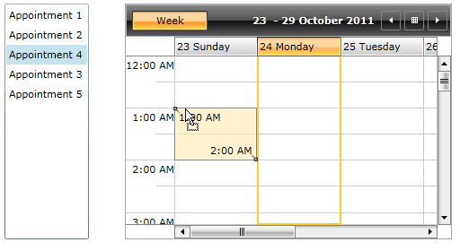

# Drag-drop between ListBox and ScheduleView

To enable drag-drop between a ListBox and a RadScheduleView, on the ListBox should be attached a ListBoxDragDropBehavior and a DataConverter. The DataConverter should convert the dragged items from the ListBox into a ScheduleViewDragDropPayload and vice versa.          

Following is an example demonstrating how to convert appointments between a ListBox and a ScheduleView:

* Create the DataConverter:

<snippet id='dragdropmanager-behaviors-listboxandscheduleview-block_1-cs' />

* Add CustomScheduleViewDragDropBehavior class which inherits ScheduleViewDragDropBehavior:      	

<snippet id='dragdropmanager-behaviors-listboxandscheduleview-block_2-cs' />

* The final configuration of the two controls in XAML should look like:

<snippet id='dragdropmanager-behaviors-listboxandscheduleview-block_3-xaml' />

Here is the result:

