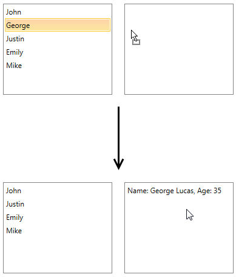

# DragDropPayloadManager

The __DragDropPayloadManager__ lets you easily generate valid drag payload objects that can be used in various drag-and-drop scenarios.

This article will cover the main features of the  __DragDropPayloadManager__ as well as their usage within a sample drag-and-drop example between two __RadListBoxes__.      

## Using the DragDropPayloadManager

Along with the option to easily create a valid drag payload, the __DragDropPayloadManager__ allows you to attach a DataConverter to it. This DataConverter will be carried within the different methods and used in order to convert the DataObjects from one to another type. This section will demonstrate the exact approach for creating a payload, attaching a DataConverter and using it.       

Let's start by creating a simple drag drop application with two __RadListBoxes__ with ItemsSources of different types. You have the following ViewModel with one collection that contains custom objects of type Customer and another with an empty collection of strings:        

<snippet id='dragdropmanager-dragdroppayloadmanager-block_1-cs' />
             
The __RadListBoxes__ are defined in XAML the following way:        

<snippet id='dragdropmanager-dragdroppayloadmanager-block_2-xaml' />

You can see the application in __Figure 1__:

Figure 1: ListBox1 is on the left and ListBox2 is on the right.

Next you will need to enable the drag and drop by adding a __DragInitializeHandler__ for the first __RadListBox__, so you can drag from the first __RadListBox__ and drop afterwards on the second one.        

<snippet id='dragdropmanager-dragdroppayloadmanager-block_3-cs' />

In the handler method where the payload is generated you will need to attach a DataConverter that will be used to convert the dragged item from object of type Customer to a simple string. That is why before implementing the handler you will need to create the following DataConverter:        

<snippet id='dragdropmanager-dragdroppayloadmanager-block_4-cs' />

>tip The DataConverter can convert objects from multiple types to multiple types inside its __ConvertTo()__ method. You will need to check if the format is the desired one as well as if the needed data is present. The __GetConvertToFormats()__ method should return a collection of the supported formats to convert to, so the control can accept or prevent the drop when the dragged object cannot be converted to the required format.

In the __DragInitialize__ handler itself you will need to pass to the DragDropPayloadManager an instance of the converter that will be carried by the payload within the events and used when needed:

<snippet id='dragdropmanager-dragdroppayloadmanager-block_5-cs' />

Now you can add the __DropHandler__ for the second __RadListBox__ inside of which the dragged data will be converted using the converter.        

<snippet id='dragdropmanager-dragdroppayloadmanager-block_6-cs' />

Inside of the handler you can also add another DataObject to the payload that indicates whether the drop was successful or not. Let's add an object named __IsDropSuccessful__ and set its value to __true__. This way you will know afterwards in the __DragDropCompletedHandler__ of the first __RadListBox__ if the drop on the second one was successful (or data has been dropped elsewhere):       

<snippet id='dragdropmanager-dragdroppayloadmanager-block_7-cs' />

After that, you should handle the __DragDropCompleted__ of the first list box and check if the drop was successful:        

<snippet id='dragdropmanager-dragdroppayloadmanager-block_8-cs' />

<snippet id='dragdropmanager-dragdroppayloadmanager-block_9-cs' />

In addition to this, you can use the __DragDropPayloadManager__ in order to check whether the dragged data can be converted to a type that is required from the ItemsSource. This is done by using the __GetFormats__ method, which returns a collection of the supported types. If the required type is not present, you can easily prevent the drop by setting the __Effects__ property of the drag arguments to __DragDropEffects.None__:        

<snippet id='dragdropmanager-dragdroppayloadmanager-block_10-cs' />

<snippet id='dragdropmanager-dragdroppayloadmanager-block_11-cs' />

__Figure 2__ shows the final result. When the dragged item is dropped, it will be converted to a string, added to the ItemsSource of the second __RadListBox__ and removed from the ItemsSource of the first list box.

Figure 2: ListBox1 is on the left and ListBox2 is on the right. After the drop is completed the object is converted to string.

>tip Find a runnable project of the previous example in the [WPF Samples GitHub repository](https://github.com/telerik/xaml-sdk/tree/master/DragDrop/DragDropUsingDragDropPayloadManager).       

## See Also

 * [Getting Started]()

 * [Events]()
