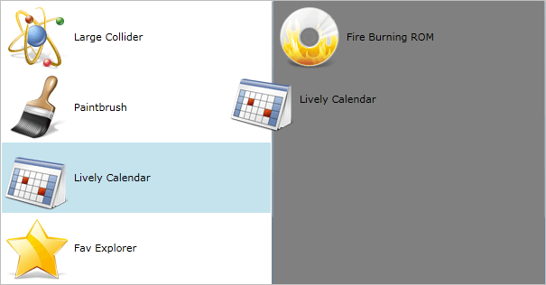

# Getting Started with {{ site.framework_name }} DragDropManager

This article will demonstrate a basic implementation of the DragDropManager by dragging between two ListBoxes. 

>To learn how to use the DragDropManager in a more MVVM-friendly matter though commands, have a look at the "DragDrop Using Commands" demo from our [SDK Samples Browser](https://github.com/telerik/xaml-sdk/). The source code of the demo is also available in our [GitHub repository](https://github.com/telerik/xaml-sdk/tree/master/DragDrop/DragDropUsingCommands).

## Adding Telerik Assemblies Using NuGet

To use `DragDropManager` when working with NuGet packages, install the `Telerik.Windows.Controls.for.Wpf.Xaml` package. The [package name may vary]() slightly based on the Telerik dlls set - [Xaml or NoXaml]()

Read more about NuGet installation in the [Installing UI for WPF from NuGet Package]() article.

>tip With the 2025 Q1 release, the Telerik UI for WPF has a new licensing mechanism. You can learn more about it [here]().

## Adding Assembly References Manually

In order to use the `DragDropManager` API you need to add a reference to the following assemblies:

* __Telerik.Licensing.Runtime__
* __Telerik.Windows.Controls__

The required Telerik assemblies can be added using one of the available [installation approaches](). 

## Using the DragDropManager Events

For the purpose of this tutorial we will create a business object ApplicationInfo, which will expose a couple of properties as well as a sample collection for populating the ListBoxes. The structure of the class used in this example is shown on the next code snippets:

__Create ApplicationInfo__
<snippet id='dragdropmanager-getting-started-create_applicationinfo-cs' />
<snippet id='dragdropmanager-getting-started-create_applicationinfo-vb' />

Then we need to define our ListBoxes with suitable ItemTemplates. We also enable dragging the ListBoxItems (through style) and allow drop to each of the ListBoxes (through setting AllowDrop property):

__Define ListBoxes, style and DataTemplate__
<snippet id='dragdropmanager-getting-started-define_listboxes_style_and_datatemplate-xaml' />

>To use the DragDropManager and its components in XAML you have to declare the following namespace:
>	*xmlns:telerik="http://schemas.telerik.com/2008/xaml/presentation"*

Afterwards we need to set the ItemsSource of the controls:

__Set ItemsSource__
<snippet id='dragdropmanager-getting-started-set_itemssource-cs' />
<snippet id='dragdropmanager-getting-started-set_itemssource-vb' />

__Attach Drag-Drop event handlers__
<snippet id='dragdropmanager-getting-started-attach_drag_drop_event_handlers-cs' />
<snippet id='dragdropmanager-getting-started-attach_drag_drop_event_handlers-vb' />

> For more information about the available events, check out the [Events]() article.

Then on DragInitialize we define the data that will be dragged as well as the visual representation. We also set DragDropEffects to all to allow drop on all scenarios.

__Implement OnDragInitialize__
<snippet id='dragdropmanager-getting-started-implement_ondraginitialize-cs' />
<snippet id='dragdropmanager-getting-started-implement_ondraginitialize-vb' />

>important In order for the `DragInitialize` method to occur, the `DragDropManager.AllowCapturedDrag` attached property has to be set on the source element. In this example, this is set via the Style that targets the `ListBoxItem` element.

We also set mouse cursor to be arrow:

__Implement OnGiveFeedback__
<snippet id='dragdropmanager-getting-started-implement_ongivefeedback-cs' />
<snippet id='dragdropmanager-getting-started-implement_ongivefeedback-vb' />

Finally, we add logic, that will be executed when drag and drop operations finish:



__Implement OnDrop__
<snippet id='dragdropmanager-getting-started-implement_ondrop-cs' />
<snippet id='dragdropmanager-getting-started-implement_ondrop-vb' />




__Implement OnDrop__
<snippet id='dragdropmanager-getting-started-implement_ondrop-cs' />
<snippet id='dragdropmanager-getting-started-implement_ondrop-vb' />



__Drag between ListBoxes__

> By default the DragDropManager shows the drag visual in a separate window. You have the option to set the `UseAdornerLayer` property of the DragDropManager. After this property is set to __True__, the drag visual will be shown in the AdornerLayer of the MainWindow. 


## Telerik UI for WPF Learning Resources

* [Telerik UI for WPF DragAndDrop Component](https://www.telerik.com/products/wpf/drag-drop.aspx)
* [Getting Started with Telerik UI for WPF Components]()
* [Telerik UI for WPF Installation]()
* [Telerik UI for WPF and WinForms Integration]()
* [Telerik UI for WPF Visual Studio Templates]()
* [Setting a Theme with Telerik UI for WPF]()
* [Telerik UI for WPF Virtual Classroom (Training Courses for Registered Users)](https://learn.telerik.com/learn/course/external/view/elearning/16/telerik-ui-for-wpf) 
* [Telerik UI for WPF License Agreement](https://www.telerik.com/purchase/license-agreement/wpf-dlw-s)


## See Also

 * [Events]()
 * [DragDropManager Migration]()

