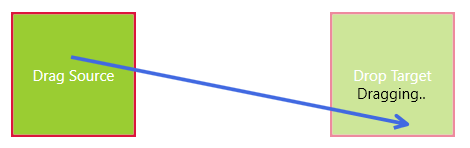

# Create Custom Drag Arrow

This article demonstrates how to create a custom drag cue that connects the drag origin point with the current mouse position. 

## Defining the Arrow Visual

The arrow visual used in this example is a custom Shape element that creates its geometry based on start and end points.

__Example 1: Creating custom arrow visual__
```C#
	public sealed class ArrowShape : Shape
	{
		public double X1 { get; set; }
		public double Y1 { get; set; }
		public double X2 { get; set; }
		public double Y2 { get; set; }
		public double HeadWidth { get; set; }
		public double HeadHeight { get; set; }

		private static Tuple<Point, Point> GetArrowPoints(Point startPoint, Point endPoint, double arrowWidth, double arrowHeight)
		{
			arrowHeight = arrowHeight / 2;
			double theta = Math.Atan2(startPoint.Y - endPoint.Y, startPoint.X - endPoint.X);
			double sint = Math.Round(Math.Sin(theta), 2);
			double cost = Math.Round(Math.Cos(theta), 2);
			Point leftPoint = new Point(endPoint.X + ((arrowWidth * cost) - (arrowHeight * sint)), endPoint.Y + ((arrowWidth * sint) + (arrowHeight * cost)));
			Point rightPoint = new Point(endPoint.X + ((arrowWidth * cost) + (arrowHeight * sint)), endPoint.Y - ((arrowHeight * cost) - (arrowWidth * sint)));
			return new Tuple<Point, Point>(leftPoint, rightPoint);
		}

		public void UpdateGeometry()
		{
			this.InvalidateVisual();
		}

		protected override Geometry DefiningGeometry
		{
			get { return this.CreateArrowGeometry(); }
		}

		private StreamGeometry CreateArrowGeometry()
		{
			StreamGeometry geometry = new StreamGeometry() { FillRule = FillRule.EvenOdd };
			using (StreamGeometryContext context = geometry.Open())
			{
				Point startPoint = new Point(X1, this.Y1);
				Point endPoint = new Point(X2, this.Y2);
				Tuple<Point, Point> arrowPoints = GetArrowPoints(startPoint, endPoint, this.HeadWidth, this.HeadHeight);
				Point leftPoint = arrowPoints.Item1;
				Point rightPoint = arrowPoints.Item2;
				context.BeginFigure(startPoint, true, false);
				context.LineTo(endPoint, true, true);
				context.LineTo(leftPoint, true, true);
				context.LineTo(endPoint, true, true);
				context.LineTo(rightPoint, true, true);
			}
			geometry.Freeze();
			return geometry;
		}
	}
```

In order to update the geometry of the ArrowShape control when changing its X and Y values, call the __UpdateGeometry()__ method.

## Defining the Drag Arrow Behavior

The logic that shows the arrow visual can be implemented in a static class using an attached property. This way it can be re-used across multiple controls.

The custom class uses a native Popup container that hosts the ArrowShape control while the drag operation is performing.

The behavior uses the __DragDropManager__ and its __DragInitialized, DragOver and DragDropCompleted__ events to update the arrow visual.

The attached behavior also handles several additional cases - it allows to define a drag start threshold and also an offset between the mouse and the arrow's end point.

__Example 2: Creating the dragdrop attached behavior that updates the arrow visual__
```C#
	public static class DragDropManagerUtilities
    {
        private const double dragStartThreshold = 5;
        private static readonly Point EndPointOffset = new Point(3, 3);
        private static bool allowDropCache;
        private static Popup arrowContainer;
        private static ArrowShape arrowVisual;
        private static FrameworkElement rootVisual;        

        static DragDropManagerUtilities()
        {
            rootVisual = App.Current.MainWindow;            
            
            arrowVisual = new ArrowShape();
            arrowVisual.HeadHeight = 10;
            arrowVisual.HeadWidth = 10;
            arrowVisual.Stroke = Brushes.RoyalBlue;
            arrowVisual.StrokeThickness = 3;

            arrowContainer = new Popup();
            arrowContainer.AllowsTransparency = true;
            arrowContainer.Placement = PlacementMode.Relative;
            arrowContainer.PlacementTarget = rootVisual;
            arrowContainer.Child = arrowVisual;

            DragDropManager.AddDragOverHandler(rootVisual, OnWindowDragOver, true);
        }
        
        public static readonly DependencyProperty ShowArrowDragCueProperty =
            DependencyProperty.RegisterAttached(
                "ShowArrowDragCue", 
                typeof(bool), 
                typeof(DragDropManagerUtilities), 
                new PropertyMetadata(false, OnShowArrowDragCueChanged));

        public static bool GetShowArrowDragCue(DependencyObject obj)
        {
            return (bool)obj.GetValue(ShowArrowDragCueProperty);
        }

        public static void SetShowArrowDragCue(DependencyObject obj, bool value)
        {
            obj.SetValue(ShowArrowDragCueProperty, value);
        }

        private static void OnShowArrowDragCueChanged(DependencyObject target, DependencyPropertyChangedEventArgs args)
        {
            var element = (FrameworkElement)target;
            if ((bool)args.NewValue)
            {
                DragDropManager.AddDragInitializeHandler(element, OnElementDragInitialize, true);                
                DragDropManager.AddDragDropCompletedHandler(element, OnElementDragDropCompleted, true);
                element.Unloaded += OnElementUnloaded;
            }
            else
            {
                UnsubscribeFromEvents(element);
            }            
        }

        private static void OnElementDragInitialize(object sender, DragInitializeEventArgs e)
        {
            arrowContainer.Width = rootVisual.ActualWidth;
            arrowContainer.Height = rootVisual.ActualHeight;
            var position = Mouse.GetPosition(rootVisual);
            arrowVisual.X1 = arrowVisual.X2 = position.X;
            arrowVisual.Y1 = arrowVisual.Y2 = position.Y;

            allowDropCache = rootVisual.AllowDrop;
            rootVisual.AllowDrop = true;
        }

        private static void OnElementDragDropCompleted(object sender, DragDropCompletedEventArgs e)
        {
            arrowContainer.IsOpen = false;
            rootVisual.AllowDrop = allowDropCache;
        }

        private static void OnWindowDragOver(object sender, Telerik.Windows.DragDrop.DragEventArgs e)
        {
            if (e.AllowedEffects != DragDropEffects.None)
            {
                var position = e.GetPosition(rootVisual) - EndPointOffset;
                arrowVisual.X2 = position.X;
                arrowVisual.Y2 = position.Y;
                arrowVisual.UpdateGeometry();

                if (!arrowContainer.IsOpen && 
                    GetDistance(arrowVisual.X1, arrowVisual.Y1, arrowVisual.X2, arrowVisual.Y2) >= dragStartThreshold)
                {
                    arrowContainer.IsOpen = true;
                }                
            }
        }

        private static void UnsubscribeFromEvents(FrameworkElement element)
        {
            DragDropManager.RemoveDragInitializeHandler(element, OnElementDragInitialize);
            DragDropManager.RemoveDragDropCompletedHandler(element, OnElementDragDropCompleted);
            element.Unloaded -= OnElementUnloaded;
        }

        private static void OnElementUnloaded(object sender, RoutedEventArgs e)
        {
            UnsubscribeFromEvents((FrameworkElement)sender);
        }

        private static double GetDistance(double x1, double y1, double x2, double y2)
        {
            return Point.Subtract(new Point(x2, y2), new Point(x1, y1)).Length;
        }
    }
```

## Using the Custom Drag Arrow

To demonstrate the custom drag arrow we will use two Border elements. A drag/drop opreation can be performed from one to the other.

__Example 3: Defining the view in XAML and setting the DragDropManagerUtilities.ShowArrowDragCue attached property__
```XAML
	<Grid>
        <Grid.ColumnDefinitions>
            <ColumnDefinition />
            <ColumnDefinition />
        </Grid.ColumnDefinitions>
        <Border x:Name="border1" Background="YellowGreen" 
                BorderThickness="2" BorderBrush="Crimson"
                Width="100" Height="100" 
                telerik:DragDropManager.AllowDrag="True"
                local:DragDropManagerUtilities.ShowArrowDragCue="True">
            <TextBlock Text="Drag Source" VerticalAlignment="Center" 
                       TextAlignment="Center" Foreground="White"/>
        </Border>
        <Border x:Name="border2" Background="YellowGreen" 
                BorderThickness="2" BorderBrush="Crimson"
                Width="100" Height="100" Grid.Column="1"
                Opacity="0.5">
            <TextBlock Text="Drop Target" VerticalAlignment="Center"
                       TextAlignment="Center" Foreground="White"/>
        </Border>
    </Grid>
```

In order to use the DragDropManagerUtilities class logic you will need to set the __AllowedEffects__ of the drag operation to a value different than None. You can do this in the DragInitialize event handler.

__Example 4: Implementing a basic drag/drop logic between the Border elements__
```C#
	public partial class MyUserControl : UserControl
    {
        public MyUserControl()
        {
            InitializeComponent();
            DragDropManager.AddDragInitializeHandler(this.border1, OnBorderDragInitialize);
            DragDropManager.AddDropHandler(this.border2, OnBorderDrop);
        }

        private void OnBorderDragInitialize(object sender, DragInitializeEventArgs e)
        {
            e.AllowedEffects = DragDropEffects.All;
            e.DragVisual = new TextBlock() { Text = "Dragging.." };
        }
		
		private void OnBorderDrop(object sender, Telerik.Windows.DragDrop.DragEventArgs e)
        {
            MessageBox.Show("Dropped.");
        }
    }
```

#### Figure 1: Custom drag arrow 


>tip The DragDropManagerUtilities class can be used with most controls.

> The drag arrow is a native {{ site.framework_name }} visual element which means that it will be shown only in the boundaries of the application's window.

>tip This example is based on the [Custom Arrow Cue](https://github.com/telerik/xaml-sdk/tree/master/DragDrop/CustomArrowCue) SDK project.

## See Also  
* [Getting Started]()
* [Events]()
* [How to Set Drag Visual]()
* [DragDropPayloadManager]()

