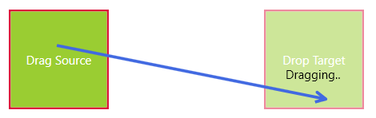

# Create Custom Drag Arrow

This article demonstrates how to create a custom drag cue that connects the drag origin point with the current mouse position. 

## Defining the Arrow Visual

The arrow visual used in this example is a custom Shape element that creates its geometry based on start and end points.

__Example 1: Creating custom arrow visual__
<snippet id='dragdropmanager-how-to-howto-create-custom-drag-arrow-example_1_creating_custom_arrow_visual-cs' />

In order to update the geometry of the ArrowShape control when changing its X and Y values, call the __UpdateGeometry()__ method.

## Defining the Drag Arrow Behavior

The logic that shows the arrow visual can be implemented in a static class using an attached property. This way it can be re-used across multiple controls.

The custom class uses a native Popup container that hosts the ArrowShape control while the drag operation is performing.

The behavior uses the __DragDropManager__ and its __DragInitialized, DragOver and DragDropCompleted__ events to update the arrow visual.

The attached behavior also handles several additional cases - it allows to define a drag start threshold and also an offset between the mouse and the arrow's end point.

__Example 2: Creating the dragdrop attached behavior that updates the arrow visual__
<snippet id='dragdropmanager-how-to-howto-create-custom-drag-arrow-example_2_creating_the_dragdrop_attached_behavior_that_updates_the_arrow_visual-cs' />

## Using the Custom Drag Arrow

To demonstrate the custom drag arrow we will use two Border elements. A drag/drop opreation can be performed from one to the other.

__Example 3: Defining the view in XAML and setting the DragDropManagerUtilities.ShowArrowDragCue attached property__
<snippet id='dragdropmanager-how-to-howto-create-custom-drag-arrow-example_3_defining_the_view_in_xaml_and_setting_the_dragdropmanagerutilities_showarrowdragcue_attached_property-xaml' />

In order to use the DragDropManagerUtilities class logic you will need to set the __AllowedEffects__ of the drag operation to a value different than None. You can do this in the DragInitialize event handler.

__Example 4: Implementing a basic drag/drop logic between the Border elements__
<snippet id='dragdropmanager-how-to-howto-create-custom-drag-arrow-example_4_implementing_a_basic_drag_drop_logic_between_the_border_elements-cs' />

#### Figure 1: Custom drag arrow 

>tip The DragDropManagerUtilities class can be used with most controls.

> The drag arrow is a native {{ site.framework_name }} visual element which means that it will be shown only in the boundaries of the application's window.

>tip This example is based on the [Custom Arrow Cue](https://github.com/telerik/xaml-sdk/tree/master/DragDrop/CustomArrowCue) SDK project.

## See Also  
* [Getting Started]()
* [Events]()
* [How to Set Drag Visual]()
* [DragDropPayloadManager]()

