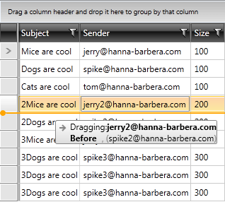

# Drag and Drop within RadGridView

The purpose of this tutorial is to show you how to implement __drag and drop within RadGridView__, giving the user feedback where the dragged item will be dropped.      

The final result should look like the one on the snapshot below:



* Create a new business object named __MessageViewModel__. It will be used to populate the __RadGridView__ with sample data.          


```C#
	public class MessageViewModel
	{
		public static IList Generate()
		{
			IList data = new ObservableCollection<MessageViewModel>();
			data.Add(new MessageViewModel("tom@hanna-barbera.com", "Cats are cool", 100));
			data.Add(new MessageViewModel("jerry@hanna-barbera.com", "Mice are cool", 100));
			data.Add(new MessageViewModel("spike@hanna-barbera.com", "Dogs are cool", 100));
			data.Add(new MessageViewModel("jerry2@hanna-barbera.com", "2Mice are cool", 200));
			data.Add(new MessageViewModel("spike2@hanna-barbera.com", "2Dogs are cool", 200));
			data.Add(new MessageViewModel("jerry3@hanna-barbera.com", "3Mice are cool", 300));
			data.Add(new MessageViewModel("spike3@hanna-barbera.com", "3Dogs are cool", 300));
			data.Add(new MessageViewModel("spike3@hanna-barbera.com", "3Dogs are cool", 300));
			data.Add(new MessageViewModel("spike3@hanna-barbera.com", "3Dogs are cool", 300));
			return data;
		}
		public MessageViewModel(string sender, string subject, int size)
		{
			this.Sender = sender;
			this.Subject = subject;
			this.Size = size;
		}
		public string Subject
		{
			get;
			set;
		}
		public string Sender
		{
			get;
			set;
		}
		public int Size
		{
			get;
			set;
		}
		 public override string ToString()
		{
			return this.Sender;
		}
	}
```
```VB.NET
	Public Class MessageViewModel
		Public Shared Function Generate() As IList
			Dim data As IList = New ObservableCollection(Of MessageViewModel)()
			data.Add(New MessageViewModel("tom@hanna-barbera.com", "Cats are cool", 100))
			data.Add(New MessageViewModel("jerry@hanna-barbera.com", "Mice are cool", 100))
			data.Add(New MessageViewModel("spike@hanna-barbera.com", "Dogs are cool", 100))
			data.Add(New MessageViewModel("jerry2@hanna-barbera.com", "2Mice are cool", 200))
			data.Add(New MessageViewModel("spike2@hanna-barbera.com", "2Dogs are cool", 200))
			data.Add(New MessageViewModel("jerry3@hanna-barbera.com", "3Mice are cool", 300))
			data.Add(New MessageViewModel("spike3@hanna-barbera.com", "3Dogs are cool", 300))
			data.Add(New MessageViewModel("spike3@hanna-barbera.com", "3Dogs are cool", 300))
			data.Add(New MessageViewModel("spike3@hanna-barbera.com", "3Dogs are cool", 300))
			Return data
		End Function
		Public Sub New(ByVal sender As String, ByVal subject As String, ByVal size As Integer)
			Me.Sender = sender
			Me.Subject = subject
			Me.Size = size
		End Sub
		Private _Subject As String
		Public Property Subject() As String
			Get
				Return _Subject
			End Get
			Set(ByVal value As String)
				_Subject = value
			End Set
		End Property
		Private _Sender As String
		Public Property Sender() As String
			Get
				Return _Sender
			End Get
			Set(ByVal value As String)
				_Sender = value
			End Set
		End Property
		Private _Size As Integer
		Public Property Size() As Integer
			Get
				Return _Size
			End Get
			Set(ByVal value As Integer)
				_Size = value
			End Set
		End Property
		Public Overrides Function ToString() As String
			Return Me.Sender
		End Function
	End Class
```

* The XAML should look like the code snippet below.


```XAML
	<telerik:RadGridView   AutoGenerateColumns="True"
	                        Margin="5"
	                        Name="radGridView"
	                        AllowDrop="True"
	                        GroupRenderMode="Flat">
		<telerik:RadGridView.Resources>
			<DataTemplate x:Key="DraggedItemTemplate">
				<StackPanel>
					<StackPanel Orientation="Horizontal">
						<TextBlock Text="Dragging:" />
						<TextBlock Text="{Binding CurrentDraggedItem}"
								   FontWeight="Bold" />
					</StackPanel>
					<StackPanel Orientation="Horizontal">
						<TextBlock Text="{Binding CurrentDropPosition}"
								   FontWeight="Bold"
								   MinWidth="45" />
						<TextBlock Text=", ("
								   Foreground="Gray" />
						<TextBlock Text="{Binding CurrentDraggedOverItem}" />
						<TextBlock Text=")"
								   Foreground="Gray" />
					</StackPanel>
				</StackPanel>
			</DataTemplate>
		</telerik:RadGridView.Resources>
		<telerik:RadGridView.RowStyle>
			<Style TargetType="telerik:GridViewRow">
				<Setter Property="telerik:DragDropManager.AllowDrag"
						Value="True" />
				<Setter Property="telerik:TouchManager.DragStartTrigger"
						Value="TapAndHold"/>
			</Style>
		</telerik:RadGridView.RowStyle>
	</telerik:RadGridView>
```

>If you are referencing NoXaml binaries, then your style should specify __BasedOn={StaticResource GridViewRowStyle}__.
          
* Create a new class named __DropIndicationDetails__.           


```C#
	public class DropIndicationDetails : ViewModelBase
	{
		private object currentDraggedItem;
		private DropPosition currentDropPosition;
		private object currentDraggedOverItem;
	
		public object CurrentDraggedOverItem
		{
			get
			{
				return currentDraggedOverItem;
			}
			set
			{
				if (this.currentDraggedOverItem != value)
				{
					currentDraggedOverItem = value;
					OnPropertyChanged("CurrentDraggedOverItem");
				}
			}
		}
	
		public int DropIndex { get; set; }
	
		public DropPosition CurrentDropPosition
		{
			get
			{
				return this.currentDropPosition;
			}
			set
			{
				if (this.currentDropPosition != value)
				{
					this.currentDropPosition = value;
					OnPropertyChanged("CurrentDropPosition");
				}
			}
		}
	
		public object CurrentDraggedItem
		{
			get
			{
				return this.currentDraggedItem;
			}
			set
			{
				if (this.currentDraggedItem != value)
				{
					this.currentDraggedItem = value;
					OnPropertyChanged("CurrentDraggedItem");
				}
			}
		}
	}
```
```VB.NET
	Public Class DropIndicationDetails
		Inherits ViewModelBase
		Private m_currentDraggedItem As Object
		Private m_currentDropPosition As DropPosition
		Private m_currentDraggedOverItem As Object

		Public Property CurrentDraggedOverItem() As Object
			Get
				Return m_currentDraggedOverItem
			End Get
			Set(value As Object)
				If Me.m_currentDraggedOverItem <> value Then
					m_currentDraggedOverItem = value
					OnPropertyChanged("CurrentDraggedOverItem")
				End If
			End Set
		End Property

		Public Property DropIndex() As Integer
			Get
				Return m_DropIndex
			End Get
			Set(value As Integer)
				m_DropIndex = Value
			End Set
		End Property
		Private m_DropIndex As Integer

		Public Property CurrentDropPosition() As DropPosition
			Get
				Return Me.m_currentDropPosition
			End Get
			Set(value As DropPosition)
				If Me.m_currentDropPosition <> value Then
					Me.m_currentDropPosition = value
					OnPropertyChanged("CurrentDropPosition")
				End If
			End Set
		End Property

		Public Property CurrentDraggedItem() As Object
			Get
				Return Me.m_currentDraggedItem
			End Get
			Set(value As Object)
				If Me.m_currentDraggedItem <> value Then
					Me.m_currentDraggedItem = value
					OnPropertyChanged("CurrentDraggedItem")
				End If
			End Set
		End Property
	End Class
```

* The row reorder capabilities will be encapsulated in a __Behavior__. Create a new class named __RowReorderBehavior__.            

* Finally, the complete code for the __RowReorderBehavior__ is shown on the code snippet below.            


```C#
	public class RowReorderBehavior
    {
        private const string DropPositionFeedbackElementName = "DragBetweenItemsFeedback";
        private ContentPresenter dropPositionFeedbackPresenter;
        private Grid dropPositionFeedbackPresenterHost;

        private RadGridView _associatedObject;

        /// <summary>
        /// AssociatedObject Property
        /// </summary>
        public RadGridView AssociatedObject
        {
            get
            {
                return _associatedObject;
            }
            set
            {
                _associatedObject = value;
            }
        }

        private static Dictionary<RadGridView, RowReorderBehavior> instances;

        static RowReorderBehavior()
        {
            instances = new Dictionary<RadGridView, RowReorderBehavior>();
        }

        public static bool GetIsEnabled(DependencyObject obj)
        {
            return (bool)obj.GetValue(IsEnabledProperty);
        }

        public static void SetIsEnabled(DependencyObject obj, bool value)
        {
            RowReorderBehavior behavior = GetAttachedBehavior(obj as RadGridView);

            behavior.AssociatedObject = obj as RadGridView;

            if (value)
            {
                behavior.Initialize();
            }
            else
            {
                behavior.CleanUp();
            }
            obj.SetValue(IsEnabledProperty, value);
        }

        // Using a DependencyProperty as the backing store for IsEnabled.  This enables animation, styling, binding, etc...
        public static readonly DependencyProperty IsEnabledProperty =
            DependencyProperty.RegisterAttached("IsEnabled", typeof(bool), typeof(RowReorderBehavior),
                new PropertyMetadata(new PropertyChangedCallback(OnIsEnabledPropertyChanged)));

        public static void OnIsEnabledPropertyChanged(DependencyObject dependencyObject, DependencyPropertyChangedEventArgs e)
        {
            SetIsEnabled(dependencyObject, (bool)e.NewValue);
        }

        private static RowReorderBehavior GetAttachedBehavior(RadGridView gridview)
        {
            if (!instances.ContainsKey(gridview))
            {
                instances[gridview] = new RowReorderBehavior();
                instances[gridview].AssociatedObject = gridview;
            }

            return instances[gridview];
        }

        public RowReorderBehavior()
        {

        }

        protected virtual void Initialize()
        {
            this.AssociatedObject.RowLoaded -= this.AssociatedObject_RowLoaded;
            this.AssociatedObject.RowLoaded += this.AssociatedObject_RowLoaded;
    		this.AssociatedObject.RowUnloaded -= AssociatedObject_RowUnloaded;
	    	this.AssociatedObject.RowUnloaded += AssociatedObject_RowUnloaded;
            this.UnsubscribeFromDragDropEvents();
            this.SubscribeToDragDropEvents();

            this.AssociatedObject.Dispatcher.BeginInvoke((Action)(() =>
            {
                this.dropPositionFeedbackPresenter = new ContentPresenter();
                this.dropPositionFeedbackPresenter.Name = DropPositionFeedbackElementName;
                this.dropPositionFeedbackPresenter.HorizontalAlignment = HorizontalAlignment.Left;
                this.dropPositionFeedbackPresenter.VerticalAlignment = VerticalAlignment.Top;
                this.dropPositionFeedbackPresenter.RenderTransformOrigin = new Point(0.5, 0.5);

                this.AttachDropPositionFeedback();
            }));
        }

        protected virtual void CleanUp()
        {
            this.AssociatedObject.RowLoaded -= this.AssociatedObject_RowLoaded;
            this.UnsubscribeFromDragDropEvents();
            
            this.DetachDropPositionFeedback();
        }

        void AssociatedObject_RowLoaded(object sender, Telerik.Windows.Controls.GridView.RowLoadedEventArgs e)
        {
            if (e.Row is GridViewHeaderRow || e.Row is GridViewNewRow || e.Row is GridViewFooterRow)
                return;

            GridViewRow row = e.Row as GridViewRow;
            this.InitializeRowDragAndDrop(row);
        }

		private void AssociatedObject_RowUnloaded(object sender, RowUnloadedEventArgs e)
		{
		     if (e.Row is GridViewRow)
		     {
		          DragDropManager.RemoveDragOverHandler(e.Row, OnRowDragOver);                
		     }
		}
   
        private void InitializeRowDragAndDrop(GridViewRow row)
        {
            if (row == null)
                return;

            DragDropManager.RemoveDragOverHandler(row, OnRowDragOver);
            DragDropManager.AddDragOverHandler(row, OnRowDragOver);
        }

        private void SubscribeToDragDropEvents()
        {
            DragDropManager.AddDragInitializeHandler(this.AssociatedObject, OnDragInitialize);
            DragDropManager.AddGiveFeedbackHandler(this.AssociatedObject, OnGiveFeedback);
            DragDropManager.AddDropHandler(this.AssociatedObject, OnDrop);
            DragDropManager.AddDragDropCompletedHandler(this.AssociatedObject, OnDragDropCompleted);
        }

        private void UnsubscribeFromDragDropEvents()
        {
            DragDropManager.RemoveDragInitializeHandler(this.AssociatedObject, OnDragInitialize);
            DragDropManager.RemoveGiveFeedbackHandler(this.AssociatedObject, OnGiveFeedback);
            DragDropManager.RemoveDropHandler(this.AssociatedObject, OnDrop);
            DragDropManager.RemoveDragDropCompletedHandler(this.AssociatedObject, OnDragDropCompleted);
        }

        private void OnDragDropCompleted(object sender, DragDropCompletedEventArgs e)
        {
            this.HideDropPositionFeedbackPresenter();
        }

        private void OnDragInitialize(object sender, DragInitializeEventArgs e)
        {
            var sourceRow = e.OriginalSource as GridViewRow ?? (e.OriginalSource as FrameworkElement).ParentOfType<GridViewRow>();
            if (sourceRow != null && sourceRow.Name != "PART_RowResizer")
            {
                DropIndicationDetails details = new DropIndicationDetails();
                var item = sourceRow.Item;
                details.CurrentDraggedItem = item;

                IDragPayload dragPayload = DragDropPayloadManager.GeneratePayload(null);

                dragPayload.SetData("DraggedItem", item);
                dragPayload.SetData("DropDetails", details);

                e.Data = dragPayload;

                e.DragVisual = new DragVisual()
                {
                    Content = details,
                    ContentTemplate = this.AssociatedObject.Resources["DraggedItemTemplate"] as DataTemplate
                };
                e.DragVisualOffset = e.RelativeStartPoint;
                e.AllowedEffects = DragDropEffects.All;
            }
        }

        private void OnGiveFeedback(object sender, Telerik.Windows.DragDrop.GiveFeedbackEventArgs e)
        {
            e.SetCursor(Cursors.Arrow);
            e.Handled = true;
        }

        private void OnDrop(object sender, Telerik.Windows.DragDrop.DragEventArgs e)
        {
            var draggedItem = DragDropPayloadManager.GetDataFromObject(e.Data, "DraggedItem");
            var details = DragDropPayloadManager.GetDataFromObject(e.Data, "DropDetails") as DropIndicationDetails;

            if (details == null || draggedItem == null)
            {
                return;
            }

            if (e.Effects == DragDropEffects.Move || e.Effects == DragDropEffects.All)
            {
                ((sender as RadGridView).ItemsSource as IList).Remove(draggedItem);
            }

            if (e.Effects != DragDropEffects.None)
            {
                var collection = (sender as RadGridView).ItemsSource as IList;
                int index = details.DropIndex < 0 ? 0 : details.DropIndex;
                index = details.DropIndex > collection.Count - 1 ? collection.Count : index;

                collection.Insert(index, draggedItem);
            }

            HideDropPositionFeedbackPresenter();
        }

        private void OnRowDragOver(object sender, Telerik.Windows.DragDrop.DragEventArgs e)
        {
            var row = sender as GridViewRow;
            var details = DragDropPayloadManager.GetDataFromObject(e.Data, "DropDetails") as DropIndicationDetails;

            if (details == null || row == null)
            {
                return;
            }

            details.CurrentDraggedOverItem = row.DataContext;

            if (details.CurrentDraggedItem == details.CurrentDraggedOverItem)
            {
                e.Effects = DragDropEffects.None;
                e.Handled = true;
                return;
            }

            details.CurrentDropPosition = GetDropPositionFromPoint(e.GetPosition(row), row);
            int dropIndex = (this.AssociatedObject.Items as IList).IndexOf(row.DataContext);
            int draggedItemIdex = (this.AssociatedObject.Items as IList).IndexOf(DragDropPayloadManager.GetDataFromObject(e.Data, "DraggedItem"));

            if (dropIndex >= row.GridViewDataControl.Items.Count - 1 && details.CurrentDropPosition == DropPosition.After)
            {
                details.DropIndex = dropIndex;
                this.ShowDropPositionFeedbackPresenter(this.AssociatedObject, row, details.CurrentDropPosition);
                return;
            }

            dropIndex = draggedItemIdex > dropIndex ? dropIndex : dropIndex - 1;
            details.DropIndex = details.CurrentDropPosition == DropPosition.Before ? dropIndex : dropIndex + 1;

            this.ShowDropPositionFeedbackPresenter(this.AssociatedObject, row, details.CurrentDropPosition);
        }

        public virtual DropPosition GetDropPositionFromPoint(Point absoluteMousePosition, GridViewRow row)
        {
            if (row != null)
            {
                return absoluteMousePosition.Y < row.ActualHeight / 2 ? DropPosition.Before : DropPosition.After;
            }

            return DropPosition.Inside;
        }

        private bool IsDropPositionFeedbackAvailable()
        {
            return
                  this.dropPositionFeedbackPresenterHost != null &&
                  this.dropPositionFeedbackPresenter != null;
        }

        private void ShowDropPositionFeedbackPresenter(GridViewDataControl gridView, GridViewRow row, DropPosition lastRowDropPosition)
        {
            if (!this.IsDropPositionFeedbackAvailable())
                return;
            var yOffset = this.GetDropPositionFeedbackOffset(row, lastRowDropPosition);
            this.dropPositionFeedbackPresenter.Visibility = Visibility.Visible;
            this.dropPositionFeedbackPresenter.Width = row.ActualWidth;
            this.dropPositionFeedbackPresenter.RenderTransform = new TranslateTransform()
            {
                Y = yOffset
            };
        }

        private void HideDropPositionFeedbackPresenter()
        {
            this.dropPositionFeedbackPresenter.RenderTransform = new TranslateTransform()
            {
                X = 0,
                Y = 0
            };
            this.dropPositionFeedbackPresenter.Visibility = Visibility.Collapsed;
        }

        private double GetDropPositionFeedbackOffset(GridViewRow row, DropPosition dropPosition)
        {
            var yOffset = row.TransformToVisual(this.dropPositionFeedbackPresenterHost).Transform(new Point(0, 0)).Y;
            if (dropPosition == DropPosition.After)
                yOffset += row.ActualHeight;
            yOffset -= (this.dropPositionFeedbackPresenter.ActualHeight / 2.0);
            return yOffset;
        }

        private void DetachDropPositionFeedback()
        {
            if (this.IsDropPositionFeedbackAvailable())
            {
                this.dropPositionFeedbackPresenterHost.Children.Remove(this.dropPositionFeedbackPresenter);
                this.dropPositionFeedbackPresenter = null;
            }
        }

        private void AttachDropPositionFeedback()
        {
            this.dropPositionFeedbackPresenterHost = this.AssociatedObject.ParentOfType<Grid>();

            if (this.dropPositionFeedbackPresenterHost != null)
            {
                this.dropPositionFeedbackPresenter.Content = CreateDefaultDropPositionFeedback();
                if (dropPositionFeedbackPresenterHost != null && dropPositionFeedbackPresenterHost.FindName(this.dropPositionFeedbackPresenter.Name) == null)
                {
                    this.dropPositionFeedbackPresenterHost.Children.Add(this.dropPositionFeedbackPresenter);
                }
            }
            this.HideDropPositionFeedbackPresenter();
        }

        private static UIElement CreateDefaultDropPositionFeedback()
        {
            Grid grid = new Grid()
            {
                Height = 8,
                HorizontalAlignment = HorizontalAlignment.Stretch,
                IsHitTestVisible = false,
                VerticalAlignment = VerticalAlignment.Stretch
            };
            grid.ColumnDefinitions.Add(new ColumnDefinition()
            {
                Width = new GridLength(8)
            });
            grid.ColumnDefinitions.Add(new ColumnDefinition());
            Ellipse ellipse = new Ellipse()
            {
                Stroke = new SolidColorBrush(Colors.Orange),
                StrokeThickness = 2,
                Fill = new SolidColorBrush(Colors.Orange),
                HorizontalAlignment = HorizontalAlignment.Stretch,
                VerticalAlignment = VerticalAlignment.Stretch,
                Width = 8,
                Height = 8
            };
            Rectangle rectangle = new Rectangle()
            {
                Fill = new SolidColorBrush(Colors.Orange),
                RadiusX = 2,
                RadiusY = 2,
                VerticalAlignment = VerticalAlignment.Stretch,
                HorizontalAlignment = HorizontalAlignment.Stretch,
                Height = 2
            };
            Grid.SetColumn(ellipse, 0);
            Grid.SetColumn(rectangle, 1);
            grid.Children.Add(ellipse);
            grid.Children.Add(rectangle);

            Canvas.SetZIndex(grid, 10000);

            return grid;
        }
    }
```

Finally, you should populate your  __RadGridView__ with sample data and attach the attached behavior:


```C#
	public MainWindow()
	{
    	InitializeComponent();

		this.radGridView.ItemsSource = MessageViewModel.Generate();
		RowReorderBehavior.SetIsEnabled(this.radGridView, true);
	}
```
```VB.NET
	Public Sub New()
		InitializeComponent()

		Me.radGridView.ItemsSource = MessageViewModel.Generate()
		RowReorderBehavior.SetIsEnabled(Me.radGridView, True)
	End Sub
```

>tipYou can download a __runnable project__ on the previous example from our online SDK repository [here](https://github.com/telerik/xaml-sdk/tree/master/GridView/DragDropWithLines).

>You can also check the [SDK Samples Browser]() that provides a more convenient approach in exploring and executing the examples in the Telerik XAML SDK repository.   

>tipYou can also check the implementation of  [Reorder Rows demo](https://demos.telerik.com/silverlight/#GridView/RowReorder)/[Tree to Grid demo](https://demos.telerik.com/silverlight/#DragAndDrop/TreeToGrid) __Tree to Grid/Reorder Rows__ [WPF Demos](https://demos.telerik.com/wpf/#DragAndDrop/RowReorder).      
 
