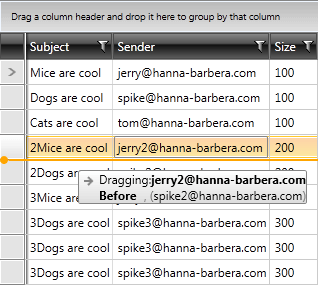

# Drag and Drop within RadGridView

The purpose of this tutorial is to show you how to implement __drag and drop within RadGridView__, giving the user feedback where the dragged item will be dropped.      

The final result should look like the one on the snapshot below:

* Create a new business object named __MessageViewModel__. It will be used to populate the __RadGridView__ with sample data.          

<snippet id='dragdropmanager-how-to-howto-draganddrop-within-radgridview-block_1-cs' />
<snippet id='dragdropmanager-how-to-howto-draganddrop-within-radgridview-block_1-vb' />

* The XAML should look like the code snippet below.

<snippet id='dragdropmanager-how-to-howto-draganddrop-within-radgridview-block_2-xaml' />

>If you are referencing NoXaml binaries, then your style should specify __BasedOn={StaticResource GridViewRowStyle}__.
          
* Create a new class named __DropIndicationDetails__.           

<snippet id='dragdropmanager-how-to-howto-draganddrop-within-radgridview-block_3-cs' />
<snippet id='dragdropmanager-how-to-howto-draganddrop-within-radgridview-block_3-vb' />

* The row reorder capabilities will be encapsulated in a __Behavior__. Create a new class named __RowReorderBehavior__.            

* Finally, the complete code for the __RowReorderBehavior__ is shown on the code snippet below.            

<snippet id='dragdropmanager-how-to-howto-draganddrop-within-radgridview-block_4-cs' />

Finally, you should populate your  __RadGridView__ with sample data and attach the attached behavior:

<snippet id='dragdropmanager-how-to-howto-draganddrop-within-radgridview-block_5-cs' />
<snippet id='dragdropmanager-how-to-howto-draganddrop-within-radgridview-block_5-vb' />

>tip You can download a __runnable project__ on the previous example from our online SDK repository [here](https://github.com/telerik/xaml-sdk/tree/master/GridView/DragDropWithLines).

>You can also check the [SDK Samples Browser]() that provides a more convenient approach in exploring and executing the examples in the Telerik XAML SDK repository.   

>tip You can also check the implementation of  [Reorder Rows demo](https://demos.telerik.com/silverlight/#GridView/RowReorder)/[Tree to Grid demo](https://demos.telerik.com/silverlight/#DragAndDrop/TreeToGrid) __Tree to Grid/Reorder Rows__ [WPF Demos](https://demos.telerik.com/wpf/#DragAndDrop/RowReorder).      
 
