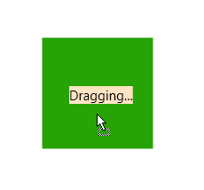

# Set Drag Visual Offset

The drag visual offset is the offset of the drag visual relative to the drag source element.

The offset can be set in the __DragDropManager.DragInitialize__ event handler, via the __DragVisualOffset__ property of DragInitializeEventArgs.

The DragVisualOffset property can be used in combination with the __RelativeStartPoint__ property of DragInitializeEventArgs in order to calculate and set a proper offset. The RelativeStartPoint property gives you the relative coordinates of the mouse cursor when starting a drag operation.

__Example 1: Setting up the view__
<snippet id='dragdropmanager-how-to-howto-set-dragvisualoffset-example_1_setting_up_the_view-xaml' />

__Example 2: Setting DragVisualOffset__
<snippet id='dragdropmanager-how-to-howto-set-dragvisualoffset-example_2_setting_dragvisualoffset-cs' />
<snippet id='dragdropmanager-how-to-howto-set-dragvisualoffset-example_2_setting_dragvisualoffset-vb' />

