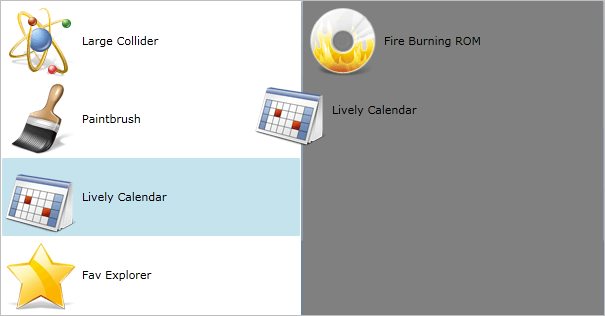

# Overview








DragDropManager offers intuitive API similar to Microsoft DragDrop, enabling drag-drop in multiple scenarios.

## Features:

* __Rich Event Handling__ - the DragAndDrop framework provides a wide set of events that can be used to handle the actions happening upon a drag and drop operation. Using the variety of events you can adjust the Drag And Drop actions to your very custom application’s logic, thus providing a great flexibility to the users. 

* __Visual DragCue__ - Telerik DragAndDrop uses a DragCue to follow the mouse while the user performs drag and drop operations. The DragCue appears always on the top of the other objects. This feature is another visual guide for the drag and drop operations. It helps the users while reordering elements on the pages.

* __Drag Threshold__ - you can choose the minimum vertical and horizontal distance which one user needs to move the mouse to start a drag operation.  With this, accidental and unwanted dragging can be avoided.

* __Integrations between applications__ – DragDropManager has build-in support for dragging from and to external programs (WPF), allowing easy interaction between applications.

Check out the online demos at [http://demos.telerik.com/silverlight/#DragAndDrop/FirstLook](http://demos.telerik.com/silverlight/#DragAndDrop/FirstLook)[WPF Demos (DragDropManager/FirstLook) ](http://demos.telerik.com/wpf)

>tipYou can download more runnable projects from our online SDK repository [here](https://github.com/telerik/xaml-sdk), the examples are listed bellow __DragDrop__ folder.         
