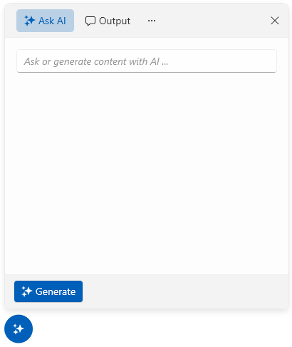

# AIPrompt Button

The AIPrompt component can also be displayed as a button that will show a `RadAIPrompt` when interacted with it. To display the component as a button, create a new `RadAIPromptButton` instance.

The RadAIPromptButton provides the following properties:

* `AIPrompt`&mdash;Allows you to set an RadAIPrompt instance that will be displayed when the RadAIPromptButton is open.
* `PopupWidth`&mdash;Provides the ability to specify the width of the popup of RadAIPromptButton.
* `PopupHeight`&mdash;Provides the ability to specify the height of the popup of RadAIPromptButton.
* `IsPopupOpen`&mdash;Allows you to open/close the popup holding the RadAIPrompt.

__Creating a RadAIPromptButton__
```XAML
    <telerik:RadAIPromptButton x:Name="aiPromptButton">
    	<telerik:RadAIPromptButton.AIPrompt>
    		<telerik:RadAIPrompt x:Name="aiPrompt" 
                                 Commands="{Binding MyCommands}"
                                 Suggestions="{Binding MySuggestions}">
    			<telerik:RadAIPromptInputItem />
    			<telerik:RadAIPromptOutputItem />
    			<telerik:RadAIPromptCommandsItem />
    		</telerik:RadAIPrompt>
    	</telerik:RadAIPromptButton.AIPrompt>
    </telerik:RadAIPromptButton>
```

__RadAIPromptButton__



## See Also
* [Suggestions]()
* [Commands]()
* [Paging]()
* [Events]()
