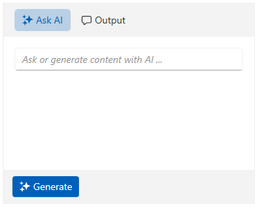
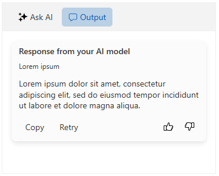
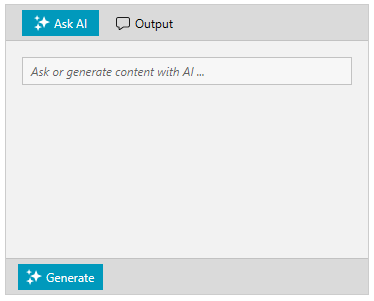

# Getting Started with WPF AIPrompt

This tutorial will walk you through the creation of a sample application that contains a `RadAIPrompt` control.

## Adding Telerik Assemblies Using NuGet

To use `RadAIPrompt` when working with NuGet packages, install the `Telerik.Windows.Controls.ConversationalUI.for.Wpf.Xaml` package. The [package name may vary]() slightly based on the Telerik dlls set - [Xaml or NoXaml]()

Read more about NuGet installation in the [Installing UI for WPF from NuGet Package]() article.

>tip With the 2025 Q1 release, the Telerik UI for WPF has a new licensing mechanism. You can learn more about it [here]().

## Adding Assembly References Manually

If you are not using NuGet packages, you can add a reference to the following assemblies:

* __Telerik.Licensing.Runtime__
* __Telerik.Windows.Controls__
* __Telerik.Windows.Controls.ConversationalUI__
* __Telerik.Windows.Controls.Input__
* __Telerik.Windows.Controls.Navigation__
* __Telerik.Windows.Data__

## Defining the RadAIPrompt

You can add RadAIPrompt manually in XAML as demonstrated in the following example:

#### __[XAML] Defining the RadAIPrompt in XAML__
{{region radaiprompt-getting-started-0}}
    <telerik:RadAIPrompt x:Name="aiPrompt">
    </telerik:RadAIPrompt>
{{endregion}}

The RadAIPrompt control has views that you can add to its `Items` collection. 

>tip To learn more about the views, check this [article]().

In this example, the input and output views will be added.

#### __[XAML] Adding the input and output views__
{{region radaiprompt-getting-started-1}}
    <telerik:RadAIPrompt x:Name="aiPrompt">
        <telerik:RadAIPromptInputItem />
        <telerik:RadAIPromptOutputItem />
    </telerik:RadAIPrompt>
{{endregion}}

__RadAIPrompt with the input and output views__

## Requesting a Response

When the input button is clicked, the RadAIPrompt control will raise the `PromptRequest` event. In it, you can contact your AI model with the request. The `PromptRequestEventArgs` event arguments provide information about the input text and if the request is initiated to retry an already generated response. You can create a new `AIPromptOutputItemModel` instance and fill it with returned response from the AI model. Then, add it to the `OutputItems` collection of RadAIPrompt. This will create a new card in the `RadAIPromptOutputItem` view where you can interact with the response.

#### __[C#] Subscribing to the PromptRequest event__
{{region radaiprompt-getting-started-2}}
    <telerik:RadAIPrompt x:Name="aiPrompt" PromptRequest="OnPromptRequested">
        <telerik:RadAIPromptInputItem />
        <telerik:RadAIPromptOutputItem />
    </telerik:RadAIPrompt>
{{endregion}}

#### __[C#] Handling the PromptRequest event__
{{region radaiprompt-getting-stared-3}}
    private void OnPromptRequested(object sender, PromptRequestEventArgs e)
    {
    	RadAIPrompt radAIPrompt = (RadAIPrompt)sender;
    
    	//You can pass the e.InputText property to your AI model, in order to receive a response.

    	AIPromptOutputItemModel responseAIPromptOutputItemModel = new AIPromptOutputItemModel()
    	{ 
    		Title = "Response from your AI model",
    		InputText = e.InputText,
    		ResponseText = "Lorem ipsum dolor sit amet, consectetur adipiscing elit, sed do eiusmod tempor incididunt ut labore et dolore magna aliqua.", // Here you can set the string value returned from your AI model
    	};

    	radAIPrompt.OutputItems.Add(responseAIPromptOutputItemModel);
    }
{{endregion}}

__RadAIPrompt with a response in the output view__

## Setting a Theme

The controls from our suite support different themes. You can see how to apply a theme different than the default one in the [Setting a Theme]() help article.

>important Changing the theme using implicit styles will affect all controls that have styles defined in the merged resource dictionaries. This is applicable only for the controls in the scope in which the resources are merged. 
* Choose between the themes and add reference to the corresponding theme assembly (ex: __Telerik.Windows.Themes.Fluent.dll__). You can see the different themes applied in the __Theming__ examples from our [WPF Controls Examples](https://demos.telerik.com/wpf/) application.

* Merge the ResourceDictionaries with the namespace required for the controls that you are using from the theme assembly. For the RadAIPrompt, you will need to merge the following resources:

	* __Telerik.Windows.Controls__
    * __Telerik.Windows.Controls.ConversationalUI__
    * __Telerik.Windows.Controls.Input__
    * __Telerik.Windows.Controls.Navigation__

The following example demonstrates how to merge the ResourceDictionaries so that they are applied globally for the entire application.

#### __[XAML] Merge the ResourceDictionaries__
{{region radaiprompt-getting-started-4}}
    <Application.Resources>
    	<ResourceDictionary>
    		<ResourceDictionary.MergedDictionaries>
    			<ResourceDictionary Source="/Telerik.Windows.Themes.Fluent;component/Themes/System.Windows.xaml"/>
    			<ResourceDictionary Source="/Telerik.Windows.Themes.Fluent;component/Themes/Telerik.Windows.Controls.xaml"/>
                <ResourceDictionary Source="/Telerik.Windows.Themes.Fluent;component/Themes/Telerik.Windows.Controls.ConversationalUI.xaml"/>
                <ResourceDictionary Source="/Telerik.Windows.Themes.Fluent;component/Themes/Telerik.Windows.Controls.Input.xaml"/>
                <ResourceDictionary Source="/Telerik.Windows.Themes.Fluent;component/Themes/Telerik.Windows.Controls.Navigation.xaml"/>
    		</ResourceDictionary.MergedDictionaries>
    	</ResourceDictionary>
    </Application.Resources>
{{endregion}}

>Alternatively, you can use the theme of the control via the [StyleManager](https://docs.telerik.com/devtools/wpf/styling-and-appearance/stylemanager/common-styling-apperance-setting-theme-wpf).
The following image shows a RadAIPrompt with the __Fluent__ theme applied.

__RadAIPrompt with the Fluent theme__

## See Also
* [Views]()
* [Suggestions]()
* [Events]()
* [RadAIPromptButton]()
* [Commands]()
* [Paging]()
